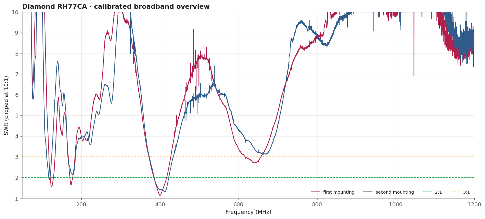
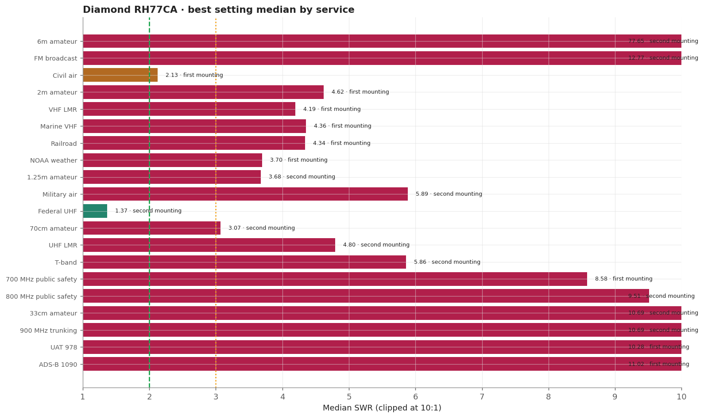
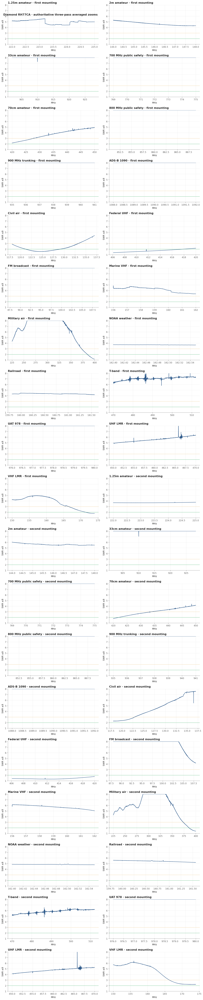
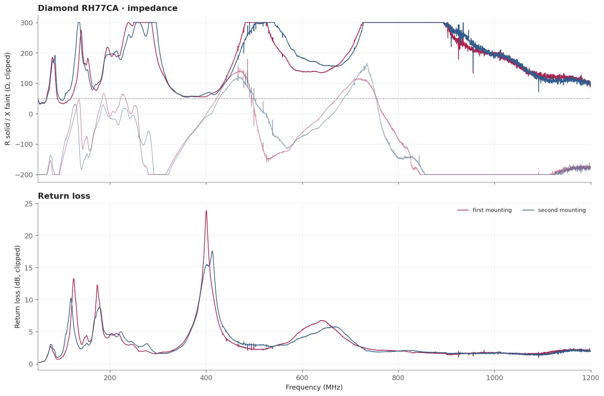

# Diamond RH77CA

The BNC sibling of the SRH77CA, measured in the September 2026 session on a mechanically secured fixture. Federal UHF is its one broad window here; both nominal amateur bands match poorly without a chassis, which is the same behaviour the SRH77CA shows. It is the only family captured at two independent mountings, so it also carries this survey's measured remount spread.

> **SWR is impedance match only.** It does not measure receive gain, sensitivity, radiation pattern, or on-air decoding.

## Measurement inventory

- Connection: BNC antenna, direct to the measurement plane.
- Measurement context: Handheld bench fixture.
- Calibrated 50-1200 MHz broadband sweep: 40,001 points (~28.75 kHz spacing).
- Three-pass complex-averaged service zooms override broadband data for the same configuration and service.
- [first mounting](measurements/2026-09-19-bnc-direct/antenna.s1p): BNC straight onto the calibrated plane with no adapter, 2026-09-19.
- [second mounting](measurements/2026-09-20-bnc-direct-second-mounting/antenna.s1p): The same antenna and the same calibration, remounted and recaptured on 2026-09-20 to test the first result. Kept as a separate row because the two mountings disagree by far more than the drift within either one.

## Conclusions

- Federal UHF is its one broad window in both mountings: 1.36 and 1.30 minimum, 1.70 and 1.37 median.
- 2m is poor and reproducibly so: 4.26, 5.43 and 4.82 minimum across three mountings, with no point at or below 2:1 in any of them.
- The two mountings disagree by a median |dGamma| of 0.164 at 2m, so treat the VHF numbers as approximate.
- Strongest dips sit at 392.7-420.8 MHz, below the 70cm band, and repeat across mountings to 0.1 MHz.
- There is no resonance near 146 MHz on this fixture at all.

## Analysis charts

### Broadband overview

### Scanner scorecard

### Authoritative averaged zoom panels

### Impedance and return loss

## Caveats

- The two mountings disagree by a median |dGamma| of 0.164 at 2m, against a drift floor of about 0.010 within one mounting. Read the VHF figures as roughly plus or minus 1 SWR, not to three decimals; see the session uncertainty note.
- That both mountings, and a third discarded free-standing capture, put 2m between 4.26 and 5.43 with no point at or below 2:1 is the robust part of this result.
- The UHF resonances repeat across mountings to 0.1 MHz (392.7/392.8 and 400.8 MHz), while the VHF behaviour moves with every remount. At VHF the instrument body and cable are half the antenna.
- 2m and 1.25m are poor in this no-chassis fixture and should not be read as the antenna's on-radio performance.
- Fixed upright bench geometry on a secured fixture, no added counterpoise; the USB cable remained part of the RF environment.
- Handheld antennas normally interact with the scanner chassis and operator. Treat these as fixture-specific comparisons.
- [Package method and calibration notes](../../README.md) · [immutable historical manual testing](../../manual-testing/)
