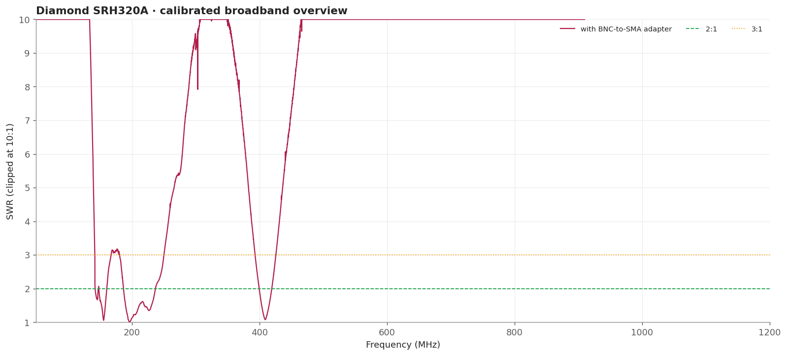
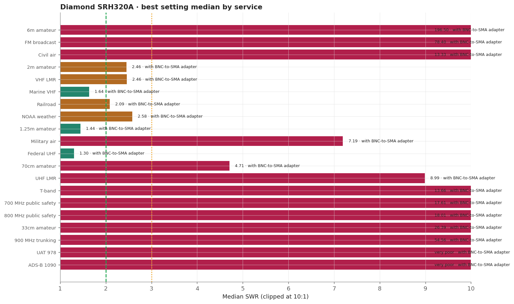
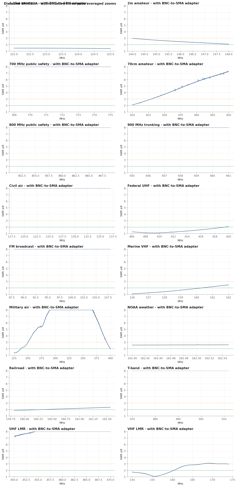
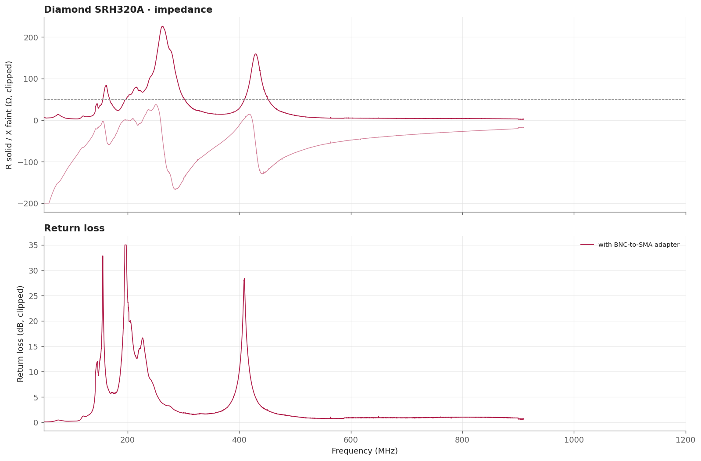

# Diamond SRH320A

The strongest 1.25m and federal-UHF match in the whole survey: the entire 222-225 MHz allocation stays under 1.47 and 96 percent of 406.1-420 MHz is at or below 2:1. Above roughly 910 MHz it exhausts the fixture's calibrated dynamic range and is reported as very poor rather than measured.

> **SWR is impedance match only.** It does not measure receive gain, sensitivity, radiation pattern, or on-air decoding.

## Measurement inventory

- Connection: SMA antenna with a BNC adapter.
- Measurement context: Handheld bench fixture.
- Calibrated 50-1200 MHz broadband sweep: 40,001 points (~28.75 kHz spacing).
- Three-pass complex-averaged service zooms override broadband data for the same configuration and service.
- [with BNC-to-SMA adapter](measurements/2026-09-19-sma-via-bnc-adapter/antenna.s1p): Single fixed configuration measured through the required BNC-to-SMA adapter, which sits outboard of the calibration plane and is part of the measured assembly.

## Conclusions

- The survey's best 1.25m result: 1.39-1.46 across the whole allocation, 100% at or below 2:1.
- Federal UHF is 1.08 minimum, 1.30 median, 96.4% at or below 2:1.
- VHF land mobile is partial, with a 1.04 minimum near 155.65 MHz.
- 70cm, UHF land mobile and T-band are poor; above 909.798 MHz there is no valid measurement.

## Analysis charts

### Broadband overview

### Scanner scorecard

### Authoritative averaged zoom panels

### Impedance and return loss

## Caveats

- Its broadband Touchstone is truncated at 909.798 MHz because the calibrated sweep reached a nonphysical reflection above that point; 33cm, UAT 978 and ADS-B 1090 have no valid measurement at all.
- 70cm, UHF land mobile and the T-band are poor; this is a 1.25m and federal-UHF antenna in this fixture.
- Measured at a single mounting; see the session uncertainty note.
- Fixed upright bench geometry on a secured fixture, no added counterpoise; the USB cable remained part of the RF environment.
- Handheld antennas normally interact with the scanner chassis and operator. Treat these as fixture-specific comparisons.
- [Package method and calibration notes](../../README.md) · [immutable historical manual testing](../../manual-testing/)
