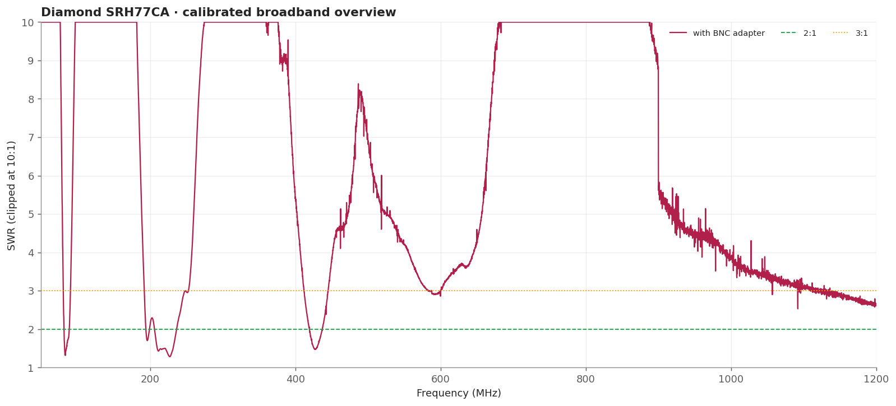
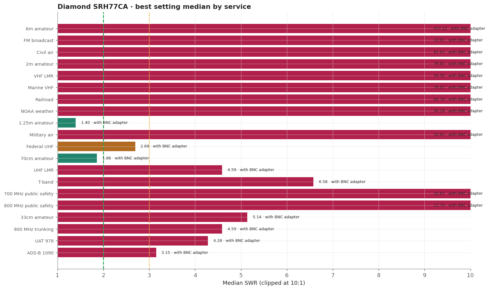
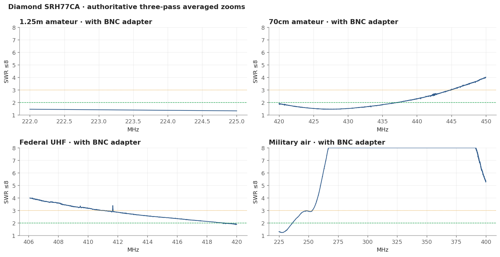
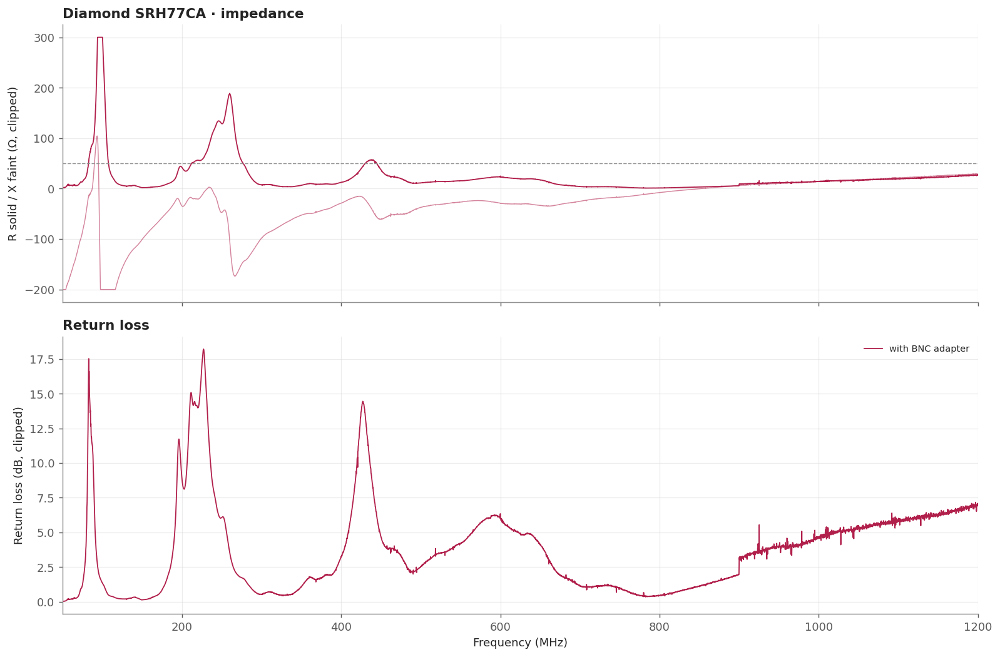

# Diamond SRH77CA

A well-known dual-band flexible whip. In this fixture it is the strongest broad choice for 420-450 MHz and is a solid alternate for 222-225 MHz, with a narrow military-air response near 227.5 MHz.

> **SWR is impedance match only.** It does not measure receive gain, sensitivity, radiation pattern, or on-air decoding.

## Measurement inventory

- Connection: SMA antenna with a BNC adapter.
- Calibrated 50-1200 MHz broadband sweep: 40,001 points (~28.75 kHz spacing).
- Three-pass complex-averaged service zooms override broadband data for the same configuration and service.
- [with BNC adapter](measurements/2026-08-16-with-bnc-adapter/antenna.s1p): Single fixed configuration measured through the required adapter.

## Conclusions

- Full 222-225 MHz allocation is approximately 1.33-1.46 SWR.
- Broadly useful across 420-450 MHz: minimum 1.46, median 1.86.

## Analysis charts

### Broadband overview

### Scanner scorecard

### Authoritative averaged zoom panels

### Impedance and return loss

## Caveats

- The VHF half of its nominal dual-band design did not match well in this no-chassis fixture.
- 700/800 MHz public safety is poor.
- Fixed upright bench geometry, no added counterpoise; the USB cable remained part of the RF environment.
- Handheld antennas normally interact with the scanner chassis and operator. Treat these as fixture-specific comparisons.
- [Package method and calibration notes](../../README.md) · [immutable historical manual testing](../../manual-testing/)
