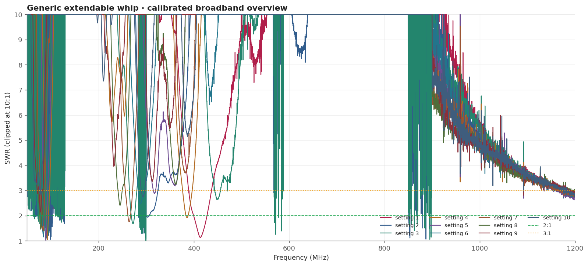
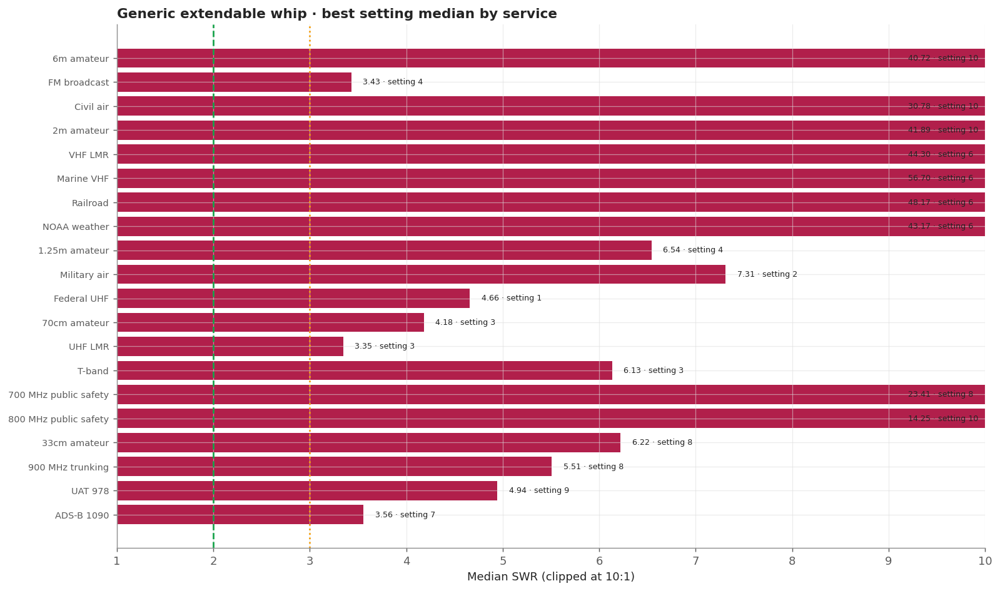
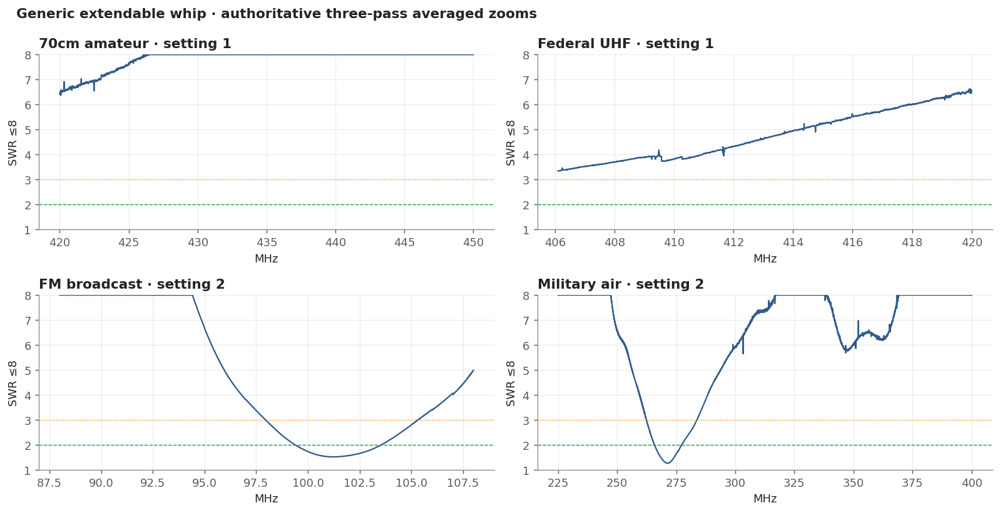
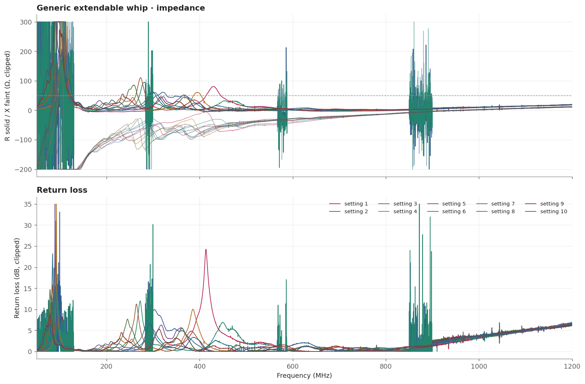

# Generic extendable whip

An unbranded telescopic whip captured at all ten settings. It is strongly geometry- and counterpoise-sensitive: later averaged zooms did not reproduce earlier broadband behaviour on the same setting, so this family is treated as experimental and session-specific.

> **SWR is impedance match only.** It does not measure receive gain, sensitivity, radiation pattern, or on-air decoding.

## Measurement inventory

- Connection: BNC, direct to the measurement plane.
- Calibrated 50-1200 MHz broadband sweep: 40,001 points (~28.75 kHz spacing).
- Three-pass complex-averaged service zooms override broadband data for the same configuration and service.
- [setting 1](measurements/setting-1-collapsed/antenna.s1p): Fully collapsed.
- [setting 2](measurements/setting-2/antenna.s1p): Fixed vane 1 plus vane 2 fully extended.
- [setting 3](measurements/setting-3/antenna.s1p): Fixed vane 1 plus vanes 2-3 fully extended.
- [setting 4](measurements/setting-4/antenna.s1p): Fixed vane 1 plus vanes 2-4 fully extended.
- [setting 5](measurements/setting-5/antenna.s1p): Fixed vane 1 plus vanes 2-5 fully extended.
- [setting 6](measurements/setting-6/antenna.s1p): Fixed vane 1 plus vanes 2-6 fully extended.
- [setting 7](measurements/setting-7/antenna.s1p): Fixed vane 1 plus vanes 2-7 fully extended.
- [setting 8](measurements/setting-8/antenna.s1p): Fixed vane 1 plus vanes 2-8 fully extended.
- [setting 9](measurements/setting-9/antenna.s1p): Fixed vane 1 plus vanes 2-9 fully extended.
- [setting 10](measurements/setting-10-fully-extended/antenna.s1p): Fixed vane 1 plus vanes 2-10 fully extended (maximum length).

## Conclusions

- Experimental and geometry-sensitive; later averaged zooms shifted after power cycles and are authoritative.
- Setting 2 has narrow responses near 101.25 MHz FM and 271.39 MHz military air.
- The later setting 1 UHF zoom is poor. Do not recommend this whip over stable choices.

## Analysis charts

### Broadband overview

### Scanner scorecard

### Authoritative averaged zoom panels

### Impedance and return loss

### Setting × service heatmap

## Best measured setting by service

[Download CSV](best-setting-table.csv). Rankings use authoritative median SWR, then maximum, then minimum.

| Service | Setting | Source | Min | Median | Max |
|---|---|---|---:|---:|---:|
| 6m amateur | setting 10 | broadband | 26.04 | 40.72 | 53.58 |
| FM broadcast | setting 4 | broadband | 1.03 | 3.43 | 14.37 |
| Civil air | setting 10 | broadband | 14.51 | 30.78 | 40.11 |
| 2m amateur | setting 10 | broadband | 35.38 | 41.89 | 51.83 |
| VHF LMR | setting 6 | broadband | 24.00 | 44.30 | 92.36 |
| Marine VHF | setting 6 | broadband | 44.31 | 56.70 | 76.17 |
| Railroad | setting 6 | broadband | 45.24 | 48.17 | 53.85 |
| NOAA weather | setting 6 | broadband | 42.08 | 43.17 | 43.64 |
| 1.25m amateur | setting 4 | broadband | 6.14 | 6.54 | 7.31 |
| Military air | setting 2 | averaged_zoom | 1.27 | 7.31 | very poor |
| Federal UHF | setting 1 | averaged_zoom | 3.34 | 4.66 | 6.64 |
| 70cm amateur | setting 3 | broadband | 2.63 | 4.18 | 12.39 |
| UHF LMR | setting 3 | broadband | 2.64 | 3.35 | 4.12 |
| T-band | setting 3 | broadband | 2.97 | 6.13 | 10.75 |
| 700 MHz public safety | setting 8 | broadband | 20.57 | 23.41 | 26.24 |
| 800 MHz public safety | setting 10 | broadband | 12.49 | 14.25 | 17.14 |
| 33cm amateur | setting 8 | broadband | 4.25 | 6.22 | 9.66 |
| 900 MHz trunking | setting 8 | broadband | 5.04 | 5.51 | 5.95 |
| UAT 978 | setting 9 | broadband | 4.17 | 4.94 | 5.67 |
| ADS-B 1090 | setting 7 | broadband | 3.18 | 3.56 | 3.82 |

## Caveats

- Setting 1 broadband and setting 1 averaged zoom disagree sharply. The authoritative zoom is poor (federal UHF minimum 3.34, 70cm minimum 6.37), so the earlier broadband numbers should not be trusted.
- Do not choose this family over a stable fixed antenna or the RH789 on the strength of these numbers.
- Fixed upright bench geometry, no added counterpoise; the USB cable remained part of the RF environment.
- Handheld antennas normally interact with the scanner chassis and operator. Treat these as fixture-specific comparisons.
- [Package method and calibration notes](../../README.md) · [immutable historical manual testing](../../manual-testing/)
