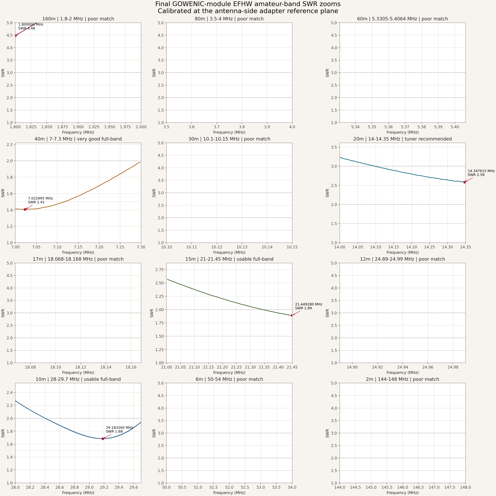
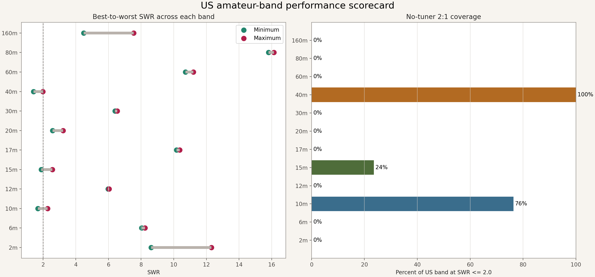
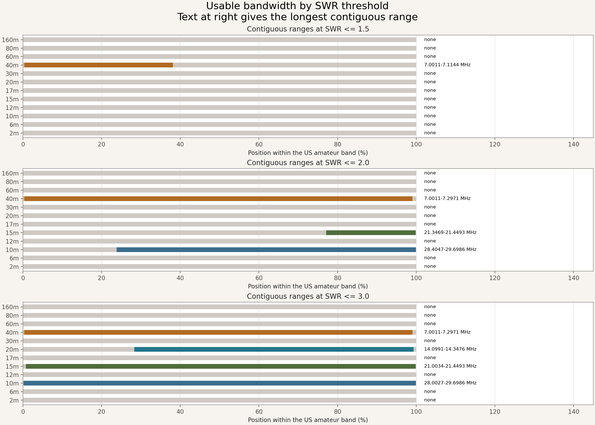
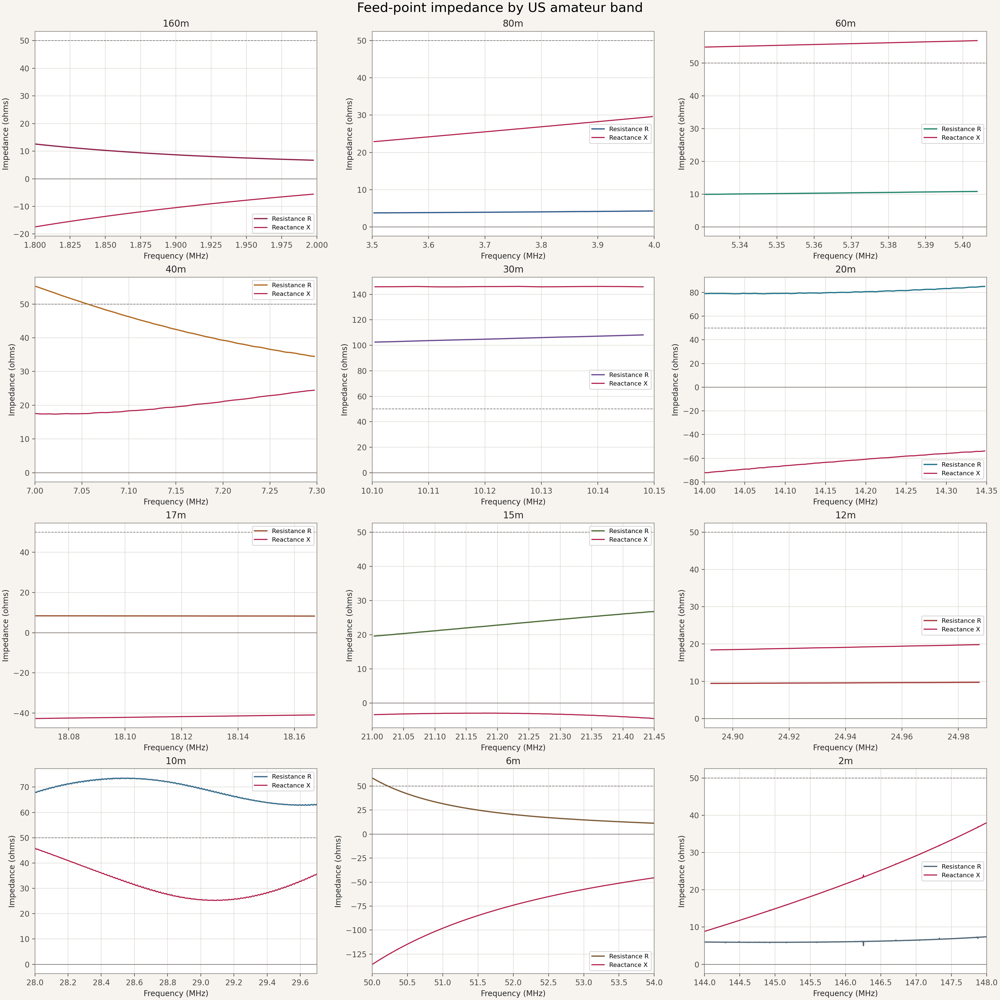
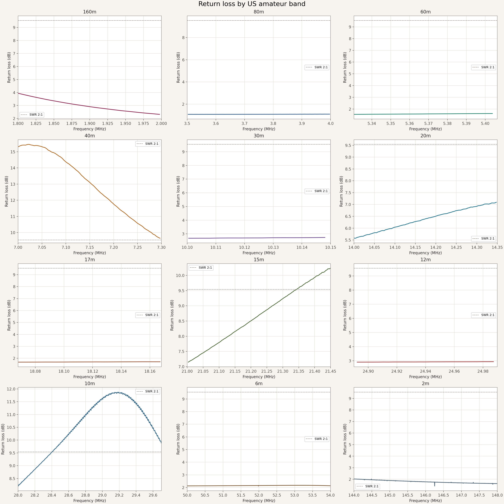
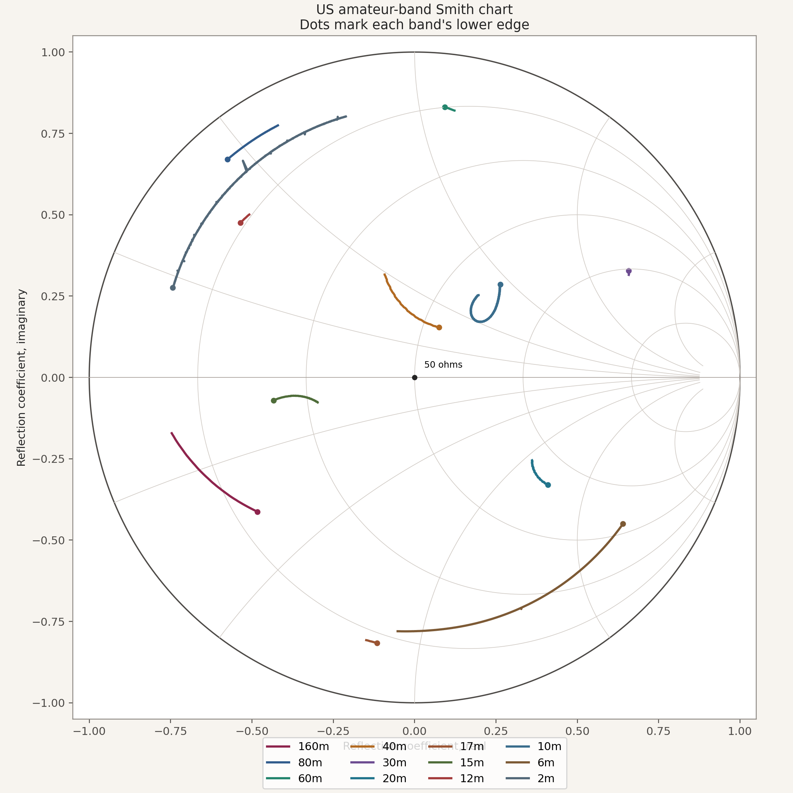
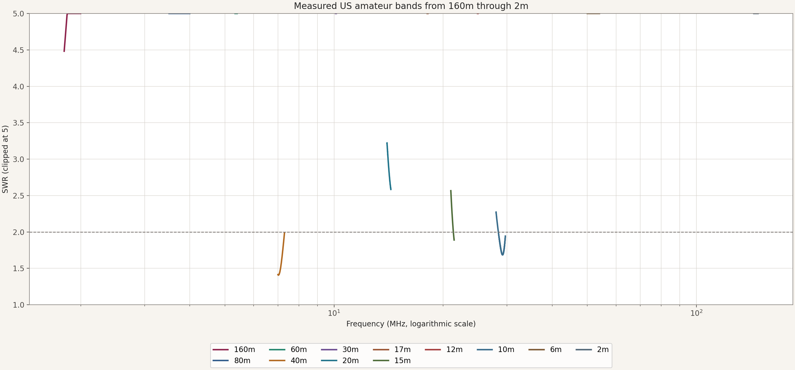
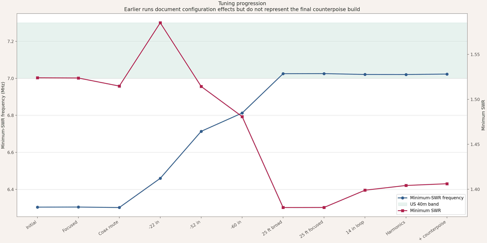
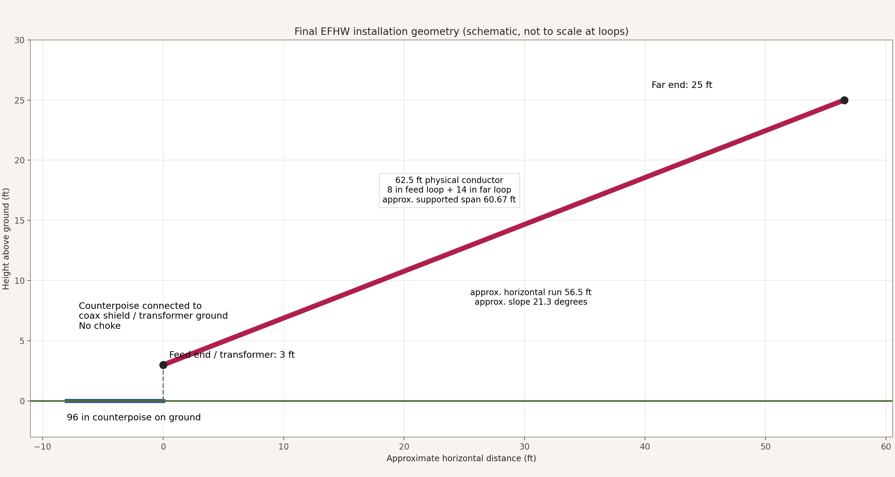

# GOWENIC-module 40m EFHW antenna results

This package characterizes a home-built 40m end-fed half-wave made with the
GOWENIC **"No Tune End Fed Half Antenna" 10 W module**
([Amazon ASIN B0C3JVM9SR](https://www.amazon.com/dp/B0C3JVM9SR)).
It is a generic compensated EFHW board in the QRPGuys style, **not a
QRPGuys-branded product**. The listing specifies 50 ohms and 10 W but does not
publish a band list or transformer ratio.

## Quick findings

- Best measured match: **40m at
  7.022995 MHz, SWR 1.41**.
- Full-band SWR at or below 2:1: **40m**.
- Intended harmonic-band result: **40m is <=2:1 across the full US band**;
  15m and 10m have useful subranges; 20m needs a tuner.
- The final 96-inch counterpoise produced a 40m minimum of
  **1.41 at
  7.022995 MHz**.
- Match quality is installation-specific; height, nearby objects, wet ground,
  counterpoise routing, coax routing, and any future common-mode choke can move
  these results.

## Later installed office-feed test

The [August 23 installed-system comparison](installed-office-feed/README.md)
measures the same antenna through the original 75 ft outdoor LS400, a window
flat-ribbon transition, and another 25 ft LS400 into the office. It includes a
fresh 0.5-54 MHz calibration, a far-end-open feed-path diagnostic, two
repeatability sweeps, comparison visuals, and an offline interactive report.

## Final build

| Item | Final value |
|---|---|
| Physical radiator wire | 62.5 ft (750 in) |
| Feed-end strain loop | 8 in of wire |
| Far-end tie-off loop | 14 in of wire |
| Approximate supported span after loop consumption | 60 ft 8 in |
| Feed-end height | 3 ft |
| Far-end height | 25 ft |
| Counterpoise | 96 in (8 ft), straight on ground |
| Counterpoise connection | Coax shield / transformer ground |
| Counterpoise direction | Angled away from the antenna direction |
| Feed line | 75 ft LS400 outdoors |
| Common-mode choke | None |

The final reproducible conductor length is **62.5 ft total physical wire**.
Subtracting the two mechanical loop allowances gives an approximate straight
supported span of **60 ft 8 in**. The full conductor remains physically present;
the span figure is for layout, not an instruction to cut off another 22 inches.

## Incremental testing and measured effects

| Time (PDT) | Change | Minimum | Measured effect |
|---|---|---:|---|
| 22:30:48 | Baseline after initial assembly. | 6.304000 MHz, SWR 1.52 | Established the initial 6.304 MHz resonance at SWR 1.52, below 40m. |
| 22:31:29 | Higher-resolution confirmation. | 6.304375 MHz, SWR 1.52 | Confirmed the baseline within 0.4 kHz and 0.001 SWR. |
| 22:35:41 | Common-mode sensitivity check. | 6.301750 MHz, SWR 1.51 | Shifted resonance down 2.6 kHz and SWR down 0.009; small but measurable feed-line sensitivity. |
| 22:41:06 | Removed 22 in of radiator. | 6.459555 MHz, SWR 1.59 | Moved resonance up 158 kHz to 6.460 MHz; minimum SWR rose to 1.59. |
| 22:45:31 | Removed another 30 in, 52 in cumulative. | 6.713611 MHz, SWR 1.51 | Moved resonance up another 254 kHz to 6.714 MHz; minimum SWR improved to 1.51. |
| 22:50:16 | Removed another 8 in, 60 in cumulative. | 6.812375 MHz, SWR 1.48 | Moved resonance up another 99 kHz to 6.812 MHz; minimum SWR improved to 1.48. |
| 23:01:44 | Raised far end to about 25 ft and changed coax route. | 7.025000 MHz, SWR 1.38 | Moved resonance into 40m at 7.025 MHz and improved minimum SWR to 1.38. |
| 23:02:29 | Three-pass focused repeat of the raised sloper. | 7.025375 MHz, SWR 1.38 | Confirmed the raised-sloper result within 0.4 kHz and 0.001 SWR. |
| 23:14:15 | Set permanent 14 in far-end tie-off loop. | 7.020750 MHz, SWR 1.40 | Shifted resonance down 4.6 kHz and raised minimum SWR by 0.019. |
| 23:21:37 | Three-pass 40m/20m/15m/10m harmonic characterization. | 7.020500 MHz, SWR 1.40 | Measured minima of 1.40 on 40m, 2.23 on 20m, 4.59 on 15m, and 1.81 on 10m. |
| 00:27:25 | Added the final 96 in counterpoise and repeated full OSL-calibrated span. | 7.022995 MHz, SWR 1.41 | Kept 40m essentially unchanged at 1.41, improved 15m from 4.59 to 1.89 and 10m from 1.81 to 1.68, while 20m changed from 2.23 to 2.58. |

The first ten rows are historical configurations. Only the final row includes
the 96-inch counterpoise and represents the finished antenna. The counterpoise
did not materially move the already-good 40m match, but it substantially
improved 15m and modestly improved 10m; 20m became somewhat worse.

## Band scorecard

| Band | US range | Best SWR | Best frequency | Z at best | Band <=2:1 | Longest <=2:1 range | Assessment |
|---|---:|---:|---:|---:|---:|---:|---|
| 160m | 1.8-2 MHz | 4.48 | 1.800000 MHz | 12.6 -17.4j ohms | 0% | none | poor match |
| 80m | 3.5-4 MHz | 15.81 | 3.963760 MHz | 4.2 +29.1j ohms | 0% | none | poor match |
| 60m | 5.3305-5.4064 MHz | 10.72 | 5.403830 MHz | 10.8 +56.9j ohms | 0% | none | poor match |
| 40m | 7-7.3 MHz | 1.41 | 7.022995 MHz | 53.1 +17.4j ohms | 100% | 7.0011-7.2971 MHz | very good full-band |
| 30m | 10.1-10.15 MHz | 6.40 | 10.148020 MHz | 108.1 +145.9j ohms | 0% | none | poor match |
| 20m | 14-14.35 MHz | 2.58 | 14.347615 MHz | 85.1 -53.8j ohms | 0% | none | tuner recommended |
| 17m | 18.068-18.168 MHz | 10.18 | 18.156125 MHz | 8.3 -41.1j ohms | 0% | none | poor match |
| 15m | 21-21.45 MHz | 1.89 | 21.449280 MHz | 26.8 -4.5j ohms | 24% | 21.3469-21.4493 MHz | usable full-band |
| 12m | 24.89-24.99 MHz | 5.97 | 24.987320 MHz | 9.7 +19.8j ohms | 0% | none | poor match |
| 10m | 28-29.7 MHz | 1.68 | 29.183260 MHz | 66.5 +25.5j ohms | 76% | 28.4047-29.6986 MHz | usable full-band |
| 6m | 50-54 MHz | 8.03 | 53.181990 MHz | 14.1 -55.1j ohms | 0% | none | poor match |
| 2m | 144-148 MHz | 8.62 | 144.012395 MHz | 6.0 +8.9j ohms | 0% | none | poor match |

`Band <=2:1` is the percentage of sampled points inside the listed US amateur
band at SWR 2.0 or lower. `Z at best` is the calibrated complex impedance at the
minimum-SWR point.

## Charts

### Amateur-band SWR zooms

### Performance scorecard

### Usable bandwidth

### Feed-point impedance

### Return loss

### Smith chart

### Full amateur-band overview

### Tuning progression

### Final installation geometry

## Interactive report

Open [`interactive-report.html`](interactive-report.html) locally to select a
band and inspect SWR, resistance/reactance, return loss, and reflection
coefficient. It is self-contained and makes no network requests.

## Data files

- [`band_summary.csv`](data/band_summary.csv) - one-row-per-band scorecard.
- [`band_summary.json`](data/band_summary.json) - full threshold intervals and
  machine-readable analysis.
- [`supported_band_points.csv`](data/supported_band_points.csv) - calibrated
  points inside the twelve measured US amateur bands.
- [`antenna_full_sweep.s1p`](data/antenna_full_sweep.s1p) - calibrated
  40,001-point Touchstone source from 1.8 through 148 MHz.
- [`measurement_metadata.json`](data/measurement_metadata.json) - instrument,
  calibration, antenna, installation, and analysis metadata.
- [`measurement_history.json`](data/measurement_history.json) and
  [`measurement_history.csv`](data/measurement_history.csv) - every tuning run,
  configuration change, and validity status.
- [`measurements/history/`](measurements/history/) - preserved source artifacts
  from every pre-counterpoise antenna run.
- [`measurements/2026-08-18-final/`](measurements/2026-08-18-final/) - complete
  final counterpoise-installed measurement output.
- [`measurements/calibration-history/`](measurements/calibration-history/) -
  preserved initial 40m and pre-counterpoise harmonic OSL calibrations.
- [`REPRODUCE.md`](REPRODUCE.md) - build and measurement reproduction steps.
- [`LLM_HANDOFF_PROMPT.md`](LLM_HANDOFF_PROMPT.md) - a reusable prompt for
  another LLM to repeat the complete process.

## Measurement method

- Instrument: NanoVNA-H, firmware 1.2.50.
- Calibration: software one-port ideal OSL at the antenna side of the attached
  adapter; the NanoVNA's saved calibration was preserved.
- Sweep: 1.8-148 MHz, 40,001 points, nominal 3.655 kHz spacing, 1 kHz
  measurement bandwidth.
- Calibration time: 2026-08-18 at 00:10-00:18 PDT.
- Final antenna capture time: 2026-08-18 at 00:24-00:27 PDT.
- Reference impedance: 50 ohms.
- Reconnected-load verification across the full span: median SWR **1.00052**,
  95th percentile **1.00088**, maximum **1.01115**, and median impedance
  **50.008 + j0.024 ohms**.

The reconnected load was also the load calibration standard, so the sanity check
establishes calibration stability and connector repeatability rather than
independent traceable accuracy. Antenna surroundings, height, routing,
feed-line length, weather, and common-mode current can shift these results.
