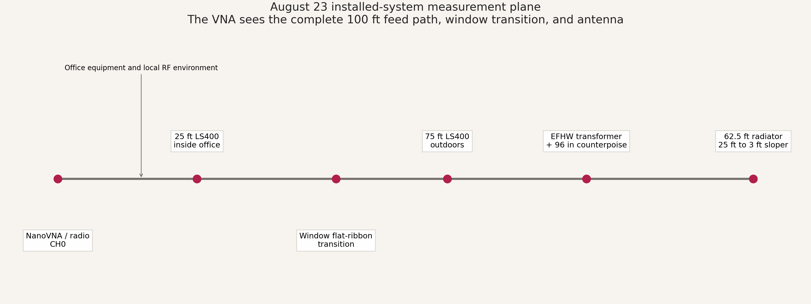
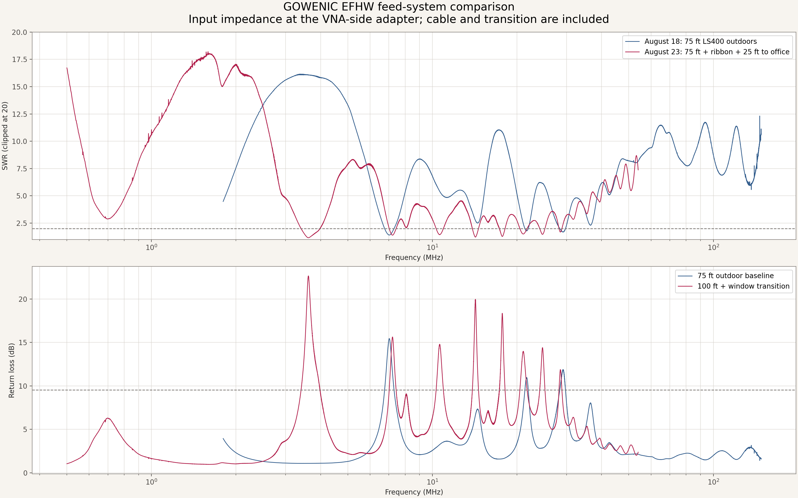
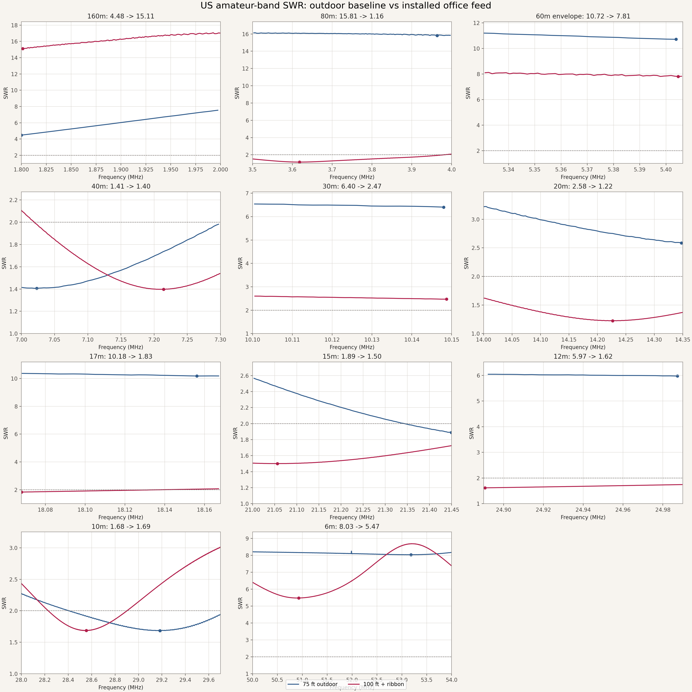
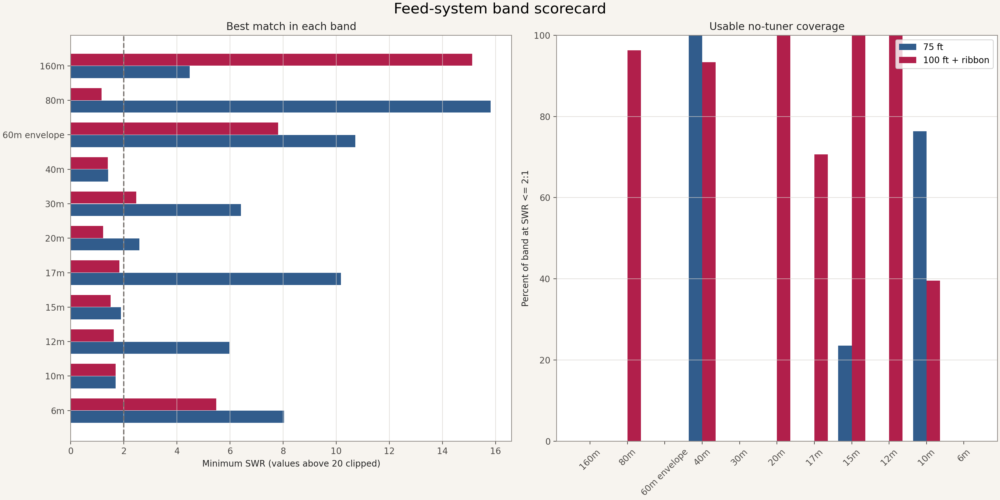
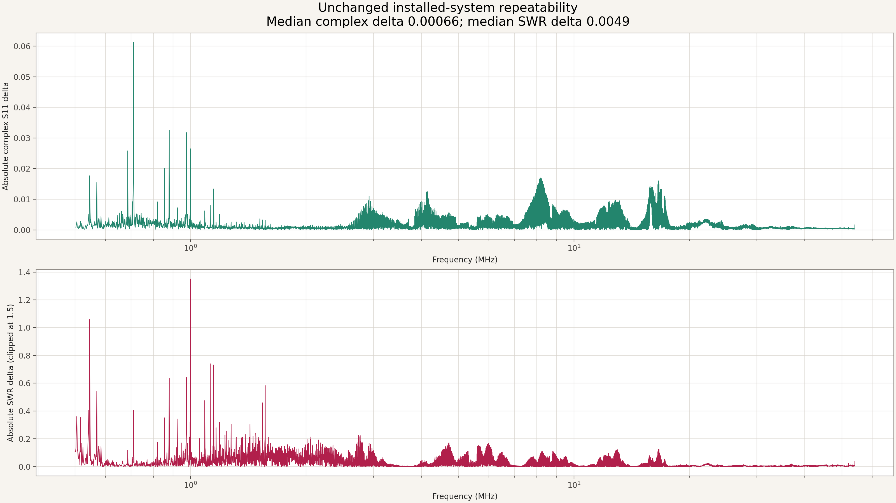
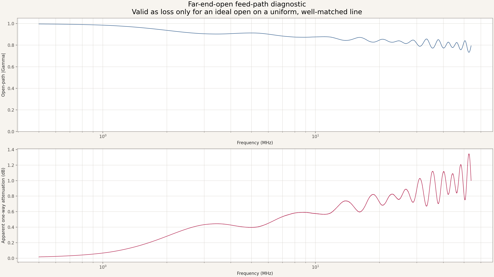

# GOWENIC EFHW installed office-feed comparison

This report measures the same 62.5 ft GOWENIC-module EFHW in two feed-system
configurations:

1. **August 18 outdoor baseline:** 75 ft LS400 outdoors.
2. **August 23 installed office path:** 75 ft LS400 outdoors, a window
   flat-ribbon transition, then another 25 ft LS400 into an office containing
   substantial computer equipment.

The August 18 parent report previously said 12 ft; that final configuration has
been corrected to **75 ft LS400 outdoors**. Earlier tuning-history runs that
actually used 12 ft remain labeled 12 ft.

## Headline results

- The installed system retains a good full-band 40m match: **SWR
  1.40 at
  7.214250 MHz**, with
  93% of sampled 40m points at
  or below 2:1.
- 40m moved **+191.3 kHz**
  relative to the 75 ft outdoor baseline.
- 80m and 20m present much better impedance matches at the office end, but this
  does **not** prove increased radiation efficiency. Added line length,
  transition loss, and transmission-line phase can transform or mask the
  antenna feed-point mismatch.
- 160m and 6m remain poor matches. The sweep starts at 0.5 MHz for diagnostic
  context, but the band table covers US amateur allocations through 6m.
- The two unchanged installed sweeps were repeatable: median complex-S11 delta
  **0.00066** and median SWR delta
  **0.0049**.

## Band comparison

| Band | Outdoor best | Office-feed best | Frequency shift | Office <=2:1 | Office Z at best |
|---|---:|---:|---:|---:|---:|
| 160m | 4.48 at 1.800000 MHz | 15.11 at 1.801388 MHz | +1.4 kHz | 0% | 140.3 +290.3j ohms |
| 80m | 15.81 at 3.963760 MHz | 1.16 at 3.617713 MHz | -346.0 kHz | 96% | 57.2 +3.3j ohms |
| 60m envelope | 10.72 at 5.403830 MHz | 7.81 at 5.404613 MHz | +0.8 kHz | 0% | 17.4 +63.9j ohms |
| 40m | 1.41 at 7.022995 MHz | 1.40 at 7.214250 MHz | +191.3 kHz | 93% | 45.4 -15.3j ohms |
| 30m | 6.40 at 10.148020 MHz | 2.47 at 10.148725 MHz | +0.7 kHz | 0% | 118.8 -21.7j ohms |
| 20m | 2.58 at 14.347615 MHz | 1.22 at 14.226763 MHz | -120.9 kHz | 100% | 59.6 +5.4j ohms |
| 17m | 10.18 at 18.156125 MHz | 1.83 at 18.068063 MHz | -88.1 kHz | 71% | 41.1 +26.5j ohms |
| 15m | 1.89 at 21.449280 MHz | 1.50 at 21.056038 MHz | -393.2 kHz | 100% | 34.8 +7.8j ohms |
| 12m | 5.97 at 24.987320 MHz | 1.62 at 24.890650 MHz | -96.7 kHz | 100% | 30.9 +0.4j ohms |
| 10m | 1.68 at 29.183260 MHz | 1.69 at 28.554063 MHz | -629.2 kHz | 40% | 30.6 +7.1j ohms |
| 6m | 8.03 at 53.181990 MHz | 5.47 at 50.927763 MHz | -2254.2 kHz | 0% | 33.2 -76.1j ohms |

## Measurement chain



The reference plane is the VNA-side adapter in the office. Therefore this is
an **installed-system input-impedance test**, not a de-embedded transformer or
antenna feed-point measurement.

## Visual results

### Full span



### Amateur-band zooms



### Band scorecard



### Repeatability



### Far-end-open feed-path diagnostic



The open-path test measured median |Gamma|
**0.834**. Under the simplifying assumption
of an ideal open on a uniform, well-matched line, that corresponds to apparent
one-way attenuation of
**0.54 dB at 7 MHz** and
**1.00 dB at 54 MHz**.
The window transition and connectors introduce discontinuities and multiple
reflections, so these are plausibility diagnostics, **not measured insertion
loss**. A calibrated two-port measurement is required for actual path loss.

## Calibration and fault detection

- NanoVNA-H firmware 1.2.50; software ideal one-port OSL at CH0/Port 1.
- Sweep: 0.5-54 MHz, 40,001 points, nominal 1.3375 kHz spacing, 1 kHz
  measurement bandwidth.
- The first SHORT capture was accidentally open-like. OPEN-to-SHORT raw
  separation was far below the known-good standard behavior.
- The impossible initial near-1:1 antenna/open-path results were rejected.
- Those rejected captures were overwritten during correction and are not
  presented as source evidence; only the corrected raw standards and sweeps are
  included.
- After replacing only SHORT and recalculating OSL, reconnect verification was
  median SWR 1.00009, p95 1.00030, and maximum 1.00047.
- A valid far-end-open test then showed the expected large reflection before
  the antenna was reconnected.

## Interpretation limits

- SWR and S11 measure the impedance presented to the radio. They do not measure
  gain, radiation efficiency, pattern, receive sensitivity, or transmitted
  field strength.
- A longer lossy line can make SWR look better at the radio while wasting power.
- The window transition and added 25 ft change both attenuation and electrical
  length, so differences cannot be attributed uniquely to office RFI.
- `60m envelope` is the continuous 5.3305-5.4064 MHz analysis envelope, not a
  claim that every frequency inside it is authorized for US transmission; US
  60m operation is channelized.
- Ambient office RFI primarily affects receiver noise and may contaminate a VNA
  trace if strong enough; it does not normally explain stable broadband
  impedance transformation by itself.
- Do not compare the two configurations as controlled antenna-performance or
  gain measurements.

## Data

- `data/band_comparison.csv` and `.json`: per-band results.
- `data/comparison_points.csv`: point-by-point complex and SWR comparison.
- `data/office_average.s1p`: complex average of the two valid installed sweeps.
- `measurements/`: complete calibration, verification, open-path diagnostic,
  and both installed-system source runs.
- `interactive-report.html`: self-contained offline band explorer.

## Regenerate from packaged inputs

From the repository root in an environment with the versions in
`requirements.txt`:

```bash
python3 antenna-results/antennas/gowenic-efhw/installed-office-feed/generate_report.py \
  --outdoor-source antenna-results/antennas/gowenic-efhw/installed-office-feed/data/outdoor_75ft_baseline.s1p \
  --office-source antenna-results/antennas/gowenic-efhw/installed-office-feed/data/office_sweep_1.s1p \
  --office-repeat-source antenna-results/antennas/gowenic-efhw/installed-office-feed/data/office_sweep_2.s1p \
  --calibration-dir antenna-results/antennas/gowenic-efhw/installed-office-feed/measurements/calibration \
  --open-path-dir antenna-results/antennas/gowenic-efhw/installed-office-feed/measurements/far-end-open \
  --office-dir antenna-results/antennas/gowenic-efhw/installed-office-feed/measurements/installed-sweep-1 \
  --office-repeat-dir antenna-results/antennas/gowenic-efhw/installed-office-feed/measurements/installed-sweep-2
```
