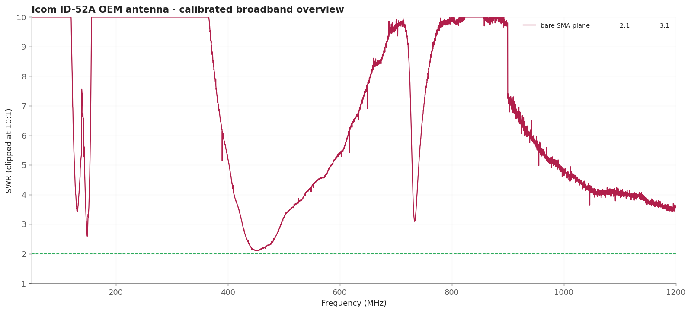
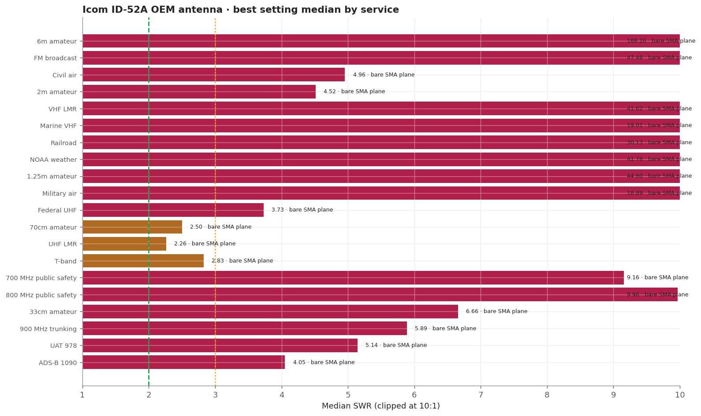
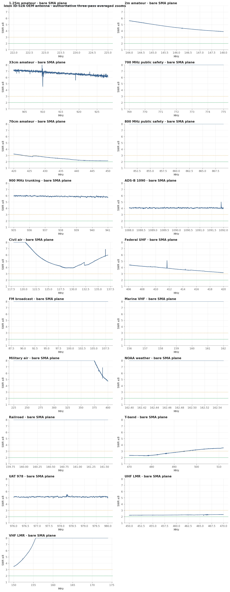
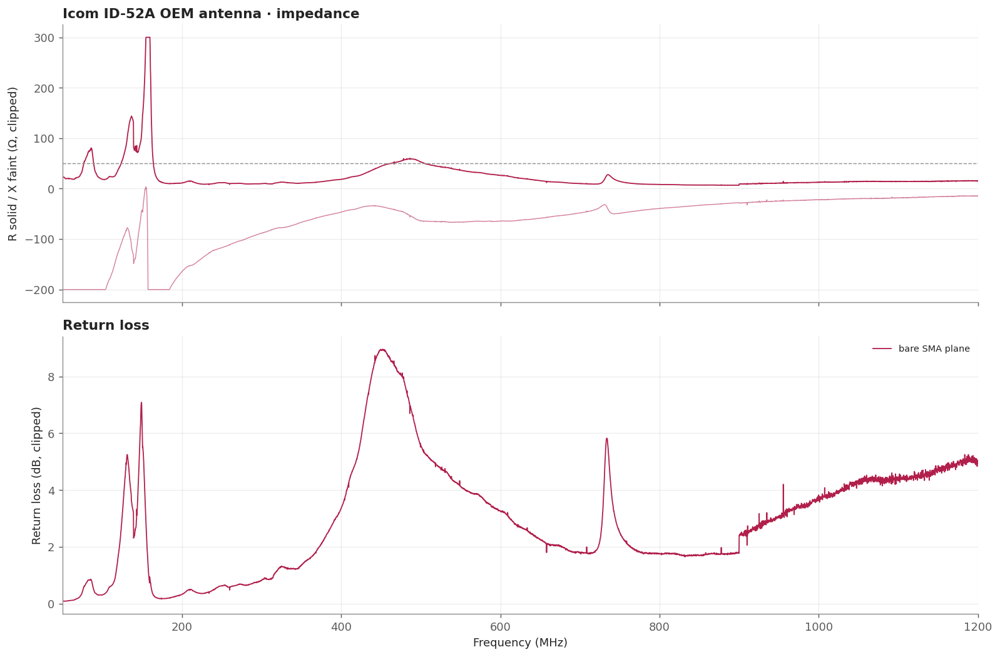

# Icom ID-52A OEM antenna

Measured on the same plane as the TH-D75A OEM whip and far better at VHF, at 4.5 median on 2m against 24.3, which is a real antenna difference rather than a fixture artefact. Its best window is UHF land mobile. 1.25m is very poor, as expected for a 2m/70cm design.

> **SWR is impedance match only.** It does not measure receive gain, sensitivity, radiation pattern, or on-air decoding.

## Measurement inventory

- Connection: SMA-male antenna direct to the measurement plane.
- Measurement context: Handheld bench fixture, SMA plane.
- Calibrated 50-1200 MHz broadband sweep: 40,001 points (~28.75 kHz spacing).
- Three-pass complex-averaged service zooms override broadband data for the same configuration and service.
- [bare SMA plane](measurements/2026-09-20-sma-direct/antenna.s1p): Supplied antenna screwed directly to CH0 with no adapter, against a calibration solved at that bare SMA plane.

## Conclusions

- Useful around 406-470 MHz, strongest at the 420 MHz edge.
- Broadest measured handheld-fixture match across both UAT 978 and ADS-B 1090, though match alone does not establish tracking sensitivity.
- Poor at VHF and 700/800 MHz in this no-radio-chassis fixture.

## Analysis charts

### Broadband overview

### Scanner scorecard

### Authoritative averaged zoom panels

### Impedance and return loss

## Caveats

- VHF figures describe the antenna plus a fixture with no radio chassis.
- No part number is marked on the antenna.
- Fixed upright bench geometry on a secured fixture, no counterpoise; the USB cable remained part of the RF environment.
- Vehicle body, mounting location, feed line, and antenna-side adapter are part of this installed result.
- [Package method and calibration notes](../../README.md) · [immutable historical manual testing](../../manual-testing/)
