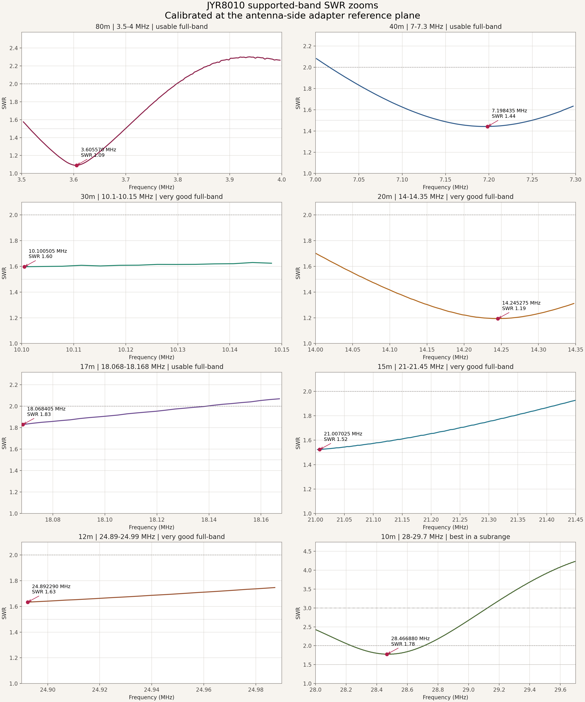
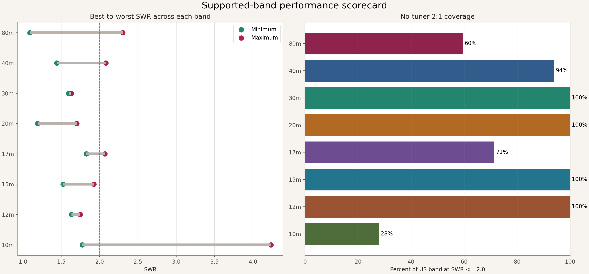
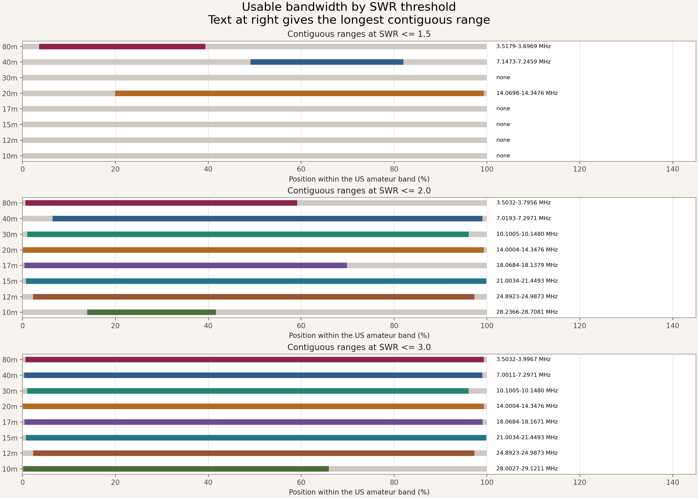
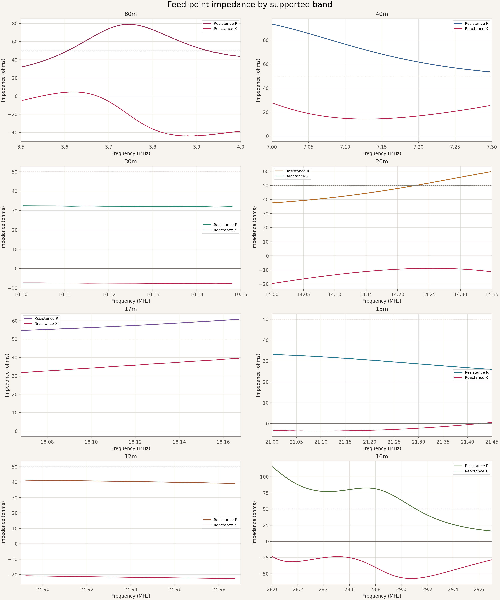
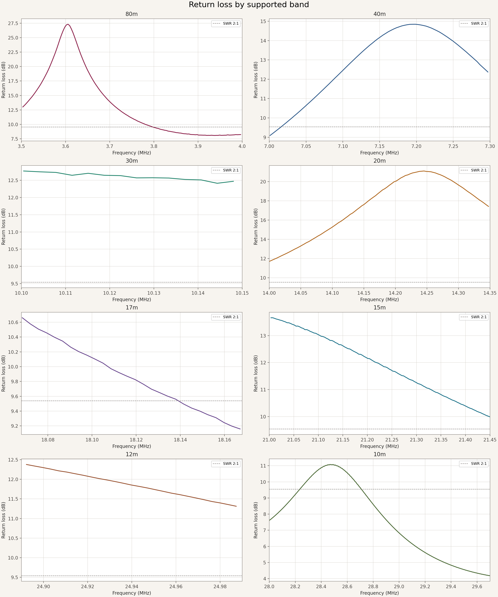
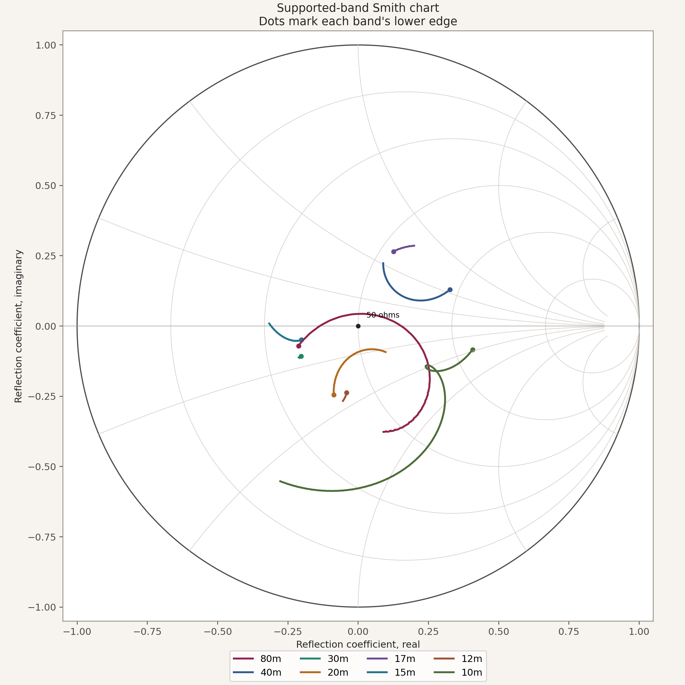
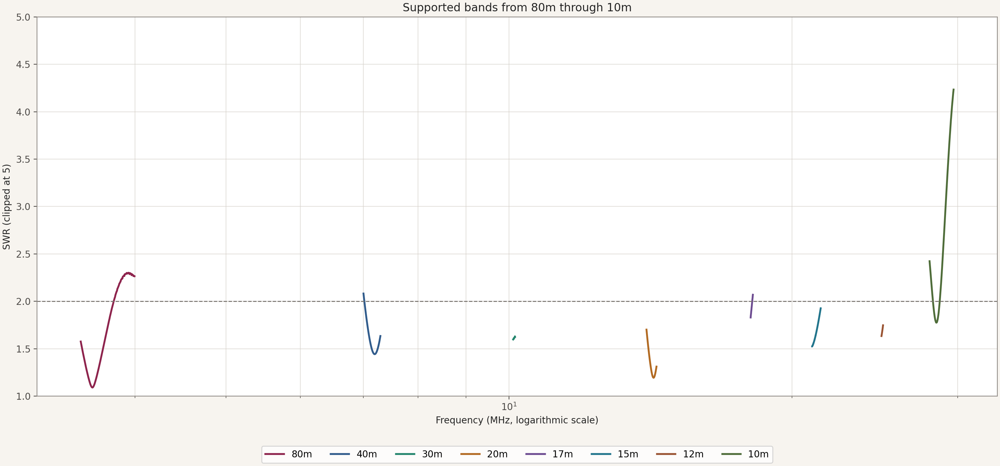

# JYR8010 EFHW antenna results

This folder contains a calibrated NanoVNA-H characterization of the antenna's
advertised US amateur bands: **80m, 40m, 30m, 20m, 17m, 15m, 12m, and 10m**.
The antenna is a 40-meter end-fed half-wave design sold as the
JYR8010-150W with a nominal 1:49/1:64 impedance transformer
([Amazon ASIN B0DBDCNVZD](https://www.amazon.com/dp/B0DBDCNVZD)).

The separate [`manual-testing/`](../../manual-testing/) dataset contains the August
15, 2026 broadband handheld-antenna sweeps, comparison report, charts, and
Touchstone source files.

## Quick findings

- Best measured match: **80m at
  3.605570 MHz, SWR 1.09**.
- Full-band SWR at or below 2:1: **30m, 20m, 15m, 12m**.
- Every supported band has at least part of its range below 2:1.
- 10m is the most frequency-sensitive band and is best around
  **28.466880 MHz**.
- The SDS150 itself starts at 25 MHz, so **10m is the only advertised antenna
  band in this report that the scanner can tune directly**. The lower HF bands
  remain useful for connected HF receivers and amateur transceivers.
- These results are installation-specific. With no dedicated ground or
  counterpoise, the feed line can become part of the antenna's return path.

## Band scorecard

| Band | US range | Best SWR | Best frequency | Z at best | Band <=2:1 | Longest <=2:1 range | Assessment |
|---|---:|---:|---:|---:|---:|---:|---|
| 80m | 3.5-4 MHz | 1.09 | 3.605570 MHz | 49.8 +4.3j ohms | 60% | 3.5032-3.7956 MHz | usable full-band |
| 40m | 7-7.3 MHz | 1.44 | 7.198435 MHz | 61.9 +16.7j ohms | 94% | 7.0193-7.2971 MHz | usable full-band |
| 30m | 10.1-10.15 MHz | 1.60 | 10.100505 MHz | 32.4 -7.3j ohms | 100% | 10.1005-10.1480 MHz | very good full-band |
| 20m | 14-14.35 MHz | 1.19 | 14.245275 MHz | 51.3 -8.9j ohms | 100% | 14.0004-14.3476 MHz | very good full-band |
| 17m | 18.068-18.168 MHz | 1.83 | 18.068405 MHz | 54.8 +31.7j ohms | 71% | 18.0684-18.1379 MHz | usable full-band |
| 15m | 21-21.45 MHz | 1.52 | 21.007025 MHz | 33.1 -3.3j ohms | 100% | 21.0034-21.4493 MHz | very good full-band |
| 12m | 24.89-24.99 MHz | 1.63 | 24.892290 MHz | 41.3 -20.8j ohms | 100% | 24.8923-24.9873 MHz | very good full-band |
| 10m | 28-29.7 MHz | 1.78 | 28.466880 MHz | 77.1 -23.9j ohms | 28% | 28.2366-28.7081 MHz | best in a subrange |

`Band <=2:1` is the percentage of sampled points inside the listed US amateur
band at SWR 2.0 or lower. `Z at best` is the calibrated complex impedance at the
minimum-SWR point.

## Charts

### Supported-band SWR zooms

### Performance scorecard

### Usable bandwidth

### Feed-point impedance

### Return loss

### Smith chart

### 80m-through-10m overview

## Interactive report

Open [`interactive-report.html`](interactive-report.html) locally to select a
band and inspect SWR, resistance/reactance, return loss, and reflection
coefficient. It is self-contained and makes no network requests.

## Data files

- [`band_summary.csv`](data/band_summary.csv) - one-row-per-band scorecard.
- [`band_summary.json`](data/band_summary.json) - full threshold intervals and
  machine-readable analysis.
- [`supported_band_points.csv`](data/supported_band_points.csv) - calibrated
  points inside the eight supported US bands.
- [`antenna_full_sweep.s1p`](data/antenna_full_sweep.s1p) - calibrated
  40,001-point Touchstone source from 1.8 through 148 MHz.
- [`measurement_metadata.json`](data/measurement_metadata.json) - instrument,
  calibration, antenna, installation, and analysis metadata.

## Measurement method

- Instrument: NanoVNA-H, firmware 1.2.50.
- Calibration: software one-port ideal OSL at the antenna side of the attached
  adapter; the NanoVNA's saved calibration was preserved.
- Sweep: 1.8-148 MHz, 40,001 points, nominal 3.655 kHz spacing, 1 kHz
  measurement bandwidth.
- Capture time: 2026-08-16 at 12:50 PDT.
- Reference impedance: 50 ohms.
- Installation reported during measurement: no dedicated ground or
  counterpoise.
- Sanity check: reconnecting the calibration load produced median SWR 1.00003
  and median impedance 50.000 ohms on focused 160m and 60m checks.

The supplied load was also the load calibration standard, so the sanity check
establishes calibration stability and connector repeatability rather than
independent traceable accuracy. Antenna surroundings, height, routing,
feed-line length, weather, and common-mode current can shift these results.
