# JYR8010 EFHW: two-choke office-feed installation

This package applies the same supported-band analysis as the original JYR8010
report to a new installed-system measurement from 0.5 through 54 MHz.

## Current configuration

- JYR8010-150W, 40 m radiating element, nominal 1:49/1:64 transformer.
- 75 ft LS400 outdoors, window flat-ribbon transition, and 25 ft LS400 inside
  the office.
- Two common-mode chokes, each **3 ft RG8X wound 11 turns through one Mix 31
  FT240-size toroid**.
- Window choke: immediately before the 25 ft indoor feed line.
- Feedpoint choke: immediately before the JYR8010 transformer.
- 16 ft counterpoise on the transformer's dedicated terminal, along the ground
  opposite the radiator.
- VNA reference plane: office-side PL-259/SO-239 adapter on CH0/Port 1.
- Total coax in the measured path: approximately 106 ft plus the flat-ribbon
  transition.

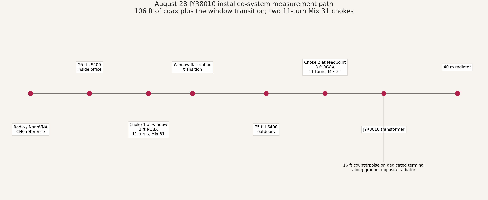

## Current results

- Best advertised-band match: **20m at
  14.265550 MHz, SWR
  1.09**.
- Full advertised bands at or below 2:1: **20m, 17m, 15m, 12m**.
- Two unchanged sweeps repeated with median complex-S11 delta
  **0.00036** and median SWR delta
  **0.00085**.

| Band | US range | Best SWR | Best frequency | Z at best | Band <=2:1 | Longest <=2:1 range | Assessment |
|---|---:|---:|---:|---:|---:|---:|---|
| 80m | 3.5-4 MHz | 1.16 | 3.564213 MHz | 55.9 +5.1j ohms | 46% | 3.5000-3.7301 MHz | best in a subrange |
| 40m | 7-7.3 MHz | 1.44 | 7.192850 MHz | 37.9 -10.3j ohms | 97% | 7.0096-7.2999 MHz | usable full-band |
| 30m | 10.1-10.15 MHz | 2.86 | 10.148725 MHz | 33.7 -42.2j ohms | 0% | none | tuner recommended |
| 20m | 14-14.35 MHz | 1.09 | 14.265550 MHz | 50.1 -4.3j ohms | 100% | 14.0007-14.3498 MHz | very good full-band |
| 17m | 18.068-18.168 MHz | 1.45 | 18.068063 MHz | 72.3 +3.1j ohms | 100% | 18.0681-18.1670 MHz | very good full-band |
| 15m | 21-21.45 MHz | 1.37 | 21.001200 MHz | 59.0 +14.8j ohms | 100% | 21.0012-21.4493 MHz | very good full-band |
| 12m | 24.89-24.99 MHz | 1.53 | 24.890650 MHz | 70.6 +14.9j ohms | 100% | 24.8907-24.9896 MHz | very good full-band |
| 10m | 28-29.7 MHz | 1.60 | 28.505913 MHz | 77.0 -11.2j ohms | 49% | 28.0833-28.9219 MHz | best in a subrange |

## Standard JYR8010 visuals

### Supported-band SWR zooms

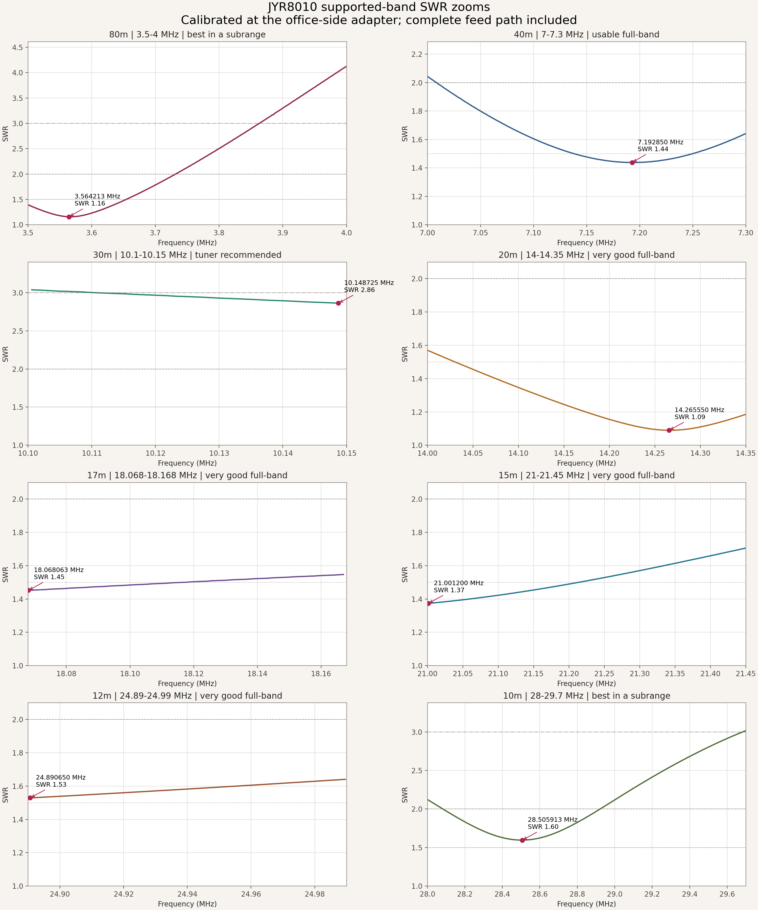

### Performance scorecard

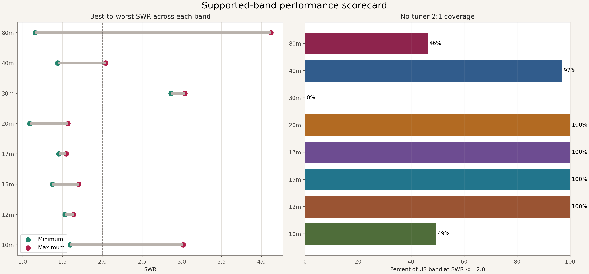

### Usable bandwidth

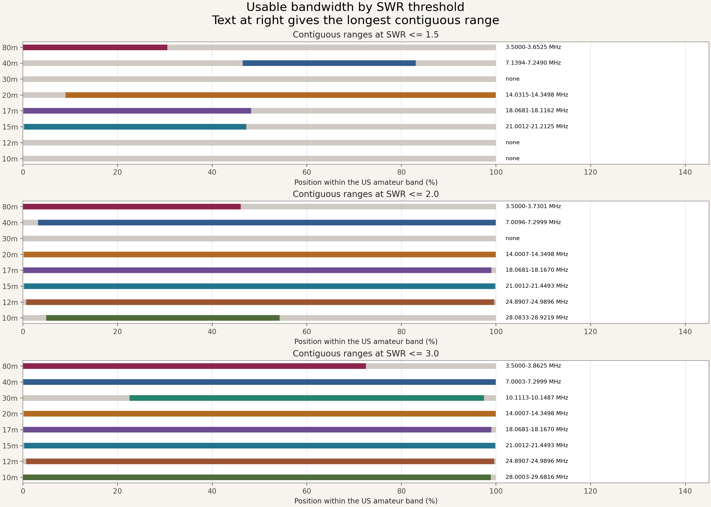

### Feed-point impedance at the office-side reference plane

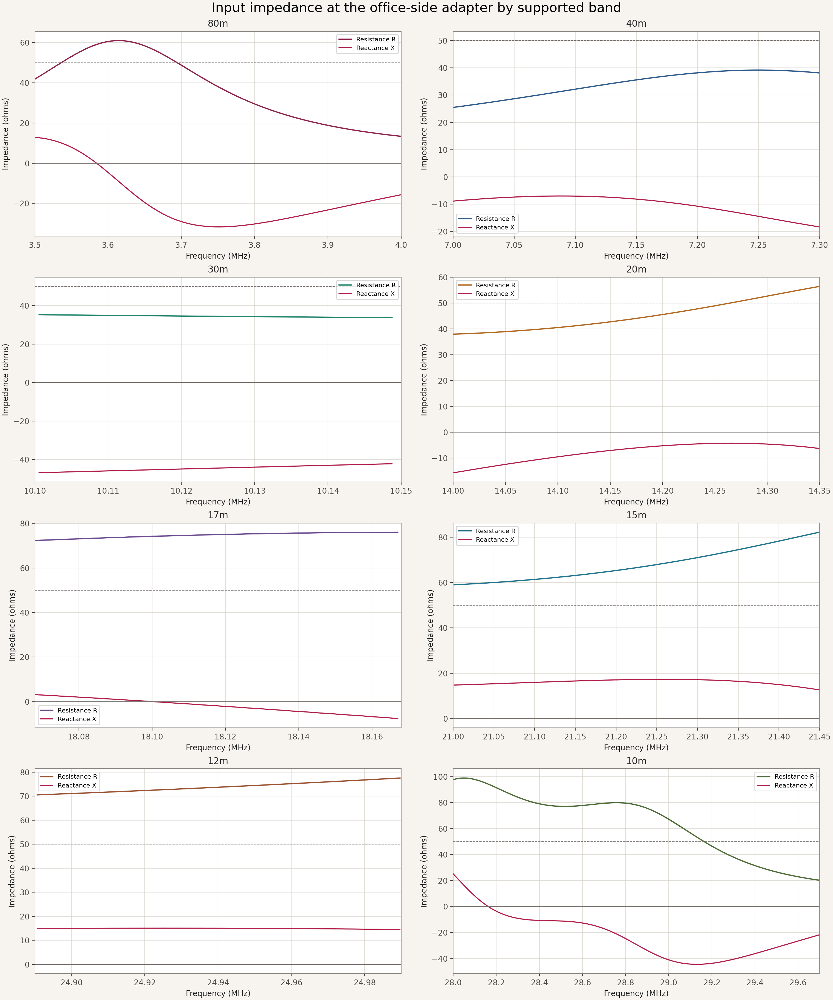

### Return loss

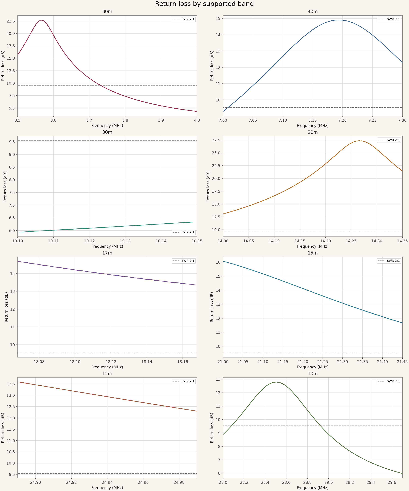

### Smith chart

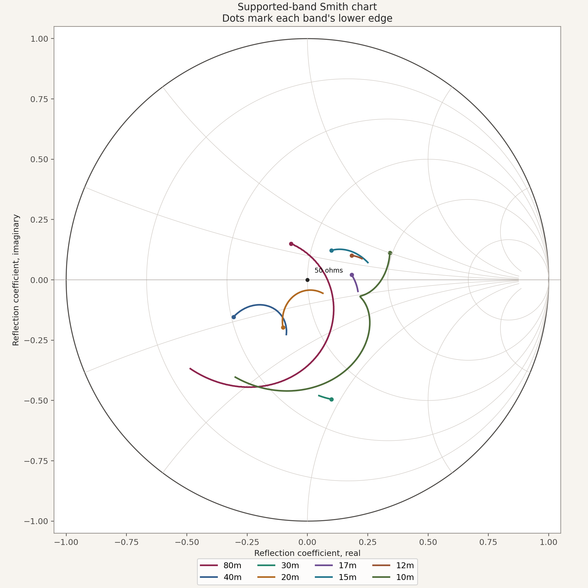

### Supported-band overview

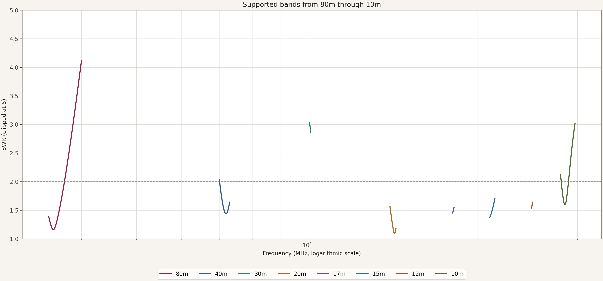

### Repeatability

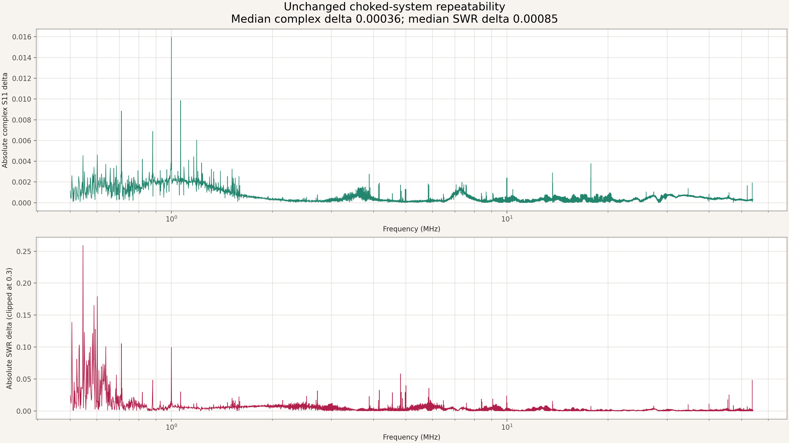

## Calibration and diagnostics

- Fresh ideal one-port software OSL: 0.5-54 MHz, 40,001 points, nominal
  1.3375 kHz spacing, and 1 kHz measurement bandwidth.
- OPEN-to-SHORT raw median separation: 1.538.
- Reconnected-load verification: median SWR 1.00075, p95 1.00087, maximum
  1.00106, and median impedance 50.0357 + j0.0112 ohms.
- The first antenna capture timed out after segment 150 because the NanoVNA
  firmware stopped answering. No partial result was accepted. The VNA was
  physically power-cycled without disturbing the RF path, and the full capture
  was restarted from segment 1.

### Far-end-open feed-path comparison

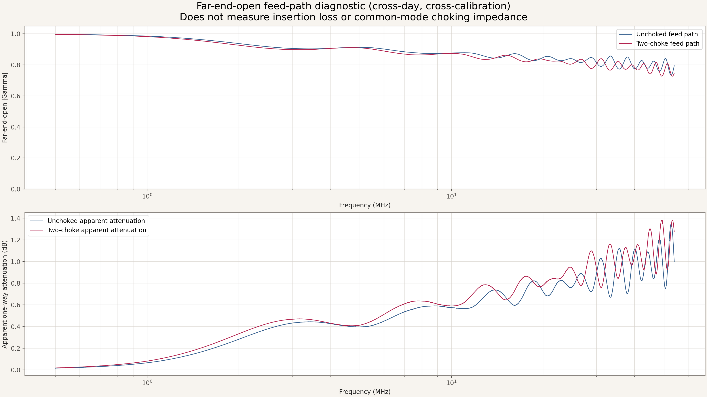

Under the simplifying ideal-open/uniform-line assumption, apparent one-way
attenuation changed by **+0.07 dB at
7 MHz**, **+0.22 dB at 28 MHz**, and
**+0.27 dB at 54 MHz**. The unchoked
trace was captured August 23 and the choked trace August 28 under separate OSL
calibrations. The observed delta includes day-to-day/calibration repeatability,
the added 6 ft of RG8X/connectors, and discontinuities from the chokes and
window transition. It cannot be attributed to any one component. A one-port
far-end-open measurement does **not** measure insertion loss or common-mode
choking impedance.

## Data and reproduction

- `data/band_summary.csv` and `.json`: the same per-band metrics as the original
  JYR8010 report.
- `data/supported_band_points.csv`: calibrated points inside all eight
  advertised bands.
- `data/antenna_full_sweep.s1p`: complex average of the two current sweeps.
- `data/historical_comparison.csv` and `.json`: old-versus-current deltas.
- `measurements/`: full calibration, verification, open-path diagnostic, and
  both current source sweeps, plus the complete August 23 unchoked open-path
  baseline and its separate calibration.
- `interactive-report.html`: self-contained supported-band explorer.

From the repository root, recreate the complete report with:

```bash
python3 antenna-results/antennas/jyr8010-efhw/two-choke-office-feed/generate_report.py \
  --historical-source antenna-results/antennas/jyr8010-efhw/two-choke-office-feed/data/historical_2026-08-16.s1p \
  --current-source antenna-results/antennas/jyr8010-efhw/two-choke-office-feed/data/current_sweep_1.s1p \
  --repeat-source antenna-results/antennas/jyr8010-efhw/two-choke-office-feed/data/current_sweep_2.s1p \
  --calibration-dir antenna-results/antennas/jyr8010-efhw/two-choke-office-feed/measurements/calibration \
  --open-path-dir antenna-results/antennas/jyr8010-efhw/two-choke-office-feed/measurements/choked-far-end-open \
  --unchoked-open-dir antenna-results/antennas/jyr8010-efhw/two-choke-office-feed/measurements/unchoked-baseline/far-end-open \
  --unchoked-calibration-dir antenna-results/antennas/jyr8010-efhw/two-choke-office-feed/measurements/unchoked-baseline/calibration \
  --current-dir antenna-results/antennas/jyr8010-efhw/two-choke-office-feed/measurements/current-sweep-1 \
  --repeat-dir antenna-results/antennas/jyr8010-efhw/two-choke-office-feed/measurements/current-sweep-2
```

## Historical comparison and observed changes

The August 16 historical run and August 28 current run differ in more than the
toroids. The old metadata records **no dedicated counterpoise** and does not
record feed-line length, antenna support geometry, or an office/window path.
The current run adds **two chokes, six feet of RG8X, their connectors, a 16 ft
counterpoise, the documented 75 ft + ribbon + 25 ft office path, and a different
date/calibration/reference environment**. Therefore, the table below precisely
describes the observed system-level differences but cannot assign them to the
toroids alone.

| Band | Historical best | Current best | Best-SWR change | Frequency shift | <=2:1 coverage change |
|---|---:|---:|---:|---:|---:|
| 80m | 1.09 at 3.605570 MHz | 1.16 at 3.564213 MHz | +0.07 | -41.4 kHz | 60% -> 46% |
| 40m | 1.44 at 7.198435 MHz | 1.44 at 7.192850 MHz | -0.00 | -5.6 kHz | 94% -> 97% |
| 30m | 1.60 at 10.100505 MHz | 2.86 at 10.148725 MHz | +1.27 | +48.2 kHz | 100% -> 0% |
| 20m | 1.19 at 14.245275 MHz | 1.09 at 14.265550 MHz | -0.10 | +20.3 kHz | 100% -> 100% |
| 17m | 1.83 at 18.068405 MHz | 1.45 at 18.068063 MHz | -0.38 | -0.3 kHz | 71% -> 100% |
| 15m | 1.52 at 21.007025 MHz | 1.37 at 21.001200 MHz | -0.15 | -5.8 kHz | 100% -> 100% |
| 12m | 1.63 at 24.892290 MHz | 1.53 at 24.890650 MHz | -0.10 | -1.6 kHz | 100% -> 100% |
| 10m | 1.78 at 28.466880 MHz | 1.60 at 28.505913 MHz | -0.18 | +39.0 kHz | 28% -> 49% |

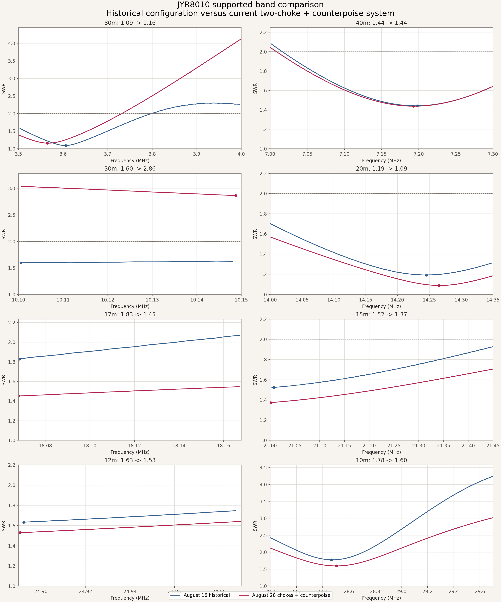

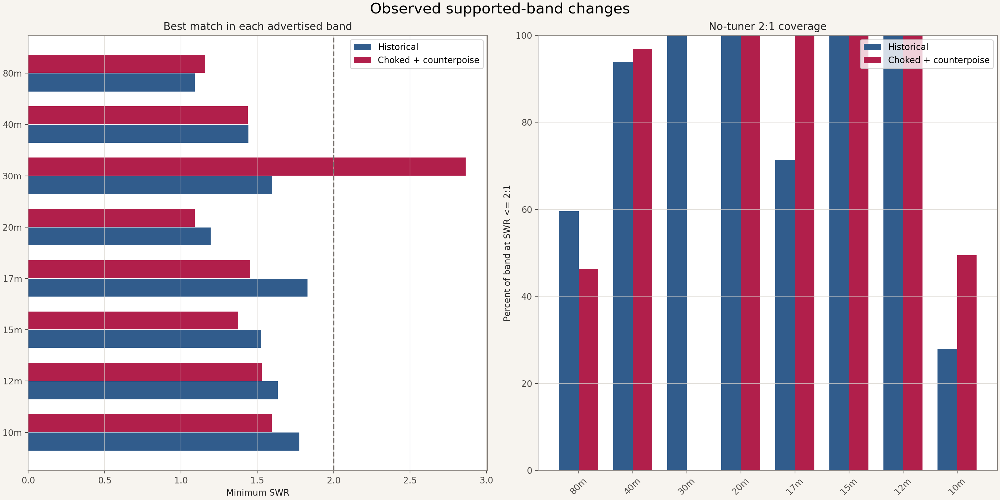

Observed pattern:

- **40m remained essentially unchanged** in minimum SWR while retaining broad
  <=2:1 coverage.
- **20m, 17m, 15m, 12m, and 10m improved** in minimum SWR; 17m became fully
  <=2:1 and 10m gained substantially more <=2:1 coverage.
- **80m became slightly worse** but retained a strong low-SWR subrange.
- **30m became substantially worse**, losing its former full-band <=2:1 match.
- These changes are stable across the two current sweeps, but they are the
  combined result of the complete current installation - not a controlled
  measurement of choke effectiveness.

SWR measures input impedance match, not gain, radiation efficiency, pattern,
receive sensitivity, noise-floor reduction, or common-mode suppression.
