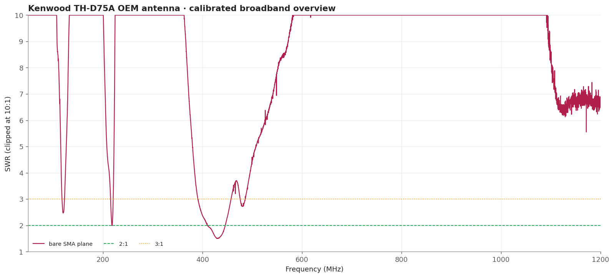
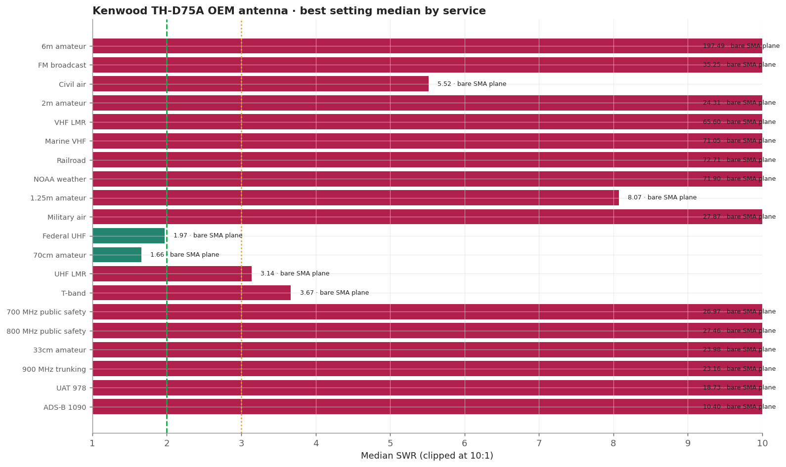
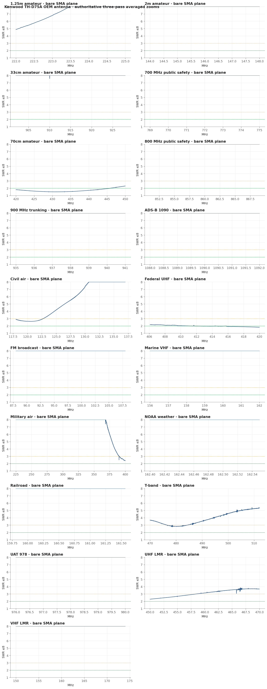
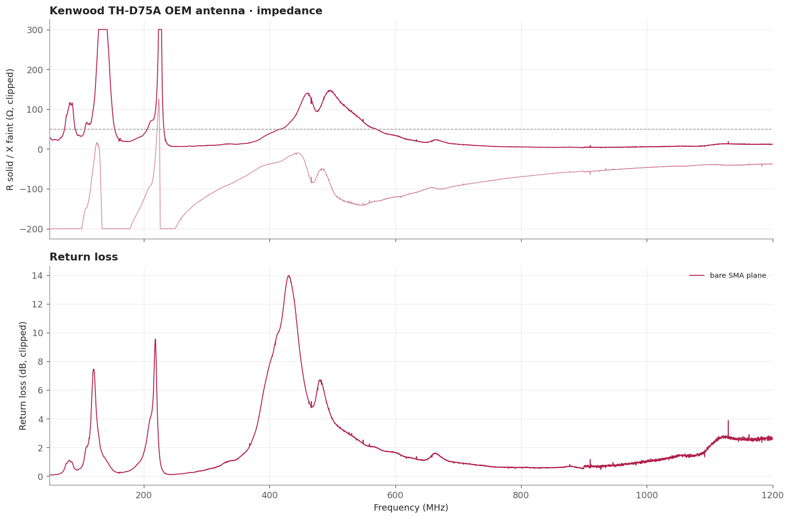

# Kenwood TH-D75A OEM antenna

The control experiment for the whole September session. A known-good dual-band whip that works on both bands on its radio: the instrument places its 70cm resonance exactly where it belongs and returns a good UHF match, while the same sweep reads about 24:1 on 2m. It is the clearest demonstration that this fixture cannot measure VHF match for a counterpoise-less handheld antenna.

> **SWR is impedance match only.** It does not measure receive gain, sensitivity, radiation pattern, or on-air decoding.

## Measurement inventory

- Connection: SMA-male antenna direct to the measurement plane.
- Measurement context: Handheld bench fixture, SMA plane.
- Calibrated 50-1200 MHz broadband sweep: 40,001 points (~28.75 kHz spacing).
- Three-pass complex-averaged service zooms override broadband data for the same configuration and service.
- [bare SMA plane](measurements/2026-09-20-sma-direct/antenna.s1p): Supplied antenna screwed directly to CH0 with no adapter, against a calibration solved at that bare SMA plane.

## Conclusions

- Useful around 406-470 MHz, strongest at the 420 MHz edge.
- Broadest measured handheld-fixture match across both UAT 978 and ADS-B 1090, though match alone does not establish tracking sensitivity.
- Poor at VHF and 700/800 MHz in this no-radio-chassis fixture.

## Analysis charts

### Broadband overview

### Scanner scorecard

### Authoritative averaged zoom panels

### Impedance and return loss

## Caveats

- Do not read the VHF figures as this antenna's performance on a TH-D75A. It is a compact helical that depends on the radio chassis more than any other antenna measured here.
- No part number is marked on the antenna.
- Fixed upright bench geometry on a secured fixture, no counterpoise; the USB cable remained part of the RF environment.
- Vehicle body, mounting location, feed line, and antenna-side adapter are part of this installed result.
- [Package method and calibration notes](../../README.md) · [immutable historical manual testing](../../manual-testing/)
