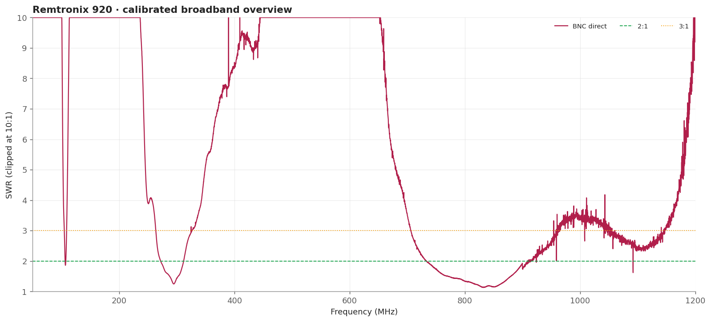
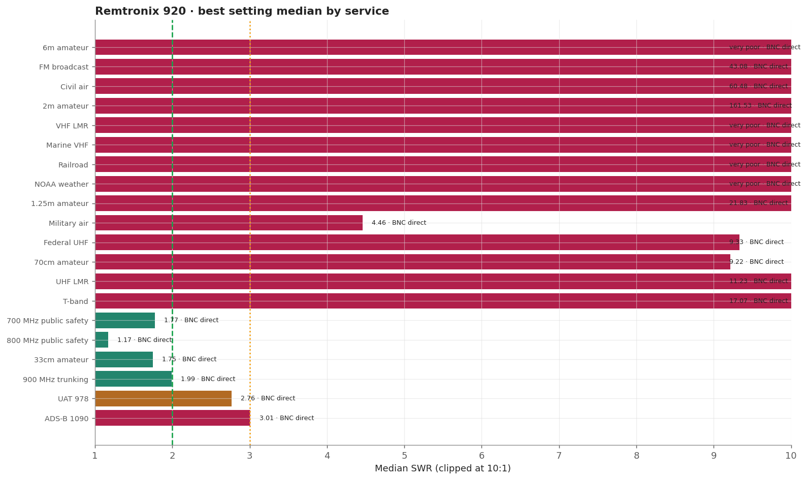
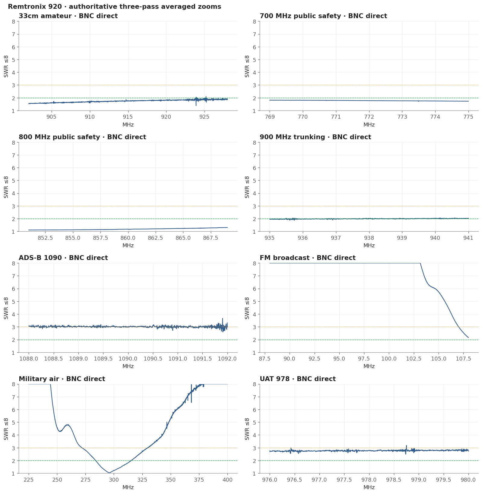
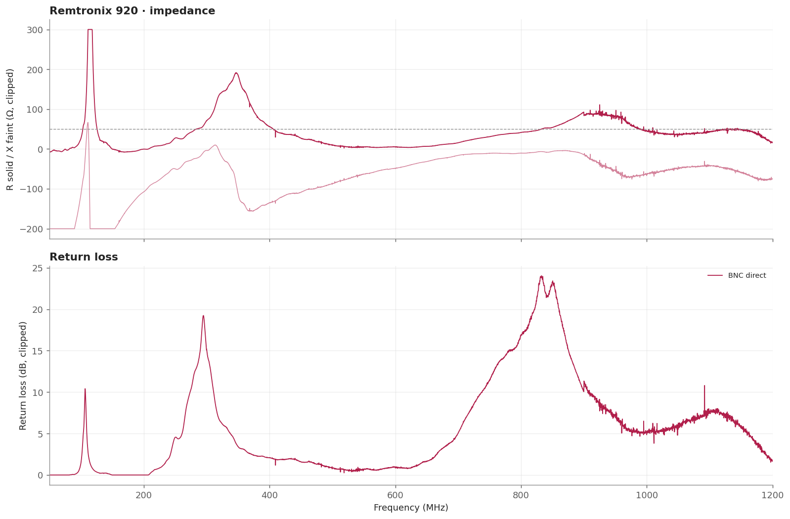

# Remtronix 920

A short fixed whip aimed at the 700/800/900 MHz public-safety and trunking downlinks. It is the only antenna measured here that holds a good match across every modern trunked public-safety window, and it is also the best of the handheld set at 33cm and 900 MHz trunking. Its L-band aviation-data match is moderate rather than best overall.

> **SWR is impedance match only.** It does not measure receive gain, sensitivity, radiation pattern, or on-air decoding.

## Measurement inventory

- Connection: BNC, direct to the measurement plane.
- Measurement context: Handheld bench fixture.
- Calibrated 50-1200 MHz broadband sweep: 40,001 points (~28.75 kHz spacing).
- Three-pass complex-averaged service zooms override broadband data for the same configuration and service.
- [BNC direct](measurements/2026-08-16-bnc-plane/antenna.s1p): Single fixed configuration; no adjustment available.

## Conclusions

- Best typical modern 700/800/900 MHz public-safety choice.
- Averaged 800 MHz: 1.11 minimum, 1.17 median; averaged 700 MHz stays below 1.82.
- Good across 902-928 MHz and useful at 935-941 MHz; UAT/ADS-B is moderate.
- Military-air response is narrow, centered near 296 MHz—not broad military-air coverage.

## Analysis charts

### Broadband overview

### Scanner scorecard

### Authoritative averaged zoom panels

### Impedance and return loss

## Caveats

- It is deliberately narrow-band: VHF, civil air, 2m, and the 220 MHz band are all far outside its match.
- A good match at 978 and 1090 MHz is still only moderate, and impedance match is not the same thing as gain.
- Fixed upright bench geometry, no added counterpoise; the USB cable remained part of the RF environment.
- Handheld antennas normally interact with the scanner chassis and operator. Treat these as fixture-specific comparisons.
- [Package method and calibration notes](../../README.md) · [immutable historical manual testing](../../manual-testing/)
