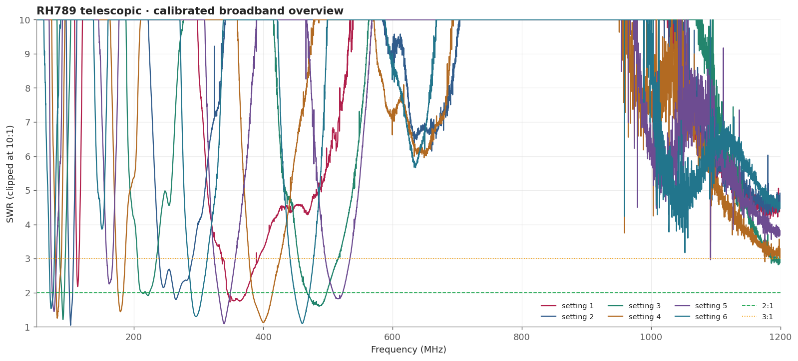
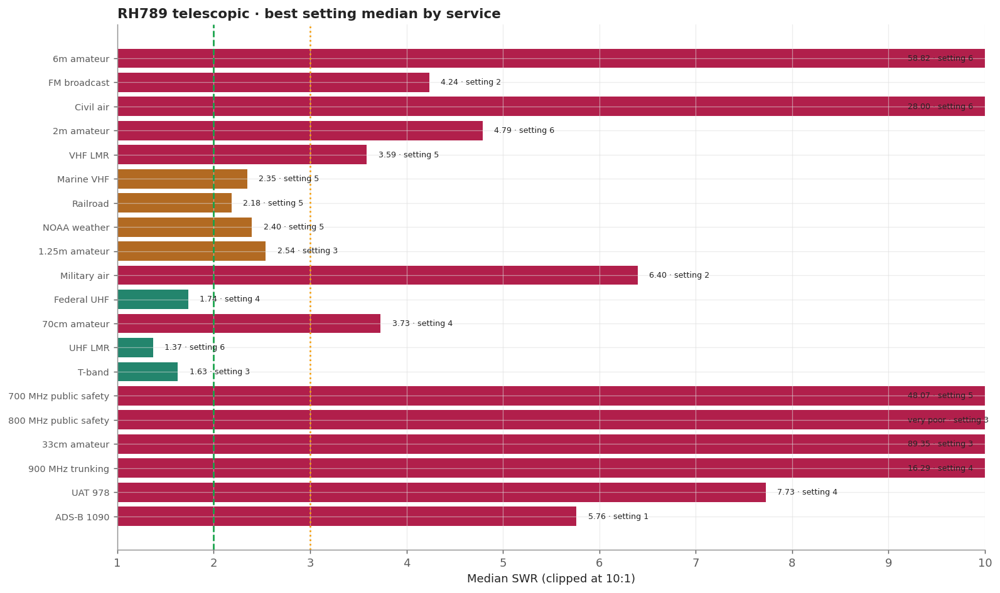
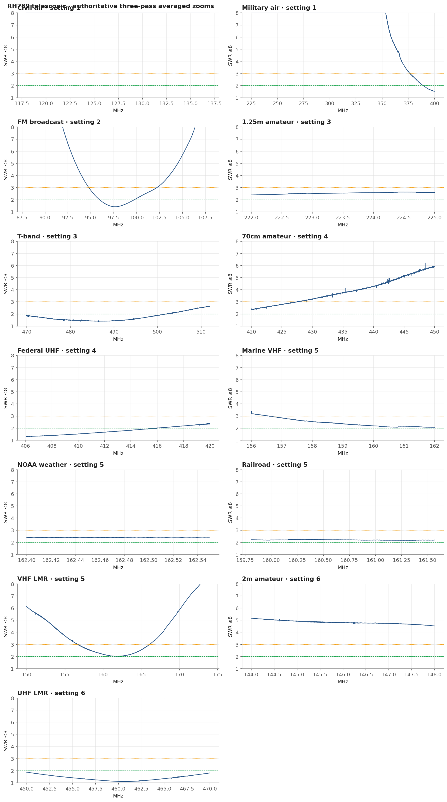
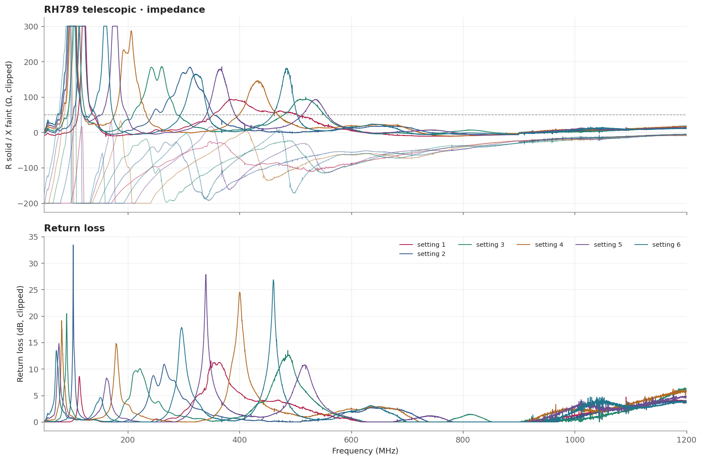

# RH789 telescopic

A telescopic whip whose match moves predictably with length, so one antenna can be retuned by hand for VHF land mobile, federal UHF, UHF land mobile, and the T-band. It is the widest-coverage antenna tested, but only if the operator is willing to change the setting.

> **SWR is impedance match only.** It does not measure receive gain, sensitivity, radiation pattern, or on-air decoding.

## Measurement inventory

- Connection: BNC, direct to the measurement plane.
- Calibrated 50-1200 MHz broadband sweep: 40,001 points (~28.75 kHz spacing).
- Three-pass complex-averaged service zooms override broadband data for the same configuration and service.
- [setting 1](measurements/setting-1-collapsed/antenna.s1p): Fully collapsed.
- [setting 2](measurements/setting-2/antenna.s1p): Fixed vane 1 plus vane 2 fully extended.
- [setting 3](measurements/setting-3/antenna.s1p): Fixed vane 1 plus vanes 2-3 fully extended.
- [setting 4](measurements/setting-4/antenna.s1p): Fixed vane 1 plus vanes 2-4 fully extended.
- [setting 5](measurements/setting-5/antenna.s1p): Fixed vane 1 plus vanes 2-5 fully extended.
- [setting 6](measurements/setting-6-fully-extended/antenna.s1p): Fixed vane 1 plus vanes 2-6 fully extended (maximum length).

## Conclusions

- Setting 5: 150-174 MHz, marine, railroad, and NOAA.
- Setting 4: federal UHF; setting 6: 450-470 MHz (1.09 minimum, below 1.88 across the band).
- Setting 3: T-band; setting 2: a narrow FM response.
- Poor at 700/800/900 MHz regardless of setting.

## Analysis charts

### Broadband overview

### Scanner scorecard

### Authoritative averaged zoom panels

### Impedance and return loss

### Setting × service heatmap

## Best measured setting by service

[Download CSV](best-setting-table.csv). Rankings use authoritative median SWR, then maximum, then minimum.

| Service | Setting | Source | Min | Median | Max |
|---|---|---|---:|---:|---:|
| 6m amateur | setting 6 | broadband | 26.06 | 58.82 | 98.51 |
| FM broadcast | setting 2 | averaged_zoom | 1.41 | 4.24 | 16.89 |
| Civil air | setting 6 | broadband | 10.93 | 28.00 | 46.81 |
| 2m amateur | setting 6 | averaged_zoom | 4.51 | 4.79 | 5.15 |
| VHF LMR | setting 5 | averaged_zoom | 2.01 | 3.59 | 9.48 |
| Marine VHF | setting 5 | averaged_zoom | 2.05 | 2.35 | 3.37 |
| Railroad | setting 5 | averaged_zoom | 2.14 | 2.18 | 2.24 |
| NOAA weather | setting 5 | averaged_zoom | 2.38 | 2.40 | 2.42 |
| 1.25m amateur | setting 3 | averaged_zoom | 2.39 | 2.54 | 2.62 |
| Military air | setting 2 | broadband | 1.80 | 6.40 | 130.52 |
| Federal UHF | setting 4 | averaged_zoom | 1.30 | 1.74 | 2.38 |
| 70cm amateur | setting 4 | averaged_zoom | 2.34 | 3.73 | 6.19 |
| UHF LMR | setting 6 | averaged_zoom | 1.09 | 1.37 | 1.87 |
| T-band | setting 3 | averaged_zoom | 1.37 | 1.63 | 2.63 |
| 700 MHz public safety | setting 5 | broadband | 31.70 | 48.07 | 93.09 |
| 800 MHz public safety | setting 3 | broadband | 5649.46 | very poor | very poor |
| 33cm amateur | setting 3 | broadband | 6.36 | 89.35 | very poor |
| 900 MHz trunking | setting 4 | broadband | 13.32 | 16.29 | 27.33 |
| UAT 978 | setting 4 | broadband | 6.53 | 7.73 | 25.66 |
| ADS-B 1090 | setting 1 | broadband | 3.79 | 5.76 | 7.34 |

## Caveats

- Every useful result depends on the setting; the wrong length is much worse than a fixed antenna.
- It is weak across 700/800/900 MHz, which is where most modern public-safety traffic lives.
- Fixed upright bench geometry, no added counterpoise; the USB cable remained part of the RF environment.
- Handheld antennas normally interact with the scanner chassis and operator. Treat these as fixture-specific comparisons.
- [Package method and calibration notes](../../README.md) · [immutable historical manual testing](../../manual-testing/)
