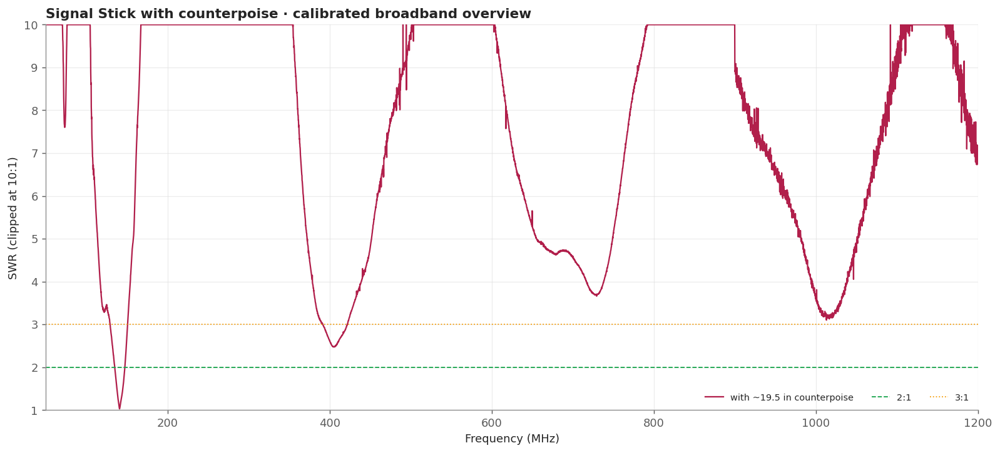
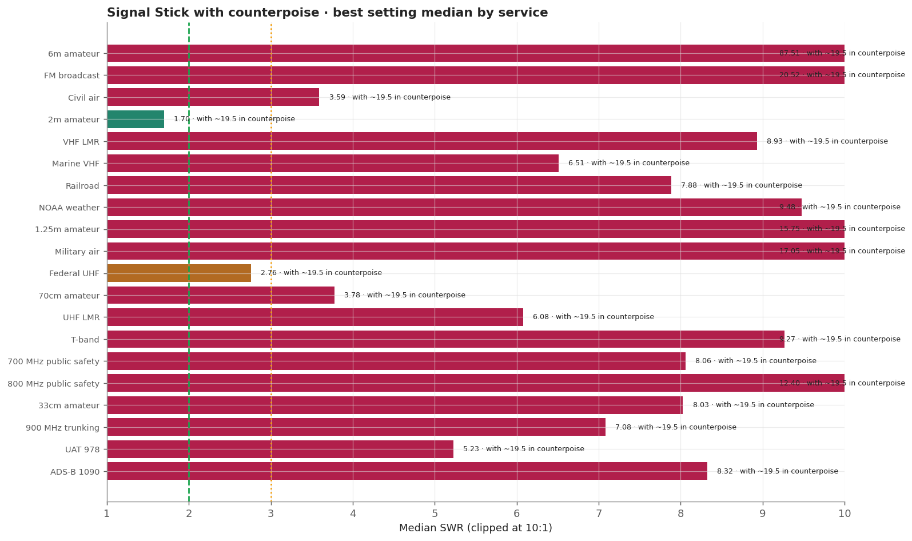
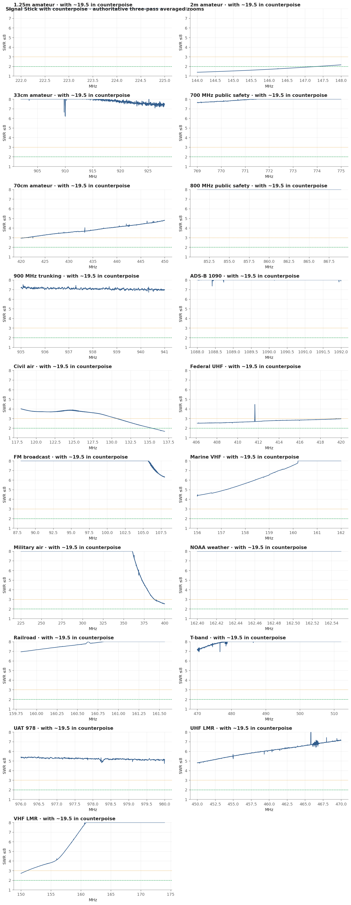
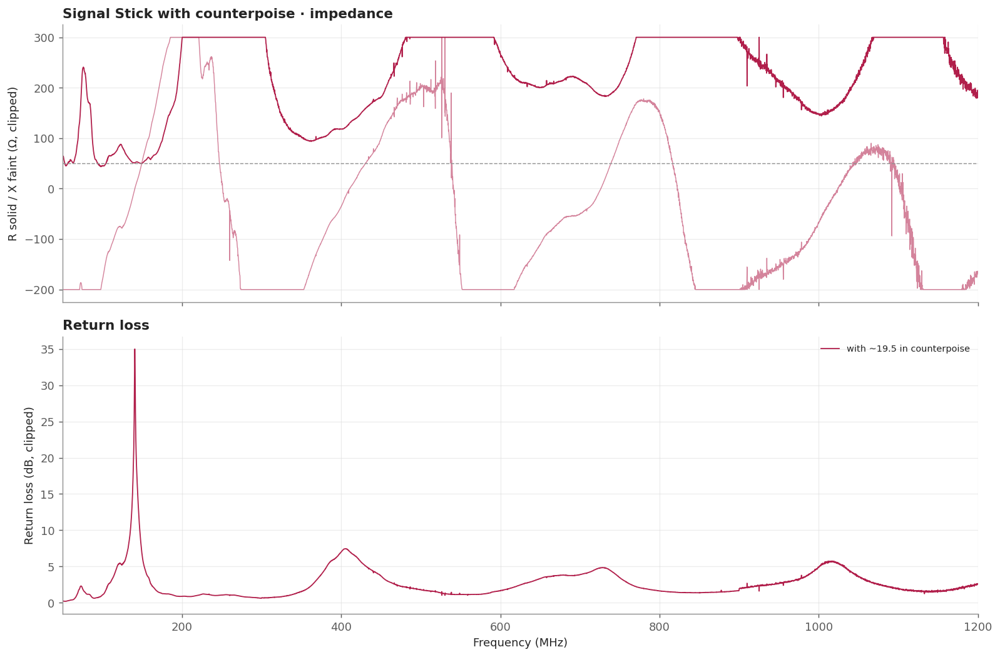

# Signal Stick with counterpoise

Fitting the counterpoise transforms 2m and detunes everything else. The 2m minimum falls from 6.41 to 1.39, coverage at or below 2:1 goes from nothing to 84 percent, and the minimum moves down to 144.0 MHz, while VHF land mobile, NOAA weather and 1.25m all get substantially worse.

> **SWR is impedance match only.** It does not measure receive gain, sensitivity, radiation pattern, or on-air decoding.

## Measurement inventory

- Connection: BNC antenna with counterpoise, direct to the measurement plane.
- Measurement context: Handheld bench fixture.
- Calibrated 50-1200 MHz broadband sweep: 40,001 points (~28.75 kHz spacing).
- Three-pass complex-averaged service zooms override broadband data for the same configuration and service.
- [with ~19.5 in counterpoise](measurements/2026-09-20-with-counterpoise/antenna.s1p): Same whip with the SignalStuff counterpoise, about 19.5 in, attached at the connector and hanging straight down.

## Conclusions

- The counterpoise transforms 2m: minimum 1.39 at 144.0 MHz, 1.70 median, 84.2% at or below 2:1.
- It detunes everything else: VHF land mobile median rises 3.84 to 8.93, NOAA 3.63 to 9.48, 1.25m 11.69 to 15.75.
- 70cm improves but stays poor: median 5.28 to 3.78.
- Counterpoise length and routing change this result; only ~19.5 in hanging vertically was measured.

## Analysis charts

### Broadband overview

### Scanner scorecard

### Authoritative averaged zoom panels

### Impedance and return loss

## Caveats

- Counterpoise length and routing change this result materially. Only the vertical hanging arrangement was measured.
- The two Signal Stick entries were captured at separate mountings rather than interleaved, so the counterpoise figure carries one remount of uncertainty. The 2m change is roughly two orders of magnitude larger than that, but the smaller shifts on other services are not separable from remount effects.
- Fixed upright bench geometry on a secured fixture, counterpoise of about 19.5 in hanging vertically from the connector; the USB cable remained part of the RF environment.
- Handheld antennas normally interact with the scanner chassis and operator. Treat these as fixture-specific comparisons.
- [Package method and calibration notes](../../README.md) · [immutable historical manual testing](../../manual-testing/)
