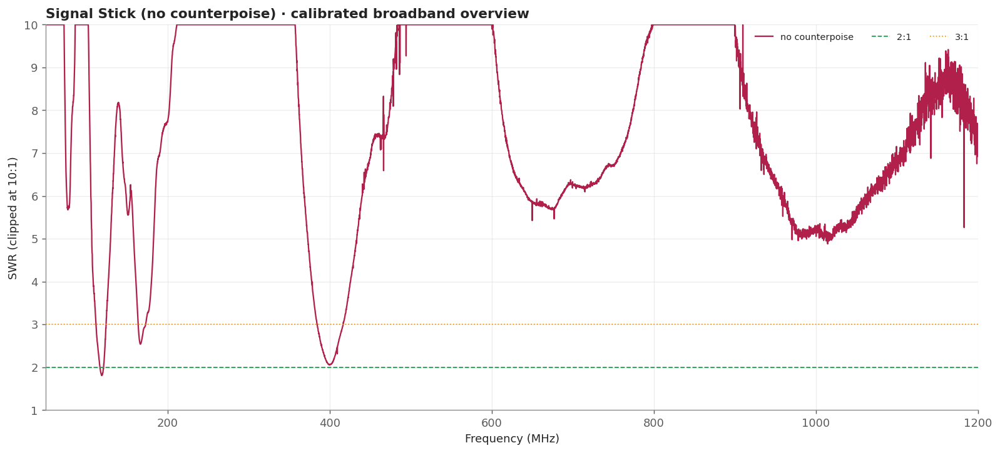
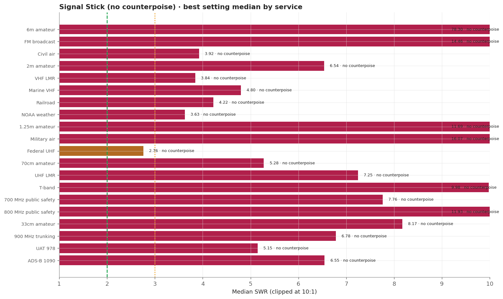
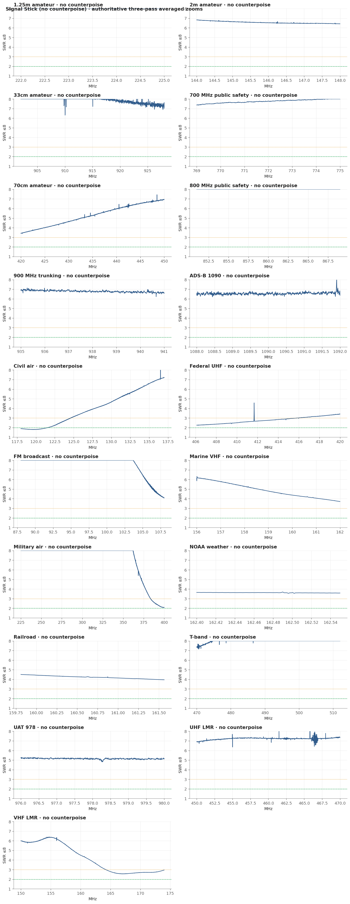
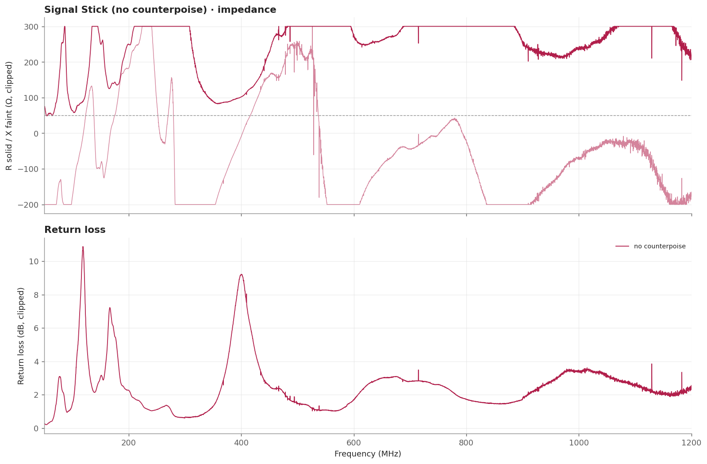

# Signal Stick (no counterpoise)

Measured without its counterpoise, this antenna matches poorly everywhere: 2m sits at 6.4-6.8 and 1.25m above 11. That is the expected and physically correct result for a whip whose only return path is the instrument body and its cable.

> **SWR is impedance match only.** It does not measure receive gain, sensitivity, radiation pattern, or on-air decoding.

## Measurement inventory

- Connection: BNC antenna, direct to the measurement plane.
- Measurement context: Handheld bench fixture.
- Calibrated 50-1200 MHz broadband sweep: 40,001 points (~28.75 kHz spacing).
- Three-pass complex-averaged service zooms override broadband data for the same configuration and service.
- [no counterpoise](measurements/2026-09-20-no-counterpoise/antenna.s1p): Flexible whip with no counterpoise fitted, BNC straight onto the calibrated plane.

## Conclusions

- Without a counterpoise this whip matches poorly everywhere: 2m 6.41-6.84, 1.25m 11.06-12.68.
- Kept as the measured control for the counterpoise comparison, not as a recommendation.

## Analysis charts

### Broadband overview

### Scanner scorecard

### Authoritative averaged zoom panels

### Impedance and return loss

## Caveats

- This configuration is the control for the counterpoise comparison, not a recommendation. Fit the counterpoise before judging the antenna.
- One isolated sample at 465.811 MHz exceeded a physical reflection and was excluded from the broadband Touchstone.
- Fixed upright bench geometry on a secured fixture, no counterpoise fitted; the USB cable remained part of the RF environment.
- Handheld antennas normally interact with the scanner chassis and operator. Treat these as fixture-specific comparisons.
- [Package method and calibration notes](../../README.md) · [immutable historical manual testing](../../manual-testing/)
