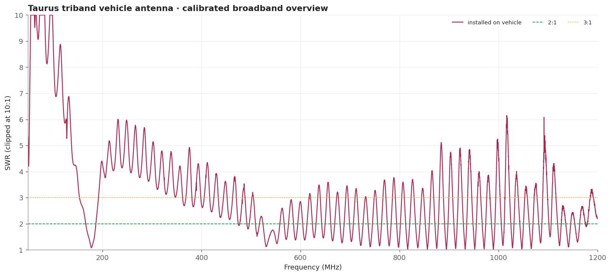
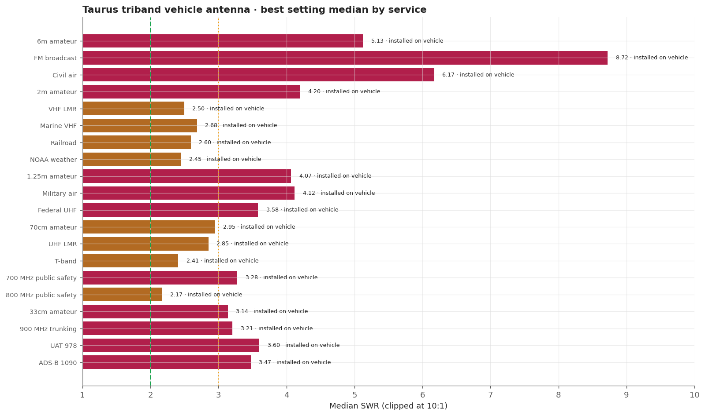
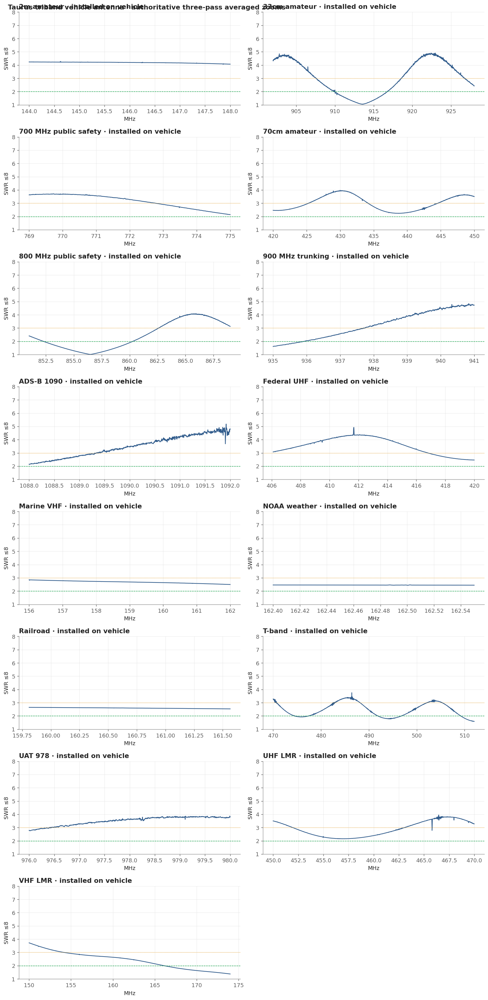
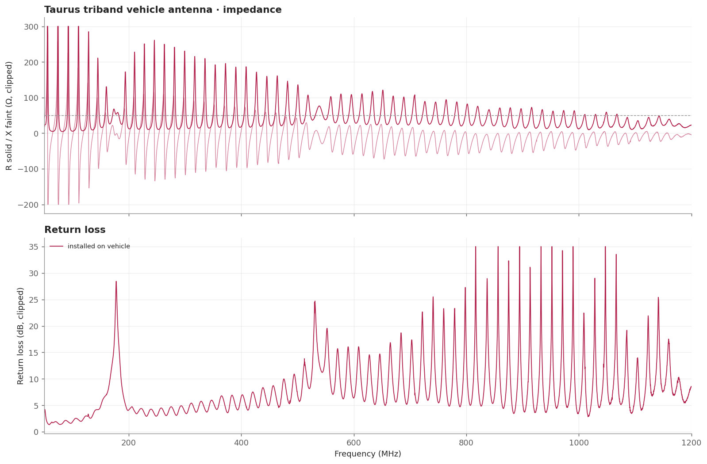

# Taurus triband vehicle antenna

A permanently installed vehicle triband scanner antenna. Its measured match is strongest near the upper end of VHF land mobile, around 856.5 MHz, and around 913.5 MHz. It provides useful installed coverage for marine, railroad, NOAA weather, and parts of the 800/900 MHz range, but it does not broadly cover every nominal triband service.

> **SWR is impedance match only.** It does not measure receive gain, sensitivity, radiation pattern, or on-air decoding.

## Measurement inventory

- Connection: NanoVNA BNC reference plane into the installed antenna feed; the antenna-side BNC-to-PL-239 adapter remained part of the DUT.
- Measurement context: Installed vehicle.
- Calibrated 50-1200 MHz broadband sweep: 40,001 points (~28.75 kHz spacing).
- Three-pass complex-averaged service zooms override broadband data for the same configuration and service.
- [installed on vehicle](measurements/2026-08-16-installed/antenna.s1p): Measured in the normal vehicle installation with the vehicle off, body closed, and feed line in its normal route.

## Conclusions

- Broadly usable under 3:1 across marine, railroad, and NOAA weather; 150-174 MHz is useful but uneven.
- 800 MHz has an excellent 1.01 minimum at 856.472 MHz, but a 2.17 median and only 44.5% of the downlink window at or below 2:1.
- 33cm has an excellent 1.05 minimum at 913.518 MHz but only partial full-window coverage; 900 MHz trunking is also partial.
- 700 MHz, 70cm, federal/UHF LMR, T-band, UAT, and ADS-B are partial or weak; FM, civil air, 2m, and 6m are clear gaps.

## Analysis charts

### Broadband overview

### Scanner scorecard

### Authoritative averaged zoom panels

### Impedance and return loss

## Caveats

- This installed-vehicle result uses a separate BNC-plane calibration and must not be treated as a controlled gain comparison with the handheld bench fixture.
- The excellent minima at 856.472 and 913.518 MHz are narrow; median and coverage figures describe the full service windows more honestly.
- FM broadcast, civil air, 2m, 6m, UAT, and ADS-B remain weak matches.
- Measured in the normal vehicle installation with the vehicle off, doors/hood/trunk closed, and feed line in its normal route.
- Vehicle body, mounting location, feed line, and antenna-side adapter are part of this installed result.
- [Package method and calibration notes](../../README.md) · [immutable historical manual testing](../../manual-testing/)
