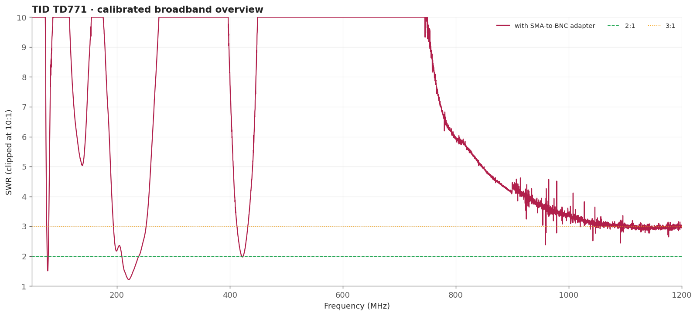
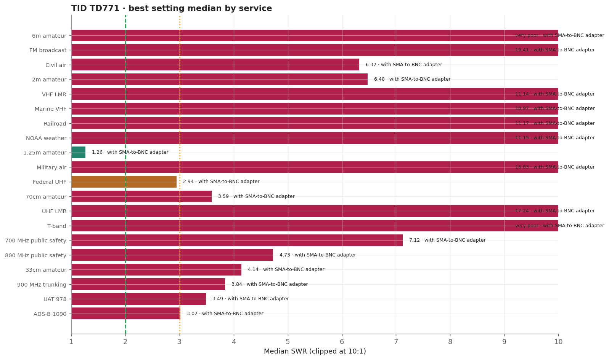
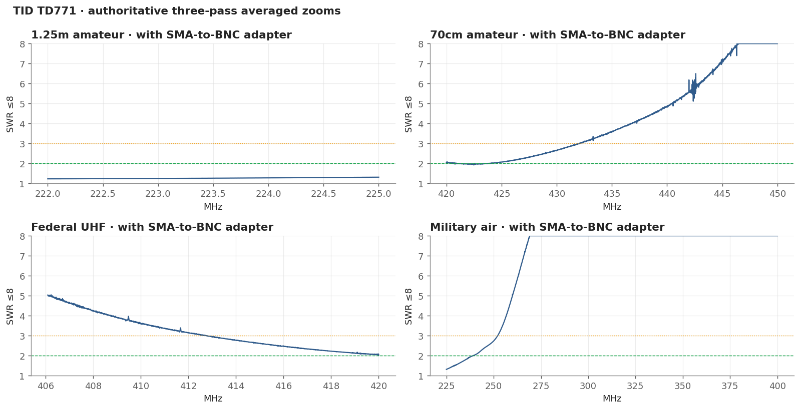
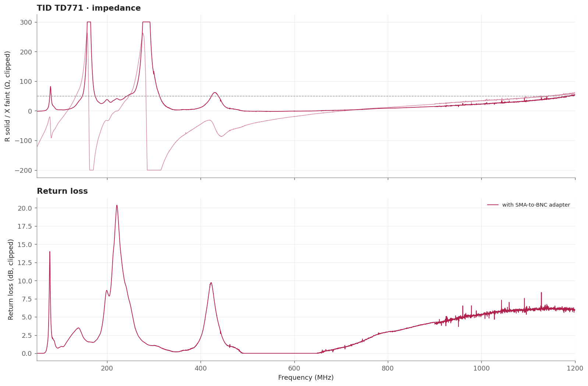

# TID TD771

A long flexible whip that turned out to be the standout performer on the 222-225 MHz amateur band, where it holds a very good match across the entire allocation. Elsewhere it is narrow, with isolated responses near 225 MHz and 422 MHz.

> **SWR is impedance match only.** It does not measure receive gain, sensitivity, radiation pattern, or on-air decoding.

## Measurement inventory

- Connection: SMA antenna with an SMA-to-BNC adapter.
- Calibrated 50-1200 MHz broadband sweep: 40,001 points (~28.75 kHz spacing).
- Three-pass complex-averaged service zooms override broadband data for the same configuration and service.
- [with SMA-to-BNC adapter](measurements/2026-08-16-with-sma-bnc-adapter/antenna.s1p): Single fixed configuration measured through the required adapter.

## Conclusions

- Outstanding across all of 222-225 MHz: approximately 1.23-1.31 SWR.
- Other useful responses are narrow, near 225 and 422 MHz.

## Analysis charts

### Broadband overview

### Scanner scorecard

### Authoritative averaged zoom panels

### Impedance and return loss

## Caveats

- VHF land mobile and the 700/800 MHz public-safety windows are poor in this fixture.
- Results include the SMA-to-BNC adapter, which is part of the practical installation.
- Fixed upright bench geometry, no added counterpoise; the USB cable remained part of the RF environment.
- Handheld antennas normally interact with the scanner chassis and operator. Treat these as fixture-specific comparisons.
- [Package method and calibration notes](../../README.md) · [immutable historical manual testing](../../manual-testing/)
