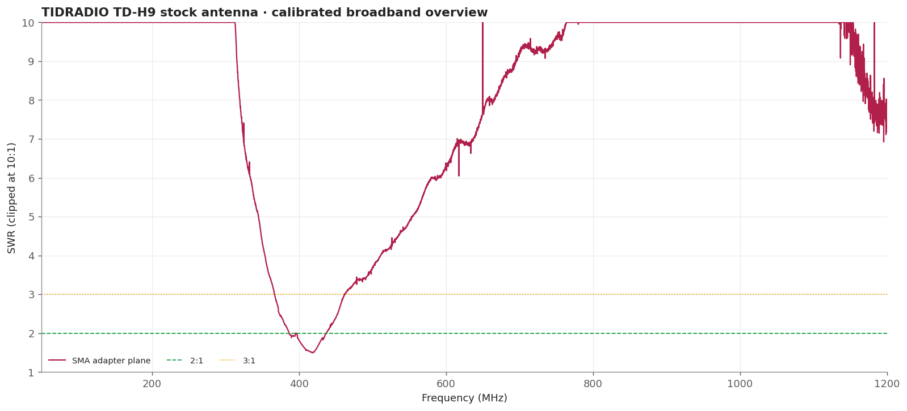
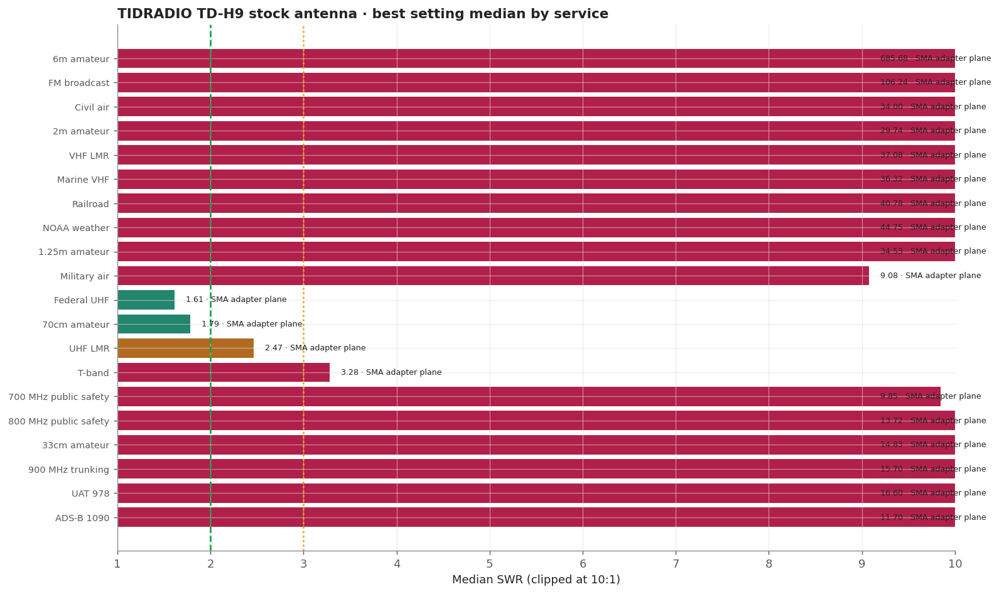
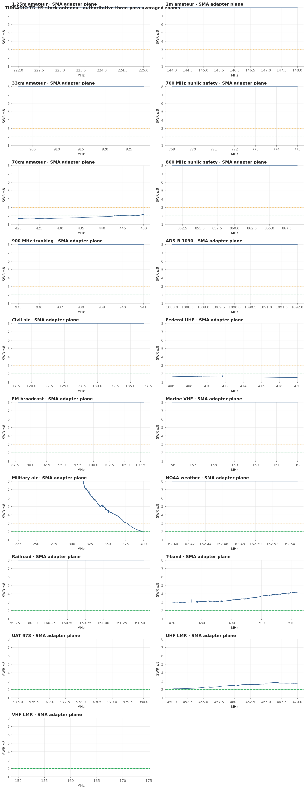
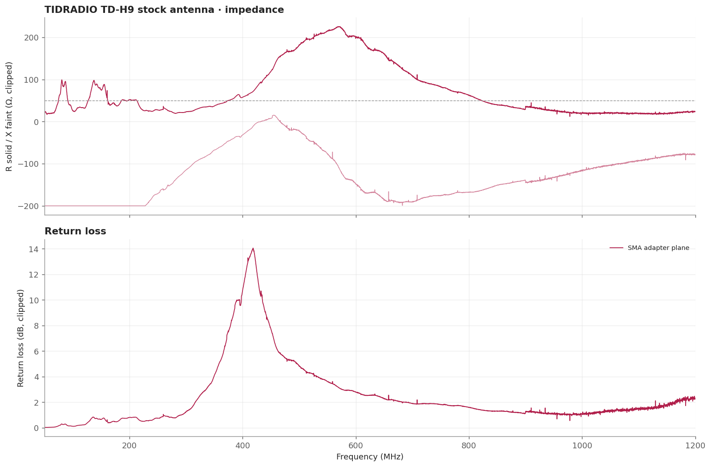

# TIDRADIO TD-H9 stock antenna

The August 2026 capture of this antenna was rejected as invalid: it read electrically open across every band it is designed for. The September recapture shows a working UHF antenna, so that first result was a connection fault, not the antenna. It is one of the strongest UHF performers measured, and like every counterpoise-less whip here it is very poor at VHF on this fixture.

> **SWR is impedance match only.** It does not measure receive gain, sensitivity, radiation pattern, or on-air decoding.

## Measurement inventory

- Connection: SMA-female antenna via an SMA male-to-male adapter.
- Measurement context: Handheld bench fixture, SMA plane.
- Calibrated 50-1200 MHz broadband sweep: 40,001 points (~28.75 kHz spacing).
- Three-pass complex-averaged service zooms override broadband data for the same configuration and service.
- [SMA adapter plane](measurements/2026-09-20-sma-adapter/antenna.s1p): Recaptured 2026-09-20 at the SMA male-to-male adapter plane after the August attempt was rejected as inconclusive.

## Conclusions

- Useful around 406-470 MHz, strongest at the 420 MHz edge.
- Broadest measured handheld-fixture match across both UAT 978 and ADS-B 1090, though match alone does not establish tracking sensitivity.
- Poor at VHF and 700/800 MHz in this no-radio-chassis fixture.

## Analysis charts

### Broadband overview

### Scanner scorecard

### Authoritative averaged zoom panels

### Impedance and return loss

## Caveats

- Its 2m and VHF figures describe the antenna plus a fixture with no radio chassis, not its behaviour on a TD-H9.
- The August capture is preserved separately and remains invalid.
- Fixed upright bench geometry on a secured fixture, no counterpoise; the USB cable remained part of the RF environment.
- Vehicle body, mounting location, feed line, and antenna-side adapter are part of this installed result.
- [Package method and calibration notes](../../README.md) · [immutable historical manual testing](../../manual-testing/)
