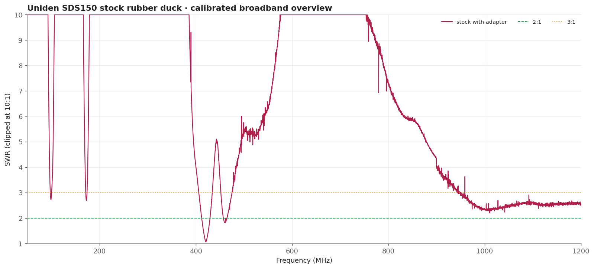
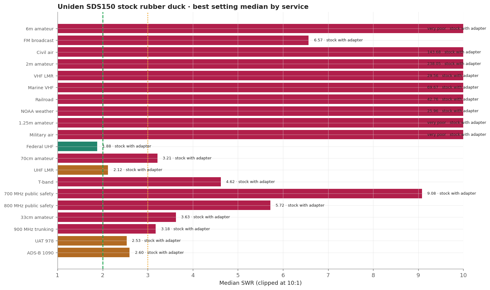
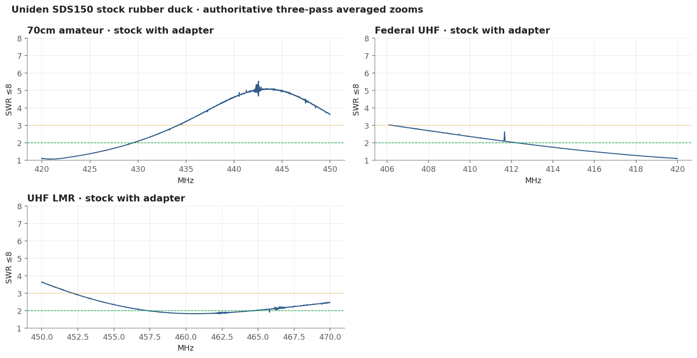
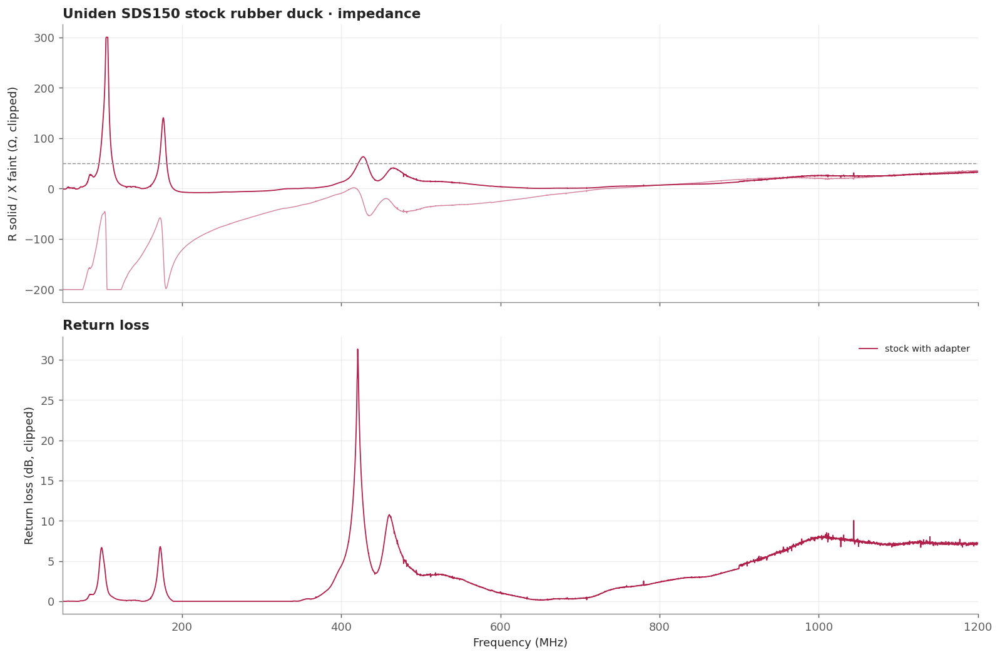

# Uniden SDS150 stock rubber duck

The reference point: whatever the scanner already has on it. In this fixture it is usable around the 406-420 MHz federal band and near the bottom edge of 70cm, moderate on UHF land mobile, and poor everywhere else that was measured.

> **SWR is impedance match only.** It does not measure receive gain, sensitivity, radiation pattern, or on-air decoding.

## Measurement inventory

- Connection: stock scanner antenna with the required adapter.
- Calibrated 50-1200 MHz broadband sweep: 40,001 points (~28.75 kHz spacing).
- Three-pass complex-averaged service zooms override broadband data for the same configuration and service.
- [stock with adapter](measurements/2026-08-16/antenna.s1p): The antenna shipped with the scanner, measured through the required adapter.

## Conclusions

- Useful around 406-470 MHz, strongest at the 420 MHz edge.
- Poor at VHF and 700/800 MHz in this no-radio-chassis fixture.

## Analysis charts

### Broadband overview

### Scanner scorecard

### Authoritative averaged zoom panels

### Impedance and return loss

## Caveats

- A stock rubber duck is designed to work against the radio body. Measuring it on a bench fixture with no chassis understates VHF.
- Use it as the baseline the other antennas have to beat, not as a characterization of the shipped product.
- Fixed upright bench geometry, no added counterpoise; the USB cable remained part of the RF environment.
- Handheld antennas normally interact with the scanner chassis and operator. Treat these as fixture-specific comparisons.
- [Package method and calibration notes](../../README.md) · [immutable historical manual testing](../../manual-testing/)
