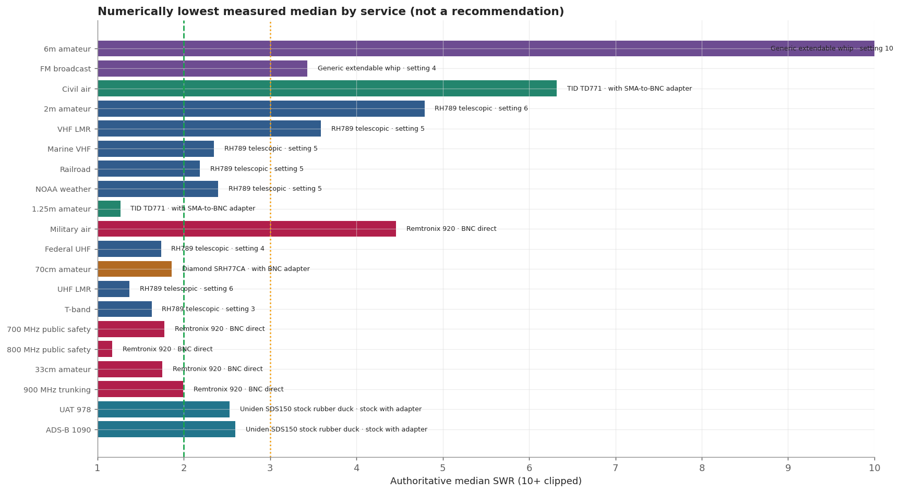
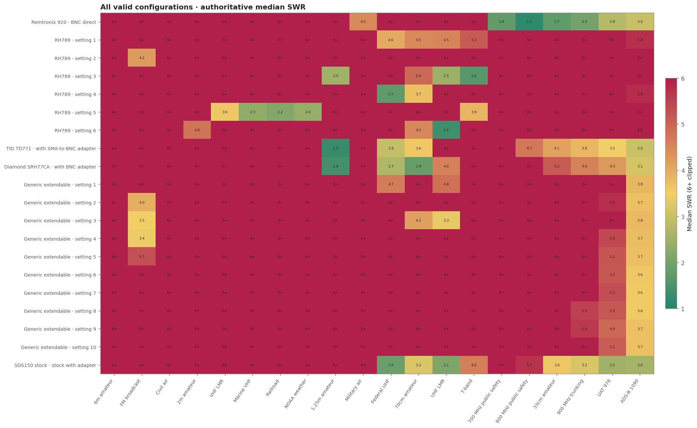
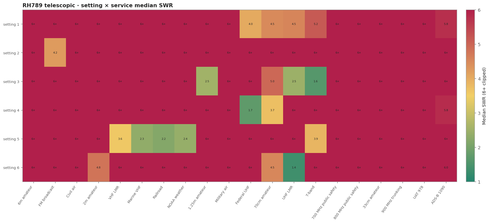
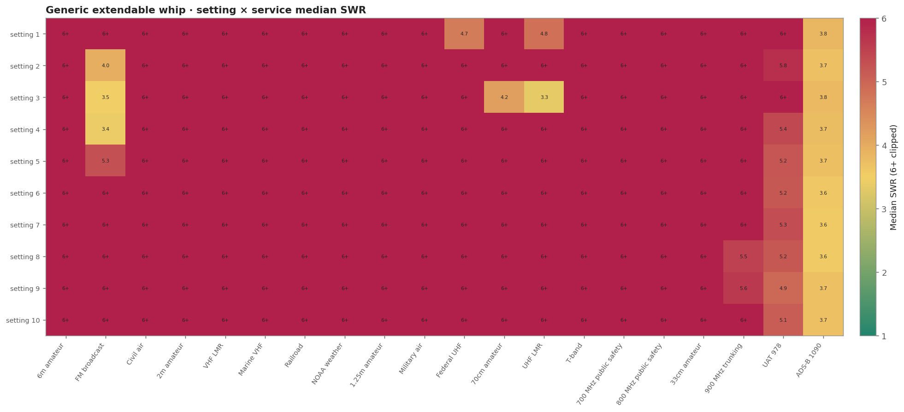
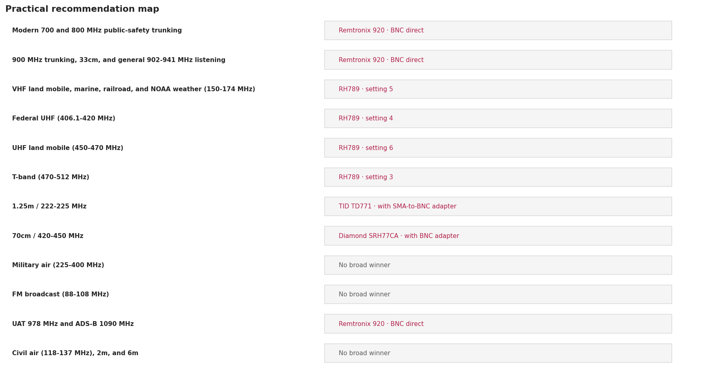

# Scanner antenna comparison

> **SWR is impedance match only—not receive gain, sensitivity, radiation pattern, or decoded-signal performance.**

Rankings use the authoritative median SWR, then maximum, then minimum. An exact service/configuration averaged zoom overrides broadband data. The invalid TIDRADIO H9 stock capture is excluded.

## Circumstance table

| Circumstance | Primary recommendation | Alternate / qualification |
|---|---|---|
| Modern 700 and 800 MHz public-safety trunking | Remtronix 920 — BNC direct | The only tested antenna that holds a good match across both downlink blocks. This is the normal SDS150 use case in Washington. |
| 900 MHz trunking, 33cm, and general 902-941 MHz listening | Remtronix 920 — BNC direct | Nothing else tested comes close in this range. |
| VHF land mobile, marine, railroad, and NOAA weather (150-174 MHz) | RH789 — setting 5 | Extend the RH789 to setting 5. Usable rather than excellent, but it is the only tested configuration that works at all across 150-174 MHz. |
| Federal UHF (406.1-420 MHz) | RH789 — setting 4 | Alternate(s): SDS150 stock — stock with adapter, Diamond SRH77CA — with BNC adapter. RH789 at setting 4 is the best broad match. The stock SDS150 antenna is a reasonable no-change alternate near the top of the band. |
| UHF land mobile (450-470 MHz) | RH789 — setting 6 | Alternate(s): SDS150 stock — stock with adapter. RH789 fully extended keeps the entire 450-470 MHz block under 1.9:1, the best single result of the whole survey outside the 800 MHz block. |
| T-band (470-512 MHz) | RH789 — setting 3 | RH789 at setting 3 is the only configuration with a broad T-band match. |
| 1.25m / 222-225 MHz | TID TD771 — with SMA-to-BNC adapter | Alternate(s): Diamond SRH77CA — with BNC adapter. The TD771 is excellent across the whole allocation; the Diamond SRH77CA is a close and equally hands-off alternate. |
| 70cm / 420-450 MHz | Diamond SRH77CA — with BNC adapter | Alternate(s): SDS150 stock — stock with adapter. The Diamond is the strongest broad choice. The stock antenna is useful near the lower band edge only. |
| Military air (225-400 MHz) | No broad measured winner | Alternate(s): Remtronix 920 — BNC direct, Generic extendable — setting 2, Diamond SRH77CA — with BNC adapter. No tested antenna covers this 175 MHz-wide range evenly. Pick by sub-range: Remtronix 920 near 296 MHz, generic extendable setting 2 near 271 MHz, Diamond SRH77CA near 227.5 MHz. |
| FM broadcast (88-108 MHz) | No broad measured winner | Alternate(s): RH789 — setting 2, Generic extendable — setting 2. Both options are narrow and geometry-sensitive: RH789 setting 2 near 97.66 MHz, generic extendable setting 2 near 101.25 MHz. Neither matches the whole broadcast band. |
| UAT 978 MHz and ADS-B 1090 MHz | Remtronix 920 — BNC direct | Best of the tested set but only a moderate match, and a moderate match is not the same as usable aircraft-tracking sensitivity. |
| Civil air (118-137 MHz), 2m, and 6m | No broad measured winner | Nothing tested matched these bands in this no-radio-chassis fixture. No recommendation is made; do not read a winner into the rankings here. |

## Best one antenna

**Remtronix 920** for typical SDS150 modern public-safety trunking. It is the clear measured choice for 700/800 MHz and remains useful through 900 MHz.

Choose the **RH789** instead when manual retuning and broad VHF/UHF flexibility matter more. It covers more legacy and conventional services at the right settings, but misses 700/800/900 MHz.

## Best two-antenna combination

**Remtronix 920 + RH789.** The pair combines modern trunking with manually tuned VHF/UHF flexibility. Substitute or add the **TD771** when 222-225 MHz is the priority; use the **Diamond SRH77CA** when broad 420-450 MHz performance is the priority.

## Files and charts

- [CSV scorecard](scanner-band-scorecard.csv) · [standards-compliant JSON](scanner-band-scorecard.json)
- [Offline interactive report](interactive-report.html)

The chart above shows the lowest measured median even when every option is
poor. Use the circumstance table—not this raw numerical rank—for practical
antenna selection.

Civil air and 2m have no good measured winner in this no-radio-chassis fixture. Military air consists of split, narrow resonances rather than one broad solution.
