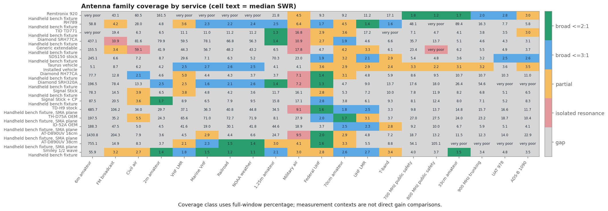

# Scanner antenna comparison

> **SWR is impedance match only—not receive gain, sensitivity, radiation pattern, or decoded-signal performance.**

Rankings use the authoritative median SWR, then maximum, then minimum. An exact service/configuration averaged zoom overrides broadband data. The invalid TIDRADIO H9 stock capture is excluded.

> The installed Taurus vehicle antenna has a separate calibration and RF environment. Its rows are included for complete inventory coverage, but numeric SWR ranks across vehicle and handheld contexts are descriptive rather than controlled gain comparisons.

## Circumstance table

| Circumstance | Primary recommendation | Alternate / qualification |
|---|---|---|
| Modern 700 and 800 MHz public-safety trunking | Remtronix 920 — BNC direct | The only tested antenna that holds a good match across both downlink blocks. This is the normal SDS150 use case in Washington. |
| Installed vehicle monitoring: VHF high, 800 MHz, and 33cm | Taurus vehicle — installed on vehicle | The Taurus is the measured installed-vehicle option. It broadly stays under 3:1 on marine, railroad, and NOAA, is uneven across 150-174 MHz, and has narrow excellent matches near 856.5 and 913.5 MHz. This is not a direct gain comparison with handheld antennas. |
| 900 MHz trunking, 33cm, and general 902-941 MHz listening | Remtronix 920 — BNC direct | The Remtronix remains the broad handheld-fixture choice. The installed Taurus has narrow excellent matches in 33cm and partial 900 MHz coverage. |
| VHF land mobile, marine, railroad, and NOAA weather (150-174 MHz) | Smiley 1/2 wave — setting 5 (69 cm) | Alternate(s): Diamond SRH320A — with BNC-to-SMA adapter, AT-D890UV 38cm — SMA adapter plane, RH789 — setting 5. The Smiley at 69 cm holds all of NOAA weather, marine and railroad at or below 2:1 and two thirds of 150-174 MHz, the best VHF-high result in the survey. The AnyTone long whip also covers the whole NOAA window. The SRH320A is the best hands-off fixed choice at a 2.46 median. The installed Taurus provides usable but uneven VHF-high coverage in its separate vehicle context. |
| Federal UHF (406.1-420 MHz) | Diamond SRH320A — with BNC-to-SMA adapter | Alternate(s): AT-D890UV 38cm — SMA adapter plane, AT-D890UV 16cm — SMA adapter plane, TD-H9 stock — SMA adapter plane. The SRH320A is the strongest measured federal-UHF match: 1.08 minimum, 1.30 median, 96.4 percent of the window at or below 2:1. The AnyTone long whip and the TD-H9 stock antenna both hold the entire block at or below 2:1 with slightly higher medians, and the AnyTone rubber duck reaches 88 percent. This is the best-served band in the whole survey. |
| UHF land mobile (450-470 MHz) | RH789 — setting 6 | Alternate(s): SDS150 stock — stock with adapter. RH789 fully extended keeps the entire 450-470 MHz block under 1.9:1, the best single result of the whole survey outside the 800 MHz block. |
| T-band (470-512 MHz) | RH789 — setting 3 | RH789 at setting 3 is the only configuration with a broad T-band match. |
| 1.25m / 222-225 MHz | TID TD771 — with SMA-to-BNC adapter | Alternate(s): Diamond SRH77CA — with BNC adapter, Diamond SRH320A — with BNC-to-SMA adapter. The TD771 is excellent across the whole allocation; the Diamond SRH77CA and SRH320A are close, equally hands-off alternates. All three hold the entire 222-225 MHz allocation at or below 2:1. |
| 70cm / 420-450 MHz | TH-D75A OEM — bare SMA plane | Alternate(s): TD-H9 stock — SMA adapter plane, Diamond SRH77CA — with BNC adapter. The TH-D75A OEM whip is the strongest 70cm match measured, at a 1.66 median and 86.5 percent of 420-450 MHz at or below 2:1, with the TD-H9 stock antenna close behind at 76.7 percent. Both are supplied antennas that cost nothing extra. The Diamond SRH77CA remains the best result at the original SMA-to-BNC bench plane. |
| Military air (225-400 MHz) | No broad measured winner | Alternate(s): Remtronix 920 — BNC direct, Generic extendable — setting 2, Diamond SRH77CA — with BNC adapter. No tested antenna covers this 175 MHz-wide range evenly. Pick by sub-range: Remtronix 920 near 296 MHz, generic extendable setting 2 near 271 MHz, Diamond SRH77CA near 227.5 MHz. |
| FM broadcast (88-108 MHz) | No broad measured winner | Alternate(s): Generic extendable — setting 4, RH789 — setting 2, Generic extendable — setting 2. Generic setting 4 has the largest measured partial coverage, but that result is broadband-only and this family is session-sensitive. Averaged zooms show narrow responses for RH789 setting 2 near 97.66 MHz and generic setting 2 near 101.25 MHz. None matches the whole broadcast band. |
| UAT 978 MHz and ADS-B 1090 MHz | SDS150 stock — stock with adapter | Alternate(s): Remtronix 920 — BNC direct. The stock antenna has the broadest measured match across both windows in the handheld fixture. The Remtronix is close on UAT but only partial at 1090 MHz. Match is not the same as aircraft-tracking sensitivity. |
| 2m / 144-148 MHz | Smiley 1/2 wave — setting 6 (80 cm) | Alternate(s): Signal Stick + CP — with ~19.5 in counterpoise, Diamond SRH320A — with BNC-to-SMA adapter. The Smiley half-wave at 80 cm is the clear winner: 1.22 minimum and 100 percent of 144-148 MHz at or below 2:1, with no counterpoise needed. Length is critical, not incidental - the same antenna covers none of the band at 69 cm or fully extended. The Signal Stick reaches 84.2 percent but only with its counterpoise fitted, which costs it VHF land mobile, NOAA weather and 1.25m. Every quarter-wave whip here is poor on 2m because the fixture gives them no chassis to work against; the half-wave does not need one, which is exactly why it wins. |
| Civil air (118-137 MHz) and 6m | No broad measured winner | No tested configuration has a broad match on these bands. No recommendation is made; do not read a winner into the numerical rankings here. |

## Best one antenna

**Remtronix 920** for typical SDS150 modern public-safety trunking. It is the clear measured choice for 700/800 MHz and remains useful through 900 MHz.

Choose the **RH789** instead when manual retuning and broad VHF/UHF flexibility matter more. It covers more legacy and conventional services at the right settings, but misses 700/800/900 MHz.

## Best two-antenna combination

**Remtronix 920 + RH789.** The pair combines modern trunking with manually tuned VHF/UHF flexibility. Substitute or add the **TD771** when 222-225 MHz is the priority; use the **Diamond SRH77CA** when broad 420-450 MHz performance is the priority.

## Performance and coverage at a glance

Coverage classes use the complete service window, not an isolated low-SWR point: **broad <=2:1** means at least 80% of the window is <=2:1; **broad <=3:1** means at least 80% is <=3:1; **partial only** means at least 20% is <=3:1; **isolated resonance** means a <=2:1 minimum exists but less than 20% is <=3:1; everything else is a **gap**.

| Service | Inventory coverage | Best available full-window result | Context | Median | <=2 | <=3 |
|---|---|---|---|---:|---:|---:|
| 6m amateur | gap | Generic extendable whip - setting 3 | Handheld bench fixture | 155.51 | 0.0% | 12.1% |
| FM broadcast | partial only | Smiley 2m half-wave telescopic - setting 2 (34.5 cm) | Handheld bench fixture | 3.16 | 23.8% | 45.9% |
| Civil air | broad <=3:1 | Diamond RH77CA - first mounting | Handheld bench fixture | 2.13 | 42.4% | 80.4% |
| 2m amateur | broad <=2:1 | Smiley 2m half-wave telescopic - setting 6 (80 cm) | Handheld bench fixture | 1.39 | 100.0% | 100.0% |
| VHF LMR | broad <=3:1 | Smiley 2m half-wave telescopic - setting 5 (69 cm) | Handheld bench fixture | 1.83 | 67.9% | 93.8% |
| Marine VHF | broad <=2:1 | Smiley 2m half-wave telescopic - setting 5 (69 cm) | Handheld bench fixture | 1.52 | 100.0% | 100.0% |
| Railroad | broad <=2:1 | Smiley 2m half-wave telescopic - setting 5 (69 cm) | Handheld bench fixture | 1.22 | 100.0% | 100.0% |
| NOAA weather | broad <=2:1 | Smiley 2m half-wave telescopic - setting 5 (69 cm) | Handheld bench fixture | 1.13 | 100.0% | 100.0% |
| 1.25m amateur | broad <=2:1 | TID TD771 - with SMA-to-BNC adapter | Handheld bench fixture | 1.26 | 100.0% | 100.0% |
| Military air | partial only | Smiley 2m half-wave telescopic - setting 1 (collapsed, 22 cm) | Handheld bench fixture | 2.96 | 32.1% | 50.2% |
| Federal UHF | broad <=2:1 | Diamond RH77CA - second mounting | Handheld bench fixture | 1.37 | 100.0% | 100.0% |
| 70cm amateur | broad <=2:1 | Kenwood TH-D75A OEM antenna - bare SMA plane | Handheld bench fixture, SMA plane | 1.66 | 86.5% | 100.0% |
| UHF LMR | broad <=2:1 | RH789 telescopic - setting 6 | Handheld bench fixture | 1.37 | 100.0% | 100.0% |
| T-band | broad <=3:1 | RH789 telescopic - setting 3 | Handheld bench fixture | 1.63 | 76.8% | 100.0% |
| 700 MHz public safety | broad <=2:1 | Remtronix 920 - BNC direct | Handheld bench fixture | 1.77 | 100.0% | 100.0% |
| 800 MHz public safety | broad <=2:1 | Remtronix 920 - BNC direct | Handheld bench fixture | 1.17 | 100.0% | 100.0% |
| 33cm amateur | broad <=2:1 | Remtronix 920 - BNC direct | Handheld bench fixture | 1.75 | 99.9% | 100.0% |
| 900 MHz trunking | broad <=3:1 | Remtronix 920 - BNC direct | Handheld bench fixture | 1.99 | 65.3% | 100.0% |
| UAT 978 | broad <=3:1 | Uniden SDS150 stock rubber duck - stock with adapter | Handheld bench fixture | 2.53 | 0.0% | 100.0% |
| ADS-B 1090 | broad <=3:1 | Uniden SDS150 stock rubber duck - stock with adapter | Handheld bench fixture | 2.60 | 0.0% | 100.0% |

## Remaining inventory gaps

- **Hard gaps:** 6m amateur.
- **Partial-only coverage:** FM broadcast, Military air.
- **Isolated resonance only:** none.
- These are impedance-match gaps, not proof that signals cannot be received. On-air RSSI/noise-floor/decode testing is still needed, especially across the two different fixture contexts.

## Files and charts

- [CSV scorecard](scanner-band-scorecard.csv) · [standards-compliant JSON](scanner-band-scorecard.json)
- [Family coverage CSV](family-coverage-summary.csv) · [inventory gap CSV](inventory-coverage-gaps.csv) · [coverage JSON](coverage-summary.json)
- [Offline interactive report](interactive-report.html)

The chart above shows the lowest measured median even when every option is
poor. Use the circumstance table—not this raw numerical rank—for practical
antenna selection.

The gap table above is generated from full-window coverage. Military air consists of split, narrow resonances rather than one broad solution.
