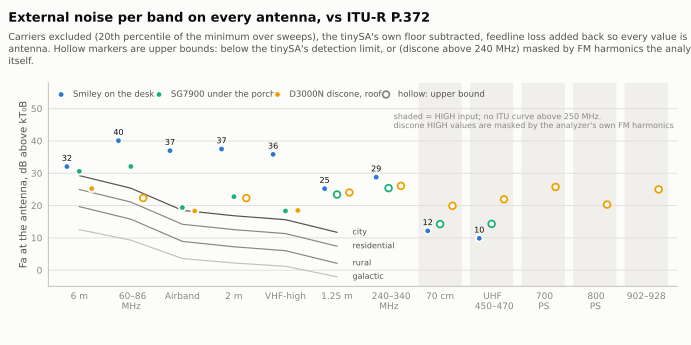
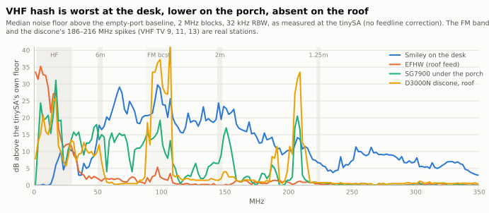
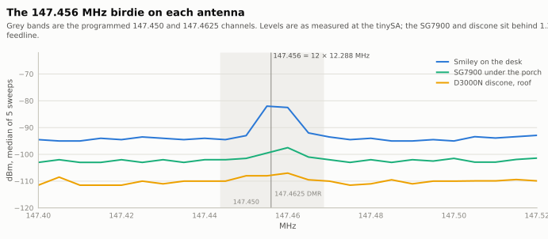
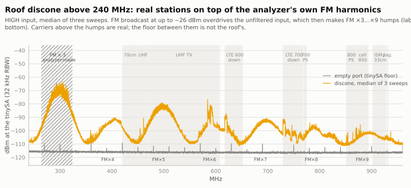
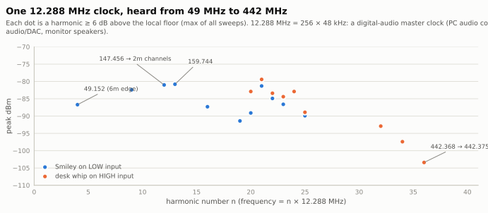
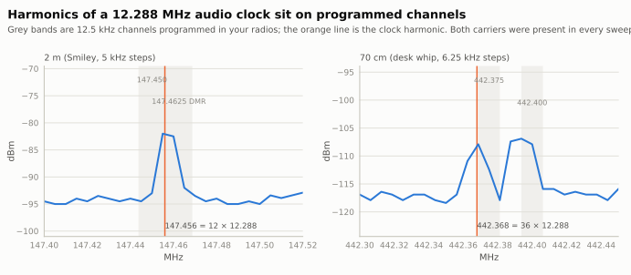
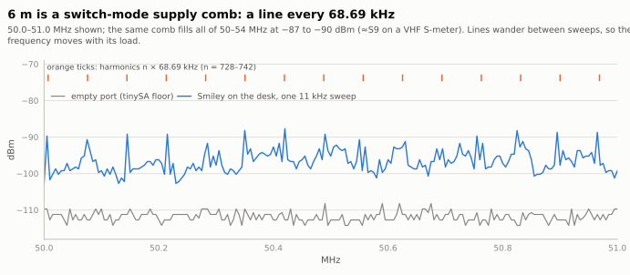
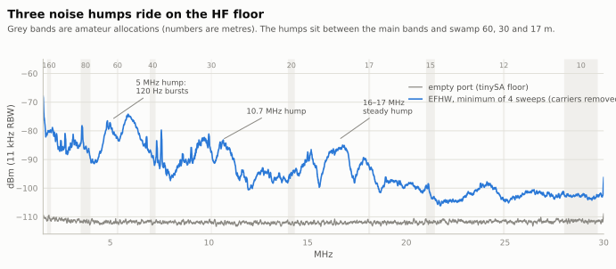
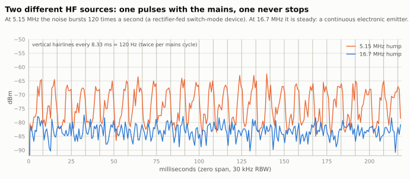
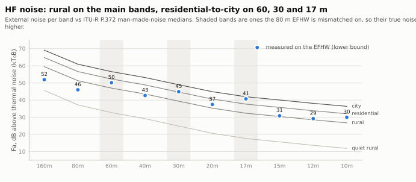

# RF environment survey, 2026-09-23

A sweep of the receive environment at the operator's QTH (Ames Lake / Redmond), looking for interference that
reaches the radios. It used a basic tinySA (hardware v0.3, firmware `tinySA_v1.4-175`) on COM17, from 20:52 to
23:45 local time, on four antennas:

| Antenna | Where | Feedline to the tinySA | Loss at 146 / 435 / 860 MHz |
|---|---|---|---|
| **Smiley 2 m half-wave**, 69 cm (plus the stock whip for 70 cm/UHF) | on the office desk, ~1 m from the PC | none (on the SMA) | 0 |
| **JYR8010 80 m EFHW** | outdoor sloper | 150 ft KMR400 + window feed-through + 20 ft KMR400 | 2.9 / 5.1 / — dB (0.3–1.3 dB on HF) |
| **Diamond SG7900** 2 m/70 cm | under the porch, base ~5 ft up, ~16 ft from the office window | 16 ft RG-8X + window feed-through + 20 ft KMR400 | 1.2 / 2.2 / — dB |
| **Diamond D3000N discone** | on the roof | 75 ft KMR400 + window feed-through + 20 ft KMR400 | 1.7 / 3.1 / 4.4 dB |

Absolute noise figures (Fa) are corrected back to each antenna for these losses (`tools/lineloss.py`).

> **Bottom line.**
>
> 1. **Radios used at the desk sit in a pool of local VHF noise.** From 60 to 174 MHz the desk antenna hears
>    Fa 36–40 dB, **about 20 dB above ITU-R P.372 "city"**. The same bands on the porch SG7900 are **15 dB
>    quieter** (2 m Fa 22.7), and on the roof discone at or below ITU city (airband and VHF-high 18.3–18.5; 2 m
>    below the tinySA's detection limit). A 12.288 MHz digital-audio clock drops birdies on **147.450,
>    147.4625 and 442.375**. Those birdies are desk-only: outdoors they fall into the floor.
> 2. **Three sources are house-wide, not desk-bound.**
>    - A **68.69 kHz switch-mode supply** combs all of 6 m, as strong on the porch as at the desk and still
>      visible on the roof.
>    - A narrow carrier at **120.000 MHz** (Sea-Tac tower/approach) is strongest at the porch.
>    - A steady **16–17 MHz emitter** reaches every outdoor antenna at nearly the same level, which points at
>      the shared window feed-through and indoor coax.
> 3. **On HF, the EFHW is mostly rural-quiet.** A mains-synchronous ~32.7 kHz switcher (humps at 5 and
>    10.7 MHz) and the 16–17 MHz emitter lift **60, 30 and 17 m** to residential-to-city noise.
> 4. **The roof discone delivers FM broadcast at up to −26 dBm.** That's strong enough to overdrive the tinySA's
>    unfiltered HIGH input, and a risk to the **SDS150** too. An FM band-stop filter on the discone line is
>    recommended.

## At a glance

| # | What | Where it lands | Level | Heard on | Where the source is | Likely source |
|---|---|---|---|---|---|---|
| 1 | Harmonics of a **12.288 MHz** clock | 147.456, 442.368, 159.744, 49.152 MHz and 11 more harmonics up to n = 36 | 147.456 at −81.5 dBm (steady); 442.368 at −106 dBm | desk; faint on the porch; not on the roof | **desk** | Digital-audio master clock (256 × 48 kHz): USB audio interface/DAC, headset dongle, monitor speakers, the PC's audio |
| 2 | **68.69 kHz** switch-mode comb | every 68.69 kHz across 50–54 MHz (≈57 lines) | −87 to −90 dBm per line at the desk (≈S9 VHF) | desk, porch, roof | **house-wide, ground level** | A switch-mode supply somewhere in the house: garage 3D printer, heat-pump water heater, landscape-light transformer, doorbell camera, a brick or charger |
| 3 | **12 MHz**-spaced clusters and a 25 MHz carrier | 48–204 MHz clusters, 240 MHz; 250.000 MHz | −70 to −80 dBm (240.1 MHz −66 dBm) | desk; weak outdoors | **desk** | USB full-speed traffic or clocks (12 Mbit/s), Ethernet/PC 25 MHz clock; the tinySA's own USB link is untested |
| 3a | Narrow **120.000 MHz** carrier, fluctuating ~12 dB | Sea-Tac tower/approach (119.9–120.35) | −79 to −91 dBm | desk, porch (strongest), roof | **house, porch side** | A clock harmonic (10 × 12, 5 × 24, 4 × 30 MHz …) from a device near the porch; the doorbell camera is 25 ft away |
| 4 | Broadband desk hash | whole VHF range | floor +18 to +29 dB | desk only | **desk** | The sum of #1 and #3 plus PC/monitor hash |
| 5 | **~32.7 kHz** switcher, **120 Hz bursts** | HF humps at 4.5–6.5 and 9.5–11 MHz | −73 dBm median at 5.15 MHz (30 kHz RBW) on the EFHW | EFHW; weaker on the SG7900 and discone | **house wiring** (scales with each antenna's HF ability) | Mains-fed device with no power-factor correction: LED/landscape/Christmas lighting, dimmers, the 3D printer, a heat-pump water heater |
| 6 | Steady broadband hump | 16.0–17.1 MHz | −75 to −80 dBm on all three outdoor feeds | EFHW, SG7900, discone | **office window / shared indoor coax** | A continuous electronic emitter near the office window or the cable run: network gear, the doorbell camera's supply, a TV |

Every finding held its level through an **attenuator test** (0/10/20 dB), so none is generated inside the
tinySA on the LOW input. Each is also absent from an **empty-port baseline** on the same input. One exception is
flagged where it applies: the discone overdrives the **HIGH** input with FM, and those analyzer-made products are
marked and excluded.

## Four antennas side by side

### External noise per band

<picture>
  <source media="(prefers-color-scheme: dark)" srcset="charts/vhf-noise-itu-dark.svg">
  
</picture>

Fa at the antenna, in dB above kT₀B. "<" is an upper bound: below the tinySA's detection limit through that
feedline, or (m) masked by FM harmonics the analyzer makes itself.

| Band | Desk | EFHW | SG7900 (porch) | Discone (roof) | ITU city | ITU rural |
|---|---|---|---|---|---|---|
| 6 m (50–54) | 32.1 | < 22.6 | 30.6 | 25.3 | 29.3 | 19.7 |
| 60–86 MHz | **40.1** | 19.3 | 32.1 | < 22.4 | 25.4 | 15.8 |
| Airband (118–137) | **37.0** | < 23.6 | 19.4 | 18.3 | 18.5 | 8.9 |
| 2 m (144–148) | **37.5** | < 23.8 | 22.7 | < 22.3 | 16.8 | 7.2 |
| VHF-high (150–174) | **35.8** | < 24.4 | 18.3 | 18.5 | 15.6 | 6.0 |
| 1.25 m (222–225) | 25.2 | < 25.8 | < 23.4 | < 24.0 | 11.7 | 2.1 |
| 240–340 MHz | 28.8 | < 27.7 | < 25.4 | < 26.1 | — | — |
| 70 cm (420–450) | 12.2 | — | < 14.3 | < 19.9 m | — | — |
| UHF 450–470 | 9.9 | — | < 14.3 | < 21.9 m | — | — |
| 700 PS (769–775) | — | — | — | < 25.8 m | — | — |
| 800 PS (851–869) | — | — | — | < 20.3 m | — | — |
| 902–928 | — | — | — | < 25.0 m | — | — |

**Reading the result:**

- **2 m, airband and VHF-high are ~15–19 dB quieter outdoors than at the desk.** That's 2.5 to 3 S-units of
  sensitivity a radio gains by listening through the porch or roof antenna instead of a whip at the desk.
- **The roof discone is the quietest VHF antenna.** Airband and VHF-high sit at ITU city, and 2 m is below what
  the tinySA can see through 95 ft of coax.
- **6 m and 60–86 MHz stay loud on the porch.** The SG7900 is 1.6 m long, a decent low-VHF receiver, and it
  hears the house-wide 68.69 kHz comb (finding 2) as strongly as the desk does.
- **Above 240 MHz nearly everything is an upper bound.** The tinySA's floor through a feedline hides the real
  noise, and on the discone the analyzer's own FM harmonics dominate (see [the roof section](#roof-diamond-d3000n-discone)).

### Where each source is

<picture>
  <source media="(prefers-color-scheme: dark)" srcset="charts/floor-excess-dark.svg">
  
</picture>

The antennas have very different gains, so raw levels can't be compared directly. Each emission is therefore
referenced to a steady, distant transmitter heard by the same antenna: FM 97.3 (West Tiger Mountain), or NOAA
162.55 (Cougar Mountain) for 159.744. Emission minus reference cancels the antenna's gain. If the number is
much higher at the desk than outdoors, the source is at the desk. If it's the same, the source reaches both
places equally. Only emissions ≥ 6 dB over their local floor are scored; "—" means not detected
(`tools/fingerprints.py`).

| Emission | Desk | SG7900 (porch) | Discone (roof) | Verdict |
|---|---|---|---|---|
| 147.456 MHz birdie (12.288 × 12) | −32.4 | — (+5.5 dB, under the line) | — | **desk** |
| 159.744 MHz birdie (12.288 × 13, vs NOAA) | −2.0 | — | — | **desk** |
| 442.368 MHz birdie (12.288 × 36) | −58.3 | — | — | **desk** |
| 132 MHz cluster (12 × 11) | −27.4 | — | — | **desk** |
| 144.4 MHz cluster (12 × 12) | −26.4 | −49.1 | — | **desk** (23 dB weaker on the porch) |
| 240 MHz cluster (12 × 20) | −24.6 | −44.8 | — | **desk** |
| 250.000 MHz carrier (25 × 10) | −30.4 | — | −62.6 | **desk** |
| **68.69 kHz 6 m comb** | **−43.1** | **−42.3** | −62.8 | **house-wide**: equal at desk and porch, weaker on the roof |
| **120.000 MHz carrier** | −30.8 | **−27.3** | −66.0 | **house, porch side**: strongest on the porch |

The HF humps can't be referenced this way, since a VHF reference says nothing about an antenna's HF gain. Their
absolute levels tell the story instead:

| HF emission | EFHW (real HF antenna) | SG7900 (VHF antenna) | Discone (25 MHz and up) |
|---|---|---|---|
| 5 MHz hash (32.7 kHz, 120 Hz bursts) | −67.5 dBm (+13.2) | −81.0 dBm (+6.5) | −91.0 dBm (+6.5) |
| 16–17 MHz steady hump | −77.0 dBm (+11.4) | **−75.3 dBm (+17.1)** | −80.3 dBm (+15.6) |

- **The 5 MHz hash follows each antenna's HF ability:** strongest on the HF wire, 14 dB weaker on the VHF
  vertical, 24 dB weaker on the discone. It arrives through the antennas, most likely radiated by the house
  wiring.
- **The 16–17 MHz hump doesn't follow antenna ability.** Two antennas that are nearly deaf at 17 MHz hear it as
  strongly as the HF wire, and the SG7900 hears it slightly more. It's getting in through the part the three
  feeds share: the window feed-through and the indoor coax to the desk, or the office wall they pass. The
  "cable-only" test in [RFI-HUNT.md](../RFI-HUNT.md) confirms it in a minute.

### The 147.456 MHz birdie on each antenna

<picture>
  <source media="(prefers-color-scheme: dark)" srcset="charts/birdie-by-antenna-dark.svg">
  
</picture>

## Impact on each radio

Counts are programmed receive channels, taken from each radio's committed fleet report
(`radio-data/*/exports/*-fleet-report.md`), that fall on a measured problem zone. A birdie counts when it sits
within 7.5 kHz of the channel, inside the FM filter. The desk columns apply when the radio is used **on its own
antenna at the desk**.

| Radio | Birdie channels (desk) | 6 m comb (house-wide) | Airband hash (desk) | 2 m / VHF-high floor +18–21 dB (desk) | HF bands with local noise |
|---|---|---|---|---|---|
| **FTX-1** | 147.450, 442.375 | 37 channels | 8 | 173 + 222 | 60 m (1), 30 m (4), 17 m (5) |
| **AT-D890UV** | 147.450, 147.4625, 442.375 | — | 15 | 208 + 498 | — |
| **TH-D75** | 147.450, 147.4625 | 17 channels (receive) | 7 | 181 + 208 | 60 m (1), 17 m (1) |
| **ID-52A** | 147.450, 147.4625 | — | 8 | 180 + 272 | — |
| **TD-H9** | — | — | 1 | 85 + 59 | — |
| **SDS150** | not cross-checked channel by channel | yes | yes | yes, at the desk | — |

What that means in practice:

- **Handhelds and the scanner used at the desk** need a signal 3–5 S-units stronger on 2 m, VHF-high, airband
  and marine than through the porch or roof antenna. Moving the radio, or feeding it from outside, fixes most of
  it; the outdoor paths measured 15–19 dB quieter.
- **147.450 and 147.4625** (the Eastside DMR repeater, programmed in three radios) carry a steady −81.5 dBm
  carrier 6 kHz off channel at the desk. Analog squelch can hold open or false-trigger, and DMR decoding degrades
  when the repeater is weak. On the SG7900 the carrier drops to −97.5 dBm, marginal. On the discone it's gone.
- **442.375** (FTX-1, AT-D890UV) has a weaker desk birdie at −106 dBm, 7 kHz off. It isn't detectable on
  either outdoor antenna.
- **6 m** is combed on every antenna except the HF wire, where the comb falls below the floor. That includes
  the porch SG7900 and the roof discone, because the supply is house-wide. Finding it is the fix.
- **Airband on the discone** is at ITU city. The 120.000 MHz carrier, strongest at the porch, still reaches the
  roof 9 dB over its floor, on Sea-Tac's tower and approach channels.
- **SDS150 on the discone**: FM broadcast arrives at up to −26 dBm (101.9 MHz), with several stations above
  −36 dBm. Scanners with wide front ends make intermodulation from inputs this strong: false signals and
  desensitisation, especially on VHF-high and airband. **An FM band-stop filter** (88–108 MHz notch) between the
  discone and the SDS150 is the standard remedy. It would also let the tinySA measure the roof above 240 MHz.
- **SDS150 upper bands on the discone** look healthy. 700 MHz public-safety control channels arrive at −94 to
  −96 dBm, and 800 MHz trunked control channels, steady in every sweep, at −88 to −93 dBm. Both sit well above
  the floor, and no interference was seen near them.
- **FTX-1 on HF**, through the EFHW: 160/80/40/20/15/12/10 m sit near rural noise, which is good. **60, 30 and
  17 m** carry an extra ~3–7 dB of local noise, roughly one S-unit, and that's a lower bound because the 80 m
  EFHW is mismatched on those bands.

## Porch: Diamond SG7900

A 2 m/70 cm mobile antenna on an NMO base under the porch, ~5 ft up and ~16 ft from the office window.
Swept on the LOW input (phase p4, VHF) and the HIGH input (phase p5, 240–500 MHz).

| Measure | Result |
|---|---|
| Strongest input | FM broadcast −47 dBm: safe for the tinySA |
| 2 m noise | Fa **22.7** (6 dB above ITU city; desk 37.5) |
| Airband / VHF-high | Fa 19.4 / 18.3, at ITU city |
| 6 m / 60–86 MHz | Fa 30.6 / 32.1: the house-wide 68.69 kHz comb and low-VHF hash |
| 70 cm / UHF | below detection (< 14.3) |
| Desk birdies | 147.456 at −97.5 dBm (+5.5 dB over the floor, marginal); 159.744 and 442.368 not detected |
| House-wide emitters | the 68.69 kHz comb as strong as at the desk (−94.7 dBm lines, confirmed by harmonic fit: 68.70–68.88 kHz); the **120.000 MHz carrier at its strongest** (−79.7 dBm); the 16–17 MHz hump at −75 dBm |
| Attenuator test | every raised floor and carrier held within 1–2 dB |

**Verdict:** a much quieter place to listen on 2 m, airband and VHF-high than the desk. The emitters it
still hears most strongly (6 m comb, 120.000 MHz, 16–17 MHz) are the house-wide ones, and they're strongest on this
side of the house. The doorbell camera 25 ft away, the garage electronics 30 ft away behind a wall, and the
landscape lighting are the nearest candidates.

## Roof: Diamond D3000N discone

The scanner antenna, on the roof. Swept on the LOW input (phase p6, 25–350 MHz, with 10 dB-attenuated repeat
passes) and on the HIGH input (phase p7, 240–960 MHz).

| Measure | Result |
|---|---|
| Strongest input | **FM broadcast −26 dBm** at 101.9 MHz, several others above −36 dBm |
| LOW-input overload check | none: across 6 m, airband, 2 m and VHF-high, no point more than 8 dB over the attenuated floor dropped with 10 dB of attenuation |
| 2 m noise | below detection (< 22.3 at the antenna; the feedline hides anything quieter) |
| Airband / VHF-high | Fa 18.3 / 18.5, at ITU city |
| 6 m | Fa 25.3; the 68.69 kHz comb is visible (+8.5 dB lines) |
| Desk birdies | none detected |
| House-wide emitters | the 6 m comb, the 120.000 MHz carrier (+9 dB) and the 250.000 MHz carrier (+7.5 dB) are faintly present; the 16–17 MHz hump at −80 dBm |
| HIGH input | real carriers (UHF TV, LTE, 700/800 MHz trunking, paging at 929–931 MHz, ISM bursts at 902–928 MHz) on top of **analyzer-made FM harmonics** |

<picture>
  <source media="(prefers-color-scheme: dark)" srcset="charts/discone-high-dark.svg">
  
</picture>

**The HIGH input is overdriven.** The tinySA's HIGH input has no filter, and the discone feeds it the full FM
band at up to −26 dBm. The analyzer turns that into harmonics:

- **FM × 3, 264–324 MHz.** Proven with the HIGH attenuator step: across ~1,100 judgeable points in 270–320 MHz,
  levels fell by up to 20 dB with attenuation, where a real signal would hold. The only strong features that held
  were UHF TV at 580–600 MHz.
- **FM × 4 to × 9.** These are the smooth humps centred on n × ~98 MHz, each n × 20 MHz wide. They reach −80 dBm
  at 500 MHz, too weak for the attenuated pass to judge, but the shape and spacing identify them.

So the discone's noise figures above 240 MHz measure the analyzer, not the roof, and are shown only as masked
upper bounds. Real carriers standing above the humps are valid. An FM band-stop filter in line would fix the
measurement, and it's the same filter the SDS150 needs.

## Findings in detail

### VHF noise at the desk

| Range | Desk whip, median | Empty port | Excess |
|---|---|---|---|
| 60–86 MHz (30 kHz RBW) | −81.8 dBm | −106 dBm | **+24 dB** (peaks +29) |
| 2 m, 144–148 MHz (10 kHz) | −92.0 dBm | −113 dBm | **+21 dB** |
| Airband, 118–137 MHz (30 kHz) | −88.0 dBm | −106 dBm | **+18 dB** |
| 150–174 MHz (30 kHz) | −88.3 dBm | −106 dBm | **+18 dB** |
| 240–340 MHz (HIGH input, 32 kHz) | −92 to −99 dBm | −116 dBm | **+17 to +24 dB** |
| 420–470 MHz (HIGH input, 11 kHz) | −116.9 dBm | −120.9 dBm | +4 dB (nearly clean) |

**Reading the noise charts.** The floor chart measures noise above the **tinySA's own floor**. The Fa charts
measure it above **thermal noise**, the physical limit any receiver starts from. The two references are far
apart. The basic tinySA's floor, −113 dBm in 11 kHz, is a noise figure of about **21 dB**. It's deaf to anything
quieter than Fa ≈ 21 dB at its input, and more through a feedline.

- **HF is naturally loud.** Atmospheric, galactic and man-made noise put even a rural site at Fa 40–60 dB on
  160–40 m. So an HF antenna towers over the tinySA floor even where the Fa chart shows rural-grade noise:
  80 m at Fa 46 is 11 dB *better* than ITU residential, yet still ~25 dB above the analyzer.
- **VHF is naturally quiet.** Even ITU "city" is only Fa 17 at 2 m, below what the tinySA can hear. A clean VHF
  antenna therefore reads 0 on the floor chart. The desk's +18–29 dB means Fa 36–40, about 20 dB above ITU city.

### What causes the VHF problem at the desk

Four independent observations point the same way.

1. **Three outdoor antennas don't hear it.** The desk sees Fa 36–40. The porch SG7900 sees 18–23 on airband, 2 m
   and VHF-high; the roof discone sees 18–19 or less. The EFHW sees nothing measurable at VHF. All three still
   hear FM broadcast and NOAA at comparable levels, so they'd hear an ambient source too.
2. **The desk emitters fade with distance much faster than distant stations.** Referenced to FM 97.3, the 12 MHz
   clusters drop 20–23 dB between the desk and the porch 16 ft away, and the 147.456 MHz birdie ~13 dB, into the
   porch floor. The near field
   of a small emitter falls roughly with the cube of distance, so a source a metre away dominates.
3. **It's digital, not mains-driven.** Zero-span captures at 284, 300, 420, 442, 446 and 454 MHz found no
   60/120 Hz structure (envelope components at the noise level of 2–4%). Power-line arcing, dimmers and rectifier
   noise all pulse with the mains. Clocks and data links don't.
4. **The floor tracks the clock families.** The biggest excess sits where the 12 MHz clusters are strongest and
   widest (60–160 MHz). It falls off above 200 MHz, where the clusters shrink to 0.5–1 MHz islands.

Band by band at the desk:

| Band | Desk Fa | What's there | Evidence |
|---|---|---|---|
| **6 m** | 32 | the **68.69 kHz comb** (house-wide, finding 2); the 12 MHz ×4 cluster (47.9–48.5 MHz) and the 12.288 MHz ×4 carrier (49.152 MHz) just below the band | Harmonic fit agrees to 2 Hz across three sweeps; the same supply fits on the porch |
| **60–86 MHz** | 40, the worst | **12 MHz ×5, ×6, ×7 clusters** (60, 72, 84 MHz), each 3–4 MHz wide at 4 dB above the floor, merging into a continuum; wide steady emitters at 66.3, 77.8, 78.3 and 78.6 MHz | The porch still hears part of it (Fa 32); the roof doesn't |
| **Airband** | 37 | **12 MHz ×10 and ×11 clusters**: 118.1–121.6 MHz and 130.7–133.5 MHz, sitting on Sea-Tac tower/approach and Boeing Field (132.4); the house-wide 120.000 MHz carrier; the 12.288 MHz ×9 carrier at 110.592 | Continuous in every sweep; not aircraft (those were the intermittent narrow peaks at 121.7–122.4) |
| **2 m** | 37.5 | **12 MHz ×12 cluster** at 142.7–145.6 MHz, covering the weak-signal, satellite, APRS (144.39) and repeater-input segments; the **12.288 MHz ×12 birdie** at 147.456 | 23 dB weaker (FM-referenced) on the porch |
| **VHF-high** | 36 | **12 MHz ×13 and ×14 clusters** at 155.6–157.5 MHz (marine) and 168.0–169.5 MHz (federal); the **12.288 MHz ×13 birdie** at 159.744; an unidentified steady carrier at 148.244 MHz | Above 160 MHz each cluster starts exactly at the multiple and spreads 0.6–1.5 MHz upward |
| **1.25 m** | 25 | Weaker: the 12.288 MHz ×18 carrier at 221.184 (intermittent); no 12 MHz cluster (×18 = 216 MHz is empty) | Excess over city is smaller because the 12 MHz family has thinned out |
| **240–340 MHz** | 29 | **12 MHz ×20 at 240.0–241.0 MHz**, the strongest desk emission (−66 dBm); the **25 MHz ×10 carrier** at 250.000; the **12.288 MHz ×20–25 ladder** (245.76–307.2 MHz) | All absent from both empty-port baselines |
| **70 cm, UHF** | 10–12 | Essentially clean; the 12.288 MHz ×36 birdie at 442.368 is the only desk emission | Floor within ~1 dB of the analyzer limit |

**Where these come from, most likely first:**

- **12 MHz family.** 12 MHz is the USB full-speed bit rate and the reference crystal of many USB controllers,
  hubs and dongles. Clusters rather than clean lines point to data traffic or a spread or modulated clock, not a
  bare crystal. The sweeps can't tell USB data from a spread clock; unplugging USB devices one at a time can. The
  tinySA's own USB link to the PC ran beside the whip, so it's one candidate. [RFI-HUNT.md](../RFI-HUNT.md) has
  a ferrite self-test for it.
- **12.288 MHz clock.** A digital-audio master clock: a USB audio interface or DAC, a headset dongle, speakers or a
  monitor fed digital audio, or the PC's own codec.
- **25 MHz carrier.** An Ethernet PHY or PC reference clock.

### One 12.288 MHz clock, heard from 49 MHz to 442 MHz

<picture>
  <source media="(prefers-color-scheme: dark)" srcset="charts/clock-ladder-dark.svg">
  
</picture>

<picture>
  <source media="(prefers-color-scheme: dark)" srcset="charts/birdies-dark.svg">
  
</picture>

Narrow carriers sit at exact multiples of 12.288 MHz, at least 6 dB above the local floor: n = 4, 9, 12, 13, 16
and 19–25 on the LOW input, and 20–25, 32, 34 and 36 on the HIGH input. n = 17 and 18 show intermittently just
under that line, and n = 8 falls inside FM broadcast. The headline carriers were present in every sweep and hold
their level with attenuation. None is detectable on the roof discone, and 147.456 is marginal on the porch.
12.288 MHz is 256 × 48 kHz, the standard master clock of digital audio.

| n | Frequency | Desk level | Lands on |
|---|---|---|---|
| 4 | 49.152 MHz | −86.7 dBm | just below 6 m |
| 12 | **147.456 MHz** | **−81.5 dBm** | **147.450 / 147.4625** (FTX-1, AT-D890UV, ID-52A, TH-D75) |
| 13 | 159.744 MHz | −81.8 dBm | VHF business |
| 18 | 221.184 MHz | −95 dBm (intermittent, band sweep) | below 1.25 m |
| 36 | **442.368 MHz** | **−106 dBm** | **442.375** (FTX-1, AT-D890UV) |

### 6 m: a house-wide switch-mode supply at 68.69 kHz

<picture>
  <source media="(prefers-color-scheme: dark)" srcset="charts/six-metre-comb-dark.svg">
  
</picture>

A least-squares harmonic fit over 50–54 MHz gives **68.690, 68.691 and 68.689 kHz** in three desk sweeps
(68.783 kHz in the fourth) and **68.70–68.88 kHz** on the porch SG7900. That's harmonics #728–786 of one
switcher whose frequency shifts with its load. Referenced to FM 97.3, the comb is as strong on the porch
(−42.3 dB) as at the desk (−43.1), and 20 dB weaker but present on the roof (−62.8). The EFHW, whose VHF response
is ~18 dB below the desk whip's, can't see it. So the supply isn't at the desk: it's somewhere in the house at
ground level. Candidates are a quasi-resonant charger or brick, an LED/landscape-light driver, the garage 3D
printer's supply, or a heat-pump water heater's electronics.

### 12 MHz clusters, a 25 MHz clock, and a separate 120.000 MHz carrier

Clusters sit at exact multiples of 12.000 MHz: 48, 60, 72, 84, 108, 120, 132, 144, 156, 168, 180, 192, 204 and
240 MHz. At the desk:

- 132.1–132.7 MHz at −76 dBm, covering Boeing Field's 132.4
- 144.375 MHz at −71 dBm, 650 kHz wide at the bottom of 2 m
- 240.1 MHz at −66 dBm

All three fade 20+ dB (FM-referenced) on the porch, so they're desk emitters. A clean carrier at **250.000 MHz**
(−78 dBm) is the 10th harmonic of a 25 MHz clock, the usual Ethernet PHY/PC reference. It's desk-local too.

**120 MHz is two things.** At the desk a ~1 MHz hump (119.8–120.7 MHz) carries a narrow carrier at exactly
**120.000 MHz**. The porch and roof antennas hear only the carrier, which fluctuates ~12 dB between sweeps.
It's strongest on the porch relative to FM (−27.3 vs −30.8 at the desk). The hump is desk-local; the carrier comes
from the porch side of the house.

### HF: two in-house sources between the bands

<picture>
  <source media="(prefers-color-scheme: dark)" srcset="charts/hf-floor-dark.svg">
  
</picture>

<picture>
  <source media="(prefers-color-scheme: dark)" srcset="charts/zero-span-dark.svg">
  
</picture>

- **Mains-synchronous hash, humps at 4.5–6.5 and 9.5–11 MHz.** Zero-span captures at 5.15 MHz show
  bursts 10–20 dB high 120 times a second, with harmonics at 240/360/480 Hz. 25% of samples sit ≥ 6 dB above
  the median. The same 120 Hz signature appears at 10.75, 7.15 and 13.2 MHz, weaker with frequency. The fine
  structure inside both humps repeats every **~32.7 kHz** (fits of 32.75 and 32.68 kHz). That's a switcher at
  ~32.7 kHz whose output is gated by its own mains rectifier, i.e. a device with no power-factor correction. The
  hash scales with each antenna's HF ability, so it arrives by radiation, most likely from house wiring. Lighting
  was on during the survey: landscape and Christmas LED lighting, and a Hue colour-cycling script (continuously
  dimmed LED bulbs are a known source). The garage 3D printer and a heat-pump water heater are the other strong
  candidates.
- **Steady 16.0–17.1 MHz hump.** No 120 Hz content (0.2% bursts) and a sharp top edge at ~17.1 MHz: a continuous
  emitter. It reaches all three outdoor feeds at nearly the same level regardless of their HF ability, so it's
  coupling into the shared window feed-through and indoor coax, or radiating from the office wall they cross.

<picture>
  <source media="(prefers-color-scheme: dark)" srcset="charts/hf-noise-itu-dark.svg">
  
</picture>

| Band | Floor on EFHW | Feedline loss | External Fa at the antenna | vs ITU residential | Read as |
|---|---|---|---|---|---|
| 160 m | −82.0 dBm | 0.32 dB | 51.9 dB | −12.9 | between rural and quiet rural |
| 80 m | −88.0 dBm | 0.45 dB | 46.0 dB | −10.6 | between rural and quiet rural |
| **60 m** | −84.0 dBm | 0.54 dB | 50.1 dB | **−2.2** | **residential** |
| 40 m | −91.5 dBm | 0.63 dB | 42.7 dB | −6.2 | rural |
| **30 m** | −89.4 dBm | 0.74 dB | 44.9 dB | **+0.3** | **residential** |
| 20 m | −97.0 dBm | 0.88 dB | 37.5 dB | −3.1 | rural |
| **17 m** | −93.9 dBm | 1.00 dB | 40.7 dB | **+3.1** | **city** |
| 15 m | −103.8 dBm | 1.08 dB | 30.8 dB | −4.9 | rural |
| 12 m | −105.5 dBm | 1.17 dB | 29.2 dB | −4.6 | rural |
| 10 m | −104.9 dBm | 1.26 dB | 30.0 dB | −2.1 | rural–residential |

Floors are the 20th percentile of the per-point minimum over four sweeps (11 kHz RBW), which removes carriers.
The analyzer's own noise is subtracted in linear power, and the feedline is corrected back to the antenna. The
EFHW's 49:1 transformer and its mismatch are not corrected, so every Fa is still a lower bound, and a larger one
on 60/30/17 m where the 80 m EFHW is mismatched.

## What is clean

- **No LOW-input overload** on any antenna. Every finding keeps its level with 10–20 dB of attenuation, including
  on the discone with FM at −26 dBm.
- **HF ham bands are free of birdies.** The only steady carriers inside them were 3.620 MHz and FT8 on
  7.074–7.075 MHz: real stations.
- **UHF is nearly clean** at the desk and below detection on the porch, with no mains-periodic impulse noise in
  zero span at 284, 300, 420, 442, 446 or 454 MHz.
- **The SDS150's 700/800 MHz systems** arrive well above the floor on the discone, with nothing interfering near them.
- **Licensed and on-air signals, not interference:**
  - continuous UHF business/data carriers at 460.950 MHz (−92 dBm) and 454.506 MHz (−98 dBm)
  - NOAA KHB60 on 162.550 MHz
  - ATSC TV pilots and VHF TV channels 9, 11 and 13
  - Sea-Tac and Boeing Field aircraft voice
  - APRS bursts on 144.390 MHz (loud on the roof)
  - paging at 929–931 MHz and ISM/meter bursts at 902–928 MHz
- **The tinySA itself** contributes only the documented spurs: 0 Hz leakage below 1 MHz, 30.000 MHz, 30 MHz
  multiples (270, 300, 330 … 480 MHz) on the HIGH input, and, with the discone only, the FM harmonics described
  above. All are excluded from the findings.

## Method

| Phase | LOW input (0.1–350 MHz) | HIGH input (240–960 MHz) |
|---|---|---|
| p1 | open: baseline | stock whip on the desk beside the PC |
| p2 | Smiley 2 m half-wave, 69 cm, on the desk | open: baseline to 500 MHz |
| p3 | JYR8010 80 m EFHW feedline (radio disconnected) | open |
| p4 | Diamond SG7900 under the porch | open: baseline 500–960 MHz |
| p5 | open | Diamond SG7900 |
| p6 | Diamond D3000N discone on the roof (plus 10 dB-attenuated repeats) | open |
| p7 | open | Diamond D3000N discone to 960 MHz (plus a ~20 dB-attenuated repeat) |

- **Sweeps.** Wide sweeps of 0–1, 0.1–30, 0.1–350, 240–500 and 240–960 MHz, plus band sweeps of 6 m, airband,
  2 m, VHF-high, 1.25 m, 70 cm, UHF, 700 and 800 MHz public safety, and 896–940 MHz. Each ran 2–10 times so
  continuous emitters could be told from intermittent ones. Resolution was 11 kHz RBW (the tinySA's
  best-sensitivity setting), 32 kHz on wide sweeps, and 3 kHz across 1.8–30 MHz. Spur removal was on in LOW mode.
- **Checks:**
  - empty-port baselines on both inputs, to 960 MHz
  - attenuator tests (0/10/20 dB on LOW, the ~20 dB step on HIGH) on every antenna, classified with
    `tools/attclass.py`
  - zero-span time captures with an envelope DFT
  - least-squares harmonic fits for switching and clock frequencies
  - autocorrelation of the fine structure
  - ITU-R P.372 man-made-noise comparison with feedline correction (`tools/lineloss.py`)
- **Localisation.** Each emission is referenced to a distant broadcast or NOAA transmitter on the same antenna.
  The comparison uses the median across sweeps, so on-air traffic (APRS, aircraft) can't pose as interference
  (`tools/fingerprints.py`).
- **Identification.** Peaks were matched against the local catalog and each radio's programmed channels. The
  licensed catalog rows (RadioReference) were used locally only and are not reproduced here.

## Limitations

- **500 Hz – ~100 kHz could not be measured.** The basic tinySA is specified from 100 kHz. Below that its own
  local-oscillator leakage sets a floor of −65 dBm at 25–150 kHz, falling to −89 dBm at 1 MHz.
- **One evening** (20:52–23:45). Daytime-only sources (solar inverters, workshop tools, a neighbour's equipment)
  would not show, and night-time propagation raises natural noise on 160/80 m.
- **Feedline correction is modelled, not measured.**
  - KMR400 is taken as LMR-400. The NMO base cable is taken as RG-8X (RG-58 would add ~0.2 dB at 2 m).
  - Each window feed-through is assumed to lose 0.3 dB at 146 MHz, rising with √f.
  - The EFHW transformer and all antenna mismatch are uncorrected.
- **The tinySA's sensitivity limits what the outdoor antennas can show.** Through 1–3 dB of coax its detection
  limit is Fa ≈ 22–26 dB at VHF, so "below detection" on the porch and roof means *at most* about 5–8 dB above
  ITU city; the true figure may be much lower.
- **The discone overdrives the HIGH input.** Its noise figures above 240 MHz are masked upper bounds until an FM
  band-stop filter is fitted.
- **The tinySA was USB-tethered to the PC** at the desk. Its own USB link may add to the 12 MHz family.
- **The tinySA froze once** during phase p4 and was power-cycled. The phase was re-run from the start, and the
  earlier partial data was discarded.
- **Sources are characterised and localised, not yet identified.** Pinning each to a device takes the switch-off
  hunt in [RFI-HUNT.md](../RFI-HUNT.md).

## Data and reproduction

- `data/`: every sweep as JSON (levels rounded to 0.1 dB), zero-span records, zoom captures, the attenuator
  tests, `survey.log`, and `manifest.json` describing each file's port, antenna, feed, RBW and pass count.
- `charts/`: light and dark SVGs, regenerated deterministically with
  `.venv-nanovna\Scripts\python.exe rf-environment\tools\make_charts.py`.
- Tables: `tools/vhfnoise.py` (VHF/UHF Fa), `tools/hfnoise.py` (HF Fa), `tools/fingerprints.py` (localisation),
  `tools/attclass.py` (real vs analyzer-made), `tools/impact.py` (per-radio counts).
- Tools and the procedure for a new survey: [../tools/README.md](../tools/README.md).
