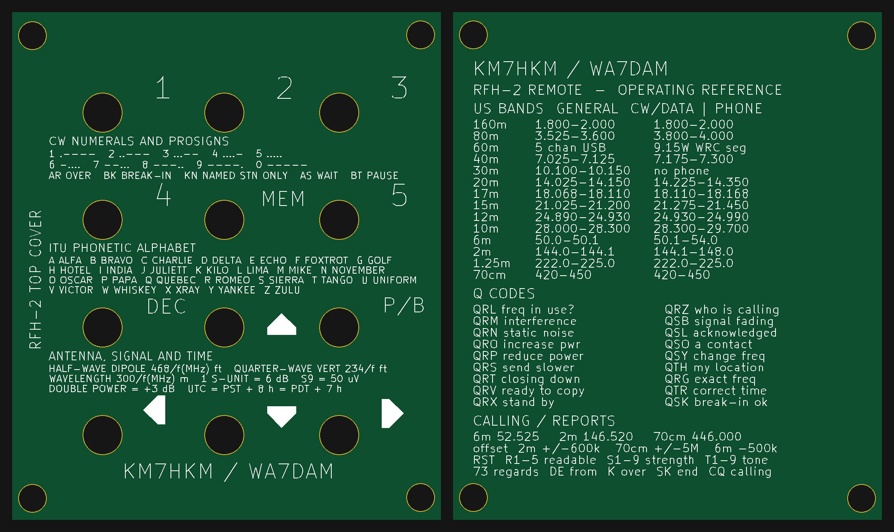

# RFH-2 Remote — enclosure boards, BOM and build notes

A three-board sandwich for the [RFH-2](https://github.com/rfrht/RFH-2), PY2RAF's
open-source clone of the Yaesu FH-2 remote keypad. Compatible with the FT-991A,
FT-991, FT-950, FTDX-9000/5000/3000/1200, FT-2000 and FT-1000MP.

Upstream ships the keypad PCB only. This folder adds a front cover and a back
plate, puts an operating reference on the back so the unit is useful when you
flip it over, and carries the BOM and build documentation that upstream leaves
to the schematic.



## What is in here

| Path | Contents |
|---|---|
| [`RFH-2-JLCPCB-all-boards.zip`](RFH-2-JLCPCB-all-boards.zip) | Everything needed to order boards, in one download. |
| `jlcpcb-upload/` | The three archives individually. This is what actually goes to the fab. |
| `gerbers/` | The same three board sets, unpacked, for inspection or diffing. |
| `bom/` | Grouped BOM, per-designator BOM, hardware list, DigiKey cart. |
| `upstream/` | PY2RAF's Eagle schematic and board, vendored so the BOM and the covers can be regenerated offline. |
| `scripts/` | Generators for the cover and back plate, plus two independent verifiers. |
| `images/` | Renders and the silkscreen overlay used during validation. |
| `ASSEMBLY.md` | Build order, standoff sizing, wiring, test. |
| `ORDERING.md` | Per-archive JLCPCB option tables. |

## Ordering: one download, three orders

Grab **[`RFH-2-JLCPCB-all-boards.zip`](RFH-2-JLCPCB-all-boards.zip)** (219 kB),
or straight from GitHub:

<https://github.com/NiyaNagi/washington-sds150-favorites/raw/main/rfh-2-remote/RFH-2-JLCPCB-all-boards.zip>

**Do not upload that file to JLCPCB.** It is a carrier, not a board. JLCPCB
accepts one board design per upload, so unpack it and upload the three inner
archives as three separate orders:

| Upload | Archive | Board |
|---|---|---|
| 1 | `JLCPCB-1-RFH-2-cover.zip` | Front cover / faceplate |
| 2 | `JLCPCB-2-RFH-2-mainboard.zip` | Keypad PCB (PY2RAF rev C, unmodified) |
| 3 | `JLCPCB-3-RFH-2-bottom.zip` | Back plate with operating reference |

Options for all three: 2 layer, 1.6 mm FR4, 1 oz copper, HASL, any mask colour,
white silkscreen, defaults otherwise. Per-board detail is in
[`ORDERING.md`](ORDERING.md), which also travels inside the bundle.

Boards only — components, screws and standoffs are not part of a PCB order.
See [`bom/`](bom/README.md).

The bundle is rebuilt from the tracked archives by
[`scripts/make_upload_bundle.py`](scripts/make_upload_bundle.py),
byte-for-byte reproducibly, so it cannot drift from the boards it claims to
contain.

## What is printed on the boards

The two printed faces are deliberately split so neither repeats the other.

**Front cover**, in the three gaps between the switch rows:

| Section | Contents |
|---|---|
| CW numerals and prosigns | 0-9 in Morse, plus AR, BK, KN, AS, BT |
| ITU phonetic alphabet | All 26 letters |
| Antenna, signal and time | Dipole 468/f, quarter-wave 234/f, wavelength 300/f, S-unit = 6 dB, S9 = 50 uV, +3 dB = double power, UTC offsets |

**Back plate**, read when the unit is flipped over: US General-class band edges
for 14 bands, 18 Q codes, simplex calling frequencies, repeater offsets, RST,
and common CW abbreviations.

Nothing on the cover is positioned by hand. `gen_cover.py` derives the free
bands from the board's own obstacles — switch cutouts, mounting-hole keepouts,
existing legends and arrows — then re-checks every rendered line against that
same geometry. A line that would overlap a cutout or run past a margin fails
the build rather than shipping quietly. Line pitch expands to fill whatever
each band leaves spare, so sections breathe instead of bunching.

The reference text is a memory aid. Band allocations change and the S-meter
figures are a convention rather than a calibration; verify anything that
matters before keying up.

## The stack

| Layer | Board | Notes |
|---|---|---|
| Top | `gerbers/cover` | Faceplate. 12 plunger cutouts, legends, callsign. |
| Middle | `gerbers/mainboard` | Upstream PY2RAF board, rev C, unmodified. |
| Bottom | `gerbers/bottom` | Back plate. Operating reference on the outward face. |

All three share a 76 × 90 mm outline and the same four 5.0 mm mounting holes.
The cover and back plate geometry is derived programmatically from upstream's
`RFH-2.brd`, so they cannot drift from the main board.

## How it works

There is no microcontroller. Each of the 12 buttons switches a different
resistor into a divider, and the radio decides which key you pressed from the
voltage on the tip of a 3.5 mm plug. That is the whole design, and it is why
[`bom/README.md`](bom/README.md) is worth reading before you order parts: a
wrong resistor is a wrong button, not a slightly-off button.

## Quick start

1. Read [`ASSEMBLY.md`](ASSEMBLY.md) step 1 and settle the cover standoff
   height. It decides nothing about the gerbers and everything about whether
   the buttons reach.
2. Download [`RFH-2-JLCPCB-all-boards.zip`](RFH-2-JLCPCB-all-boards.zip),
   unpack it, and place three separate JLCPCB orders.
3. Order parts from [`bom/RFH-2-bom.csv`](bom/RFH-2-bom.csv).
4. Build per [`ASSEMBLY.md`](ASSEMBLY.md).

## Verification

```powershell
.\.venv\Scripts\python.exe rfh-2-remote\scripts\verify_uploads.py
```

`verify_uploads.py` has no third-party dependencies. It opens each archive and
checks the layer set, flat structure, drill count and diameters against
JLCPCB's 0.3–6.3 mm plated window, the outline extent, and that the mounting
holes agree across all three boards. Last run: **39 checks, all passing**, with
the four mounting holes identical to the micron on every board.

`scripts/accept_zips.py` does the same job through `gerbonara`, so a bug in one
parser does not hide behind the same bug in the other.

## Regenerating

```powershell
pip install -r rfh-2-remote\requirements.txt
python rfh-2-remote\scripts\gen_cover.py       # front cover
python rfh-2-remote\scripts\gen_bottom.py      # back plate + reference text
python rfh-2-remote\scripts\validate_cover.py  # geometry assertions
python rfh-2-remote\scripts\pack_cover.py      # repack the cover archive
python rfh-2-remote\scripts\render_previews.py # refresh images/
python rfh-2-remote\scripts\gen_bom.py         # BOM from the schematic
python rfh-2-remote\scripts\gen_jlcpcb_assembly.py  # JLCPCB BOM + CPL
python rfh-2-remote\scripts\make_upload_bundle.py   # rebuild the one-file bundle
```

Output lands in `rfh-2-remote/build/`, which is not tracked. Set `RFH2_BRD` to
point the generators at a different board file.

`pack_cover.py` renames the drill program from `.TXT` to `.DRL` on the way in,
and **refuses to pack if any layer other than the silkscreen changed**. The
cover's geometry comes from `RFH-2.brd`; if editing artwork moves a mounting
hole, that is a bug, and the packer stops rather than shipping it.

`gen_bottom.py` measures every line against the usable area and the
mounting-hole keepouts, so content that would run off the board fails the build
rather than shipping quietly. Callsigns are the `CALL` and `CALLSIGN` constants
at the top of `gen_bottom.py` and `gen_cover.py`.

## Two things to know before ordering

**The cover has no copper.** Neither does the back plate. The copper and paste
layers are intentionally empty. A blank copper layer in JLCPCB's DFM preview is
correct.

**Do not rename the mainboard drill file.** It is `drills.xln` because that is
what upstream ships. Renaming it to `.DRL` caused a parser to find zero holes on
a 122-hole board. The only changes made to upstream's set were flattening the
`CAMOutputs/` folders and dropping the `.gbrjob`.

## Back plate reference data

US band edges are FCC §97.301 allocations as published in the ARRL band chart
rev 1/16/2026, including the WRC-15 60 m segment effective 13 Feb 2026. The
band table shows **General class** privileges. Frequencies are regulatory fact;
nothing is copied from ARRL's chart layout.

**Verify against current FCC rules before relying on silkscreen for anything
on-air.** Allocations change and a board is a snapshot, not an authority.

The silkscreen carries the callsigns `KM7HKM / WA7DAM`. `WA7DAM` was a vanity
request that may not have been granted — check before fabricating a board with
it on the front.

## Licensing

**This folder is GPL-3.0**, unlike the rest of this repository, which is MIT.
It contains and derives from PY2RAF's GPL-3.0 work. See [`LICENSE`](LICENSE).

- Keypad design, schematic, board, legends and arrow artwork: PY2RAF,
  [`github.com/rfrht/RFH-2`](https://github.com/rfrht/RFH-2), GPL-3.0
- Faceplate concept: Jim N5JGE, who built the first one
- Cover, back plate, BOM tooling and documentation here: KM7HKM
